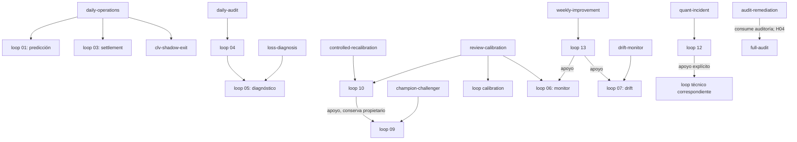
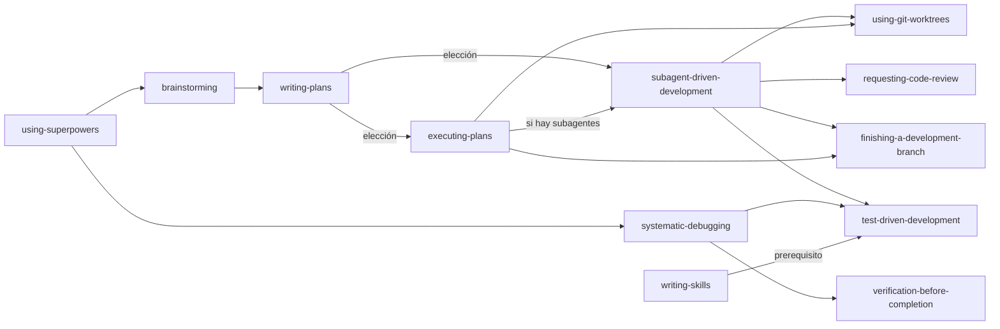

# Análisis técnico del sistema completo de Skills — Sports Quant Platform

Fecha de inspección: 2026-09-08. Repositorio local: `C:\dev\3\sports-quant-platform`. Informe: `analisis-skills-codex.md`.

## 1. Dictamen y alcance

**Se identificaron y analizaron individualmente 48 Skills: 34 propias de SQP y 14 del paquete Superpowers presente en disco.** La arquitectura propia tiene una separación útil entre entrada semántica (Skill), procedimiento (loop), reglas permanentes, comandos y evidencias. Su coherencia es parcial: se confirmaron **9 defectos —3 HIGH y 6 MEDIUM—**, principalmente fórmulas conversacionales, política de gates desactualizada y contratos de handoff/persistencia. No se identificó una ruta demostrada de impacto CRITICAL.

El informe describe el sistema existente, no un diff ni una revisión de cambios de otra persona. Los defectos pertenecen al contenido inspeccionado; no se atribuyen a una modificación reciente ni al autor de una revisión previa. Git no mostró cambios locales al inicio. El único archivo cuya escritura se autorizó en esta tarea es este informe. No se ejecutaron operaciones de generación de picks, settlement, entrenamiento, promoción, APIs, instalación, commit, merge, worktree ni limpieza.

**Cambios concurrentes detectados al cierre:** Git mostró modificaciones en `src/sqp/monitoring/run_status.py`, `src/sqp/pipeline/closing_capture.py`, `src/sqp/pipeline/intraday_scan.py`, `src/sqp/pipeline/revalidation.py`, `src/sqp/risk/clv_gate.py`, `src/sqp/risk/degradation.py`, `src/sqp/risk/prediction_gate.py`, `src/sqp/storage/atomic.py` y `src/sqp/storage/odds_store.py`. No fueron realizadas por esta revisión y se dejaron intactas; no se atribuye su autoría ni se evalúa ese diff. Las 48 definiciones de Skills conservaron sus hashes del inventario. Las conclusiones citan el contenido inspeccionado; el estado de producción y los cambios concurrentes del código no quedan certificados por este informe.

Se analizaron íntegramente los 48 `SKILL.md`, sus metadatos, los loops que delegan el funcionamiento de las Skills propias, las nueve referencias de full-audit, contratos de memoria/orquestación, configuración de hooks, manifiestos/bootstrap del paquete y recursos directamente necesarios para contrastar hallazgos. Los recursos secundarios de terceros se inventariaron y se verificaron sus referencias cuando eran enlaces literales; **no se certifica la ejecución ni una revisión exhaustiva línea a línea de cada script, servidor, fixture o referencia auxiliar del paquete**. Esto no reduce las 48 fichas, pero sí limita la conclusión dinámica sobre el comportamiento del harness.

El resultado no es un PASS incondicional: existen defectos confirmados y la activación real de plugins/Skills en otra sesión, los datos de producción y los evals multiagente no fueron ejecutados.

## 2. Método, evidencia y criterios

### 2.1 Descubrimiento y corpus

1. Se inspeccionó Git y se buscaron archivos de Skills con `rg --files --hidden`.
2. Se descubrió que esa búsqueda respeta `.gitignore` y omite Superpowers. Se repitió sobre el paquete con `--no-ignore`.
3. Se completó una enumeración programática mediante `os.walk`, independiente del ignore de Git, que encontró **48 archivos con nombre SKILL.md y cero errores de acceso en el corpus recorrido**.
4. Se excluyeron del recorrido final `.git`, `.codex-tmp`, caches Python/pytest/mypy/ruff, `__pycache__` y `node_modules`: metadatos, scratch de pruebas y dependencias, no el catálogo autoral. El directorio `data` no se volcó: la enumeración solo buscó nombres de archivos, sin leer datasets.
5. Una búsqueda indiscriminada previa alcanzó subdirectorios protegidos de `.codex-tmp` y reportó acceso denegado. Se delimitó el corpus; esos errores no se presentan como Skills faltantes ni como fallos del producto.
6. Se validó YAML de las 48 definiciones: `name` y `description` son strings y `name` coincide con la carpeta. **48 válidas, cero errores**. Esta comprobación no equivale a validar límites particulares del loader de cada harness.
7. Se comprobaron referencias literales `.claude/...md` en backticks y enlaces Markdown relativos de los SKILL.md: **ningún destino inexistente en esas categorías**. No es un verificador de toda ruta dinámica, glob, URL o referencia en lenguaje natural.

Superpowers está ignorado deliberadamente, no ausente: `.gitignore:28–43`, `.claude/memory/known-issues.md` KI-015 y `project-decisions.md` explican su conservación por la carga del plugin. Los manifiestos localizados declaran versión **6.1.1**. Se distinguió presencia física y declaración de integración de la habilitación efectiva por el harness: esta última no se infiere de un manifiesto ni de una nota histórica.

No se cuentan como Skills adicionales el backup histórico `audit/full-audit-SKILL-reemplazado-2026-08-30.md`, los comandos, agentes, loops, playbooks ni los stubs de memoria: carecen de una nueva definición activa `SKILL.md` dentro del catálogo inventariado. Las Skills instaladas fuera del repositorio y listadas por la aplicación tampoco forman parte de esta solicitud.

### 2.2 Tipos de relación

- **Invocación/derivación:** instrucción explícita de usar otra Skill o destino de handoff.
- **Dependencia de procedimiento:** la Skill exige leer/seguir un loop o recurso.
- **Dependencia de entrada:** consume el artefacto de otro procedimiento; no significa ejecutarlo nuevamente.
- **Referencia/exclusión/alternativa:** demuestra conocimiento o frontera, no una llamada simultánea.
- **Complementariedad funcional:** dos archivos cubren actividades relacionadas, pero no se declara una arista de ejecución sin referencia.
- **Acoplamiento a estado:** varios procedimientos acceden a un mismo registro; no equivale por sí solo a carrera concurrente.

Una búsqueda de nombres produjo candidatos, después revisados semánticamente. Palabras comunes como `documentation` o `bugfix` dentro de ejemplos ingleses de Superpowers **no** se interpretan como invocaciones de las Skills SQP homónimas.

### 2.3 Severidad, confianza y evidencia

Se usa la taxonomía de AGENTS.md: CRITICAL/HIGH/MEDIUM/LOW para impacto; HIGH/MEDIUM/LOW para confianza. Los defectos confirmados son únicamente REPRODUCED o STATICALLY_VERIFIED, con confianza HIGH. INFERRED, NOT_VERIFIABLE y DISMISSED se mantienen separados. En las observaciones, STATICALLY_VERIFIED acredita el hecho documental indicado; no convierte automáticamente todo solapamiento en defecto.

Las reproducciones de fórmulas son sintéticas. No se atribuyen sus números a partidos, rentabilidad histórica ni probabilidades deportivas reales. Las comparaciones económicas utilizan la implementación canónica del repositorio y unidades explícitas; no se inventaron umbrales operativos.

## 3. Inventario exhaustivo y trazabilidad

Cada fila corresponde a una ficha individual de la sección 6. El SHA-256 completo identifica el contenido leído y permite comprobar que una conclusión sigue aplicando a esa revisión. Las rutas se resuelven desde la raíz del repositorio.

| ID | Nombre y definición | Origen | Líneas | SHA-256 |
|---|---|---|---:|---|
| S01 | [audit-remediation](.claude/skills/audit-remediation/SKILL.md) | SQP | 108 | `06c267786cb1e91f167c59ec5dca646381de882de1e742622fbab7c0ba7062be` |
| S02 | [bugfix](.claude/skills/bugfix/SKILL.md) | SQP | 12 | `8dbdea1c491c75f3a18c87dfe1444fdaa5600cc466828f3d7e38e0ed4698f657` |
| S03 | [champion-challenger](.claude/skills/champion-challenger/SKILL.md) | SQP | 11 | `cd3d8de3ccb61dbcce7233534a2d40ea862e1957a6c9b5b901ed3603fae1ea80` |
| S04 | [clv-shadow-exit](.claude/skills/clv-shadow-exit/SKILL.md) | SQP | 47 | `8d824779583f0681edde0a1ac5f99206d4fe9334670258dca02632e83c56b814` |
| S05 | [code-audit](.claude/skills/code-audit/SKILL.md) | SQP | 36 | `694765c6f91406d3b84ea2f94e8dead8affef52078c501e83e266672cac5564d` |
| S06 | [controlled-recalibration](.claude/skills/controlled-recalibration/SKILL.md) | SQP | 13 | `8607a6be62f8a364068c4a9b529fd7c5684346bf106b41be07fb1717bd8f1f32` |
| S07 | [daily-audit](.claude/skills/daily-audit/SKILL.md) | SQP | 11 | `b92912e92c5b47771b5fbb16a11a8a71e4a7293f83f01c84120c6e337631e82f` |
| S08 | [daily-operations](.claude/skills/daily-operations/SKILL.md) | SQP | 48 | `c8772c1f3fec360c67d7c4985b13a86d5987f319d6ef0c8dd340610fa3ac6d3b` |
| S09 | [data-quality-recovery](.claude/skills/data-quality-recovery/SKILL.md) | SQP | 11 | `43c9b108c04032c04a178b1418d111846a315455cb2f51b61e7038aeaad50cbc` |
| S10 | [documentation](.claude/skills/documentation/SKILL.md) | SQP | 11 | `bbb323205900d790fc6addae0248224ec274eea4a4e0ee8f2429757a41f741c2` |
| S11 | [drift-monitor](.claude/skills/drift-monitor/SKILL.md) | SQP | 11 | `4ea9621d99df81599cdd9fde19f8891c537f37f71e74fda4874b53ba5e05f845` |
| S12 | [edge-ranking](.claude/skills/edge-ranking/SKILL.md) | SQP | 19 | `dddd0329909c2139991ef92880dea389b3e90058e42812dc768e3ef26d9bee77` |
| S13 | [feature-engineering](.claude/skills/feature-engineering/SKILL.md) | SQP | 33 | `81032974fb507612bd926d8c9d5266627bc0f2eb17f5c70a12c994ddfa22873b` |
| S14 | [full-audit](.claude/skills/full-audit/SKILL.md) | SQP | 372 | `17e2889ebeb5ea7de57f8c92bc54965142912f84eedc20f8d3ea5e901e42ae96` |
| S15 | [incident](.claude/skills/incident/SKILL.md) | SQP | 12 | `c2b1f97ab0128a678143a147b6e06caddaa2db58d68ec4b7f9d851eddab3150a` |
| S16 | [loss-diagnosis](.claude/skills/loss-diagnosis/SKILL.md) | SQP | 11 | `0722a273e216a4138f0b06bdfecd0e95f8cbe20c4d9b21057b2246012f1cface` |
| S17 | [markitdown](.claude/skills/markitdown/SKILL.md) | SQP | 59 | `b06b95069054ebe3fd2054e02c540687bc20606407295f62f97ccca9e9231563` |
| S18 | [memoria-persistente](.claude/skills/memoria-persistente/SKILL.md) | SQP | 58 | `8747a98e1aee6478d3e6049f9e29abd7ee2d4446fc1387a7cb155a0d21139914` |
| S19 | [mlb-pipeline](.claude/skills/mlb-pipeline/SKILL.md) | SQP | 38 | `7b8a9c564a8d942706263964f73ebe381e31e01417e3d357c63f7c341ea533c2` |
| S20 | [model-change](.claude/skills/model-change/SKILL.md) | SQP | 12 | `f473f6711253f640717f46a2dec5ae9297ce4308ec509cc816e36193b3676cef` |
| S21 | [pregame-refresh](.claude/skills/pregame-refresh/SKILL.md) | SQP | 11 | `cfa8ea46a1851c21d0e52e626e43ec8bda70b33bbeee405ca918920d2532054e` |
| S22 | [provider-integration](.claude/skills/provider-integration/SKILL.md) | SQP | 11 | `8df70140cdf2b699ffdf12d1d1df0f0def571ab181be0a3313a84630f386d9c2` |
| S23 | [quant-american-football](.claude/skills/quant-american-football/SKILL.md) | SQP | 33 | `3662c3d4214fefaf7c53f745903af66ec32f7fc39a7b4b0187859209307110d3` |
| S24 | [quant-baseball-mlb](.claude/skills/quant-baseball-mlb/SKILL.md) | SQP | 32 | `0af97ead112d86cef33e2485fd078e619c01b8ab8ec6ec7f0ab95d6d8f3574b8` |
| S25 | [quant-basketball](.claude/skills/quant-basketball/SKILL.md) | SQP | 34 | `a7a255211786d5157efd73aadc5d581aab54794d190ce59e2a046a78adec066c` |
| S26 | [quant-hockey-nhl](.claude/skills/quant-hockey-nhl/SKILL.md) | SQP | 31 | `a5152be1f8a3bf5505c4f34b59aa55aafb73f3242553f81dc889004957658a95` |
| S27 | [quant-incident](.claude/skills/quant-incident/SKILL.md) | SQP | 11 | `4cdf29691e8f118ee548779c81dcd1eecb6ce913e4193ed1e38196d0821efe64` |
| S28 | [quant-soccer](.claude/skills/quant-soccer/SKILL.md) | SQP | 39 | `4fc613959c32ef4e7b703e2bd32d9c8eec820acb6dd67b3535b604c6152c3064` |
| S29 | [quant-tennis](.claude/skills/quant-tennis/SKILL.md) | SQP | 33 | `1cad7c4b7e8f4a429c2e95f19d6ad790f2389f9e1e1f01218e2615cf5ebe77a2` |
| S30 | [review-calibration](.claude/skills/review-calibration/SKILL.md) | SQP | 61 | `b247c972e2700d03348727c5af2ae637a95a4009cb396a212ffa3b057614fa9e` |
| S31 | [season-transition](.claude/skills/season-transition/SKILL.md) | SQP | 11 | `f5162482bb798698753e5cafb6b716f26a281a51e120e8c014c8b48cbde19f15` |
| S32 | [sports-analytical-system](.claude/skills/sports-analytical-system/SKILL.md) | SQP | 241 | `64fb34bce7fe705d8f1fa697df66ef0616b93f840f78fbc671b4633722fe3a10` |
| S33 | [sports-quant-platform-architect](.claude/skills/sports-quant-platform-architect/SKILL.md) | SQP | 54 | `73f5100171088cda1fd1c8df47166710af66504e6829dfe223262e33713a8f50` |
| S34 | [brainstorming](.claude/skills/superpowers-main/skills/brainstorming/SKILL.md) | Superpowers | 159 | `e14914605f640e0841758e45d0ab2a53243b59b921f929e47921c99668f2e61d` |
| S35 | [dispatching-parallel-agents](.claude/skills/superpowers-main/skills/dispatching-parallel-agents/SKILL.md) | Superpowers | 185 | `f0df13f584049059cc5619f90061405b89dcc6e28ab3f2a8517d27d99c7a46a6` |
| S36 | [executing-plans](.claude/skills/superpowers-main/skills/executing-plans/SKILL.md) | Superpowers | 70 | `bbd8d28bb655a52817cc129ce49f9e46fa7c6303f72ed5de95bfe914ef8e0ce8` |
| S37 | [finishing-a-development-branch](.claude/skills/superpowers-main/skills/finishing-a-development-branch/SKILL.md) | Superpowers | 241 | `e6d4a812de900d33c6eacfb40747f99427f25c304a7b7099120f9373b115a47f` |
| S38 | [receiving-code-review](.claude/skills/superpowers-main/skills/receiving-code-review/SKILL.md) | Superpowers | 213 | `647036bbdab7bf2317e14e079595e984c9030f64295e2b4c0fb57dbeb48f25dd` |
| S39 | [requesting-code-review](.claude/skills/superpowers-main/skills/requesting-code-review/SKILL.md) | Superpowers | 103 | `1017ccdd5bc61fab67c654cf118cbdb520464b313073a0a6b9a6b9aa647a3ad6` |
| S40 | [subagent-driven-development](.claude/skills/superpowers-main/skills/subagent-driven-development/SKILL.md) | Superpowers | 418 | `41ab239a6ad1c487cd839fdac972a8c9cf0f5e90efa59a63f963767864f0df4c` |
| S41 | [systematic-debugging](.claude/skills/superpowers-main/skills/systematic-debugging/SKILL.md) | Superpowers | 296 | `3b20719eca4f0461cb51a195221320d775dcf03b6859271066a03a5132a6ce7a` |
| S42 | [test-driven-development](.claude/skills/superpowers-main/skills/test-driven-development/SKILL.md) | Superpowers | 371 | `b5b4717b8b761cce15a6cfe9022e33fd959e0894c0c39d72c9cb49c23486c10e` |
| S43 | [using-git-worktrees](.claude/skills/superpowers-main/skills/using-git-worktrees/SKILL.md) | Superpowers | 202 | `e2c3ec142e52868a51af246c620cd76ab648dcf27d6900d47e6ffd07159a9794` |
| S44 | [using-superpowers](.claude/skills/superpowers-main/skills/using-superpowers/SKILL.md) | Superpowers | 62 | `55379fe7c1c473a02c61961c822996bff30e1320d6921d9062509bc508482c05` |
| S45 | [verification-before-completion](.claude/skills/superpowers-main/skills/verification-before-completion/SKILL.md) | Superpowers | 139 | `ea52d15aabaf72bc6b558efe2c126f161b53961090ddcd712000273bfe8c7b6c` |
| S46 | [writing-plans](.claude/skills/superpowers-main/skills/writing-plans/SKILL.md) | Superpowers | 174 | `272e1af349f5062c28dc282b3e21b220d58d683a7314a10c455b7432ec91d845` |
| S47 | [writing-skills](.claude/skills/superpowers-main/skills/writing-skills/SKILL.md) | Superpowers | 689 | `6b8d08fe863318be8480ae8428e169640309fa9208df84bb0510012764454146` |
| S48 | [weekly-improvement](.claude/skills/weekly-improvement/SKILL.md) | SQP | 11 | `d8f823dc9b15121fb2df8d21d25e3ad2d09dc161390998dcb6ded1b58487e79c` |

## 4. Arquitectura y relaciones demostradas

### 4.1 Grupos funcionales

| Grupo | Skills | Responsabilidad conjunta |
|---|---|---|
| Auditoría y corrección | full-audit, code-audit, audit-remediation | Diagnóstico integral/acotado y corrección aprobada. |
| Ingeniería | bugfix, feature-engineering, model-change, provider-integration, documentation, sports-quant-platform-architect | Cambios por tipo de contrato y decisiones de arquitectura. |
| Operación y observación | daily-operations, daily-audit, pregame-refresh, loss-diagnosis, drift-monitor, data-quality-recovery, weekly-improvement, season-transition | Ciclo temporal de predicción, liquidación, diagnóstico y evolución. |
| Evaluación y gates | champion-challenger, controlled-recalibration, review-calibration, clv-shadow-exit | Candidatos, comparación OOS, promoción humana y evidencia de elegibilidad. |
| Incidentes | incident, quant-incident | Contención técnica/cuanti y recuperación con evidencia. |
| Dominio deportivo | quant-baseball-mlb, quant-basketball, quant-american-football, quant-hockey-nhl, quant-soccer, quant-tennis | Semántica de mercados, modelos, features y límites por deporte. |
| Análisis/inspección transversal | sports-analytical-system, edge-ranking, mlb-pipeline | Síntesis conversacional, ranking y mapa operativo específico. |
| Recursos de sesión | memoria-persistente, markitdown | Continuidad contextual y conversión documental. |
| Superpowers | Las 14 fichas con raíz superpowers-main/skills | Diseño, planificación, ejecución, review, TDD, depuración, aislamiento y creación de Skills. |

Estos grupos son una clasificación de este informe, no un registro de herencia implementado. Una Skill pertenece a un grupo principal para evitar doble conteo; puede compartir recursos con otros.

### 4.2 Jerarquía efectiva de instrucciones

En SQP, las reglas permanentes de `AGENTS.md`/`CLAUDE.md` delimitan autoridad, seguridad y validación. `.claude/CLAUDE.md` define carga selectiva y entrada a routing cuantitativo; `ORCHESTRATOR.md` elige un loop principal y especifica apoyos. Los SKILL.md mayoritariamente son entradas declarativas o punteros, no funciones que un runtime Python importe. `model-routing.json` y `route_classifier.py` enrutan tareas/loops/modelos: **no son un loader universal de las 48 Skills**.

El ORCHESTRATOR define un único propietario: los apoyos escriben evidencia en una subsección y no sustituyen encabezado, ciclo de vida ni criterios de aceptación de `current-task.md`; solo el principal cierra. `quant/STATES.md` separa Status de Result y define precedencia BLOCKED > DEGRADED > PASS, con DONE como cierre finito completo. Los ocho contratos probados sustentan esa parte, no todos los workflows.

Superpowers declara su propia prioridad de procesos en `using-superpowers`, pero el mismo archivo reconoce precedencia del usuario y de CLAUDE/AGENTS. El hook del paquete `hooks/hooks.json` apunta SessionStart a `run-hook.cmd session-start`; `hooks/session-start` lee el bootstrap y lo emite como contexto según plataforma. El manifiesto Codex declara `skills: ./skills/`. Esto demuestra cómo está diseñada la integración; no demuestra que la configuración global actual esté cargando ese paquete local.

### 4.3 Grafo de ejecución principal (aristas seleccionadas verificables)



La flecha remediation→audit representa consumo/requisito, no volver a ejecutar auditoría ni autorización de escritura. En review-calibration las flechas son selección del loop correspondiente, no mandato de recorrer todos en secuencia.



Son instrucciones declaradas en archivos; no una transcripción de agentes ejecutados. `receiving-code-review` y `dispatching-parallel-agents` tienen activación propia y complementariedad con esos flujos, sin arista obligatoria inventada.

### 4.4 Registro de relaciones entre Skills

| Origen | Destino | Tipo | Evidencia | Interpretación |
|---|---|---|---|---|
| audit-remediation | full-audit | Dependencia de entrada | SKILL Requisito de entrada y Fase 4 | Consume auditoría y referencias; contrato material incompleto H04. |
| daily-operations | clv-shadow-exit | Derivación explícita | SKILL Liquidación | Evaluación del gate CLV; propaga H03. |
| incident | quant-incident | Exclusión/derivación | description | Los incidentes cuantitativos tienen destino especializado. |
| mlb-pipeline | quant-baseball-mlb | Exclusión/derivación | description | Análisis de partidos/calibración MLB fuera de esta inspección. |
| controlled-recalibration | review-calibration | Exclusión/derivación | description | Revisar/promover entrenados corresponde al destino; entrenamiento solapado O02. |
| sports-analytical-system | quant-baseball-mlb, quant-basketball, quant-american-football, quant-hockey-nhl, quant-soccer, quant-tennis | Exclusión de activación | description | Análisis simple por deporte pertenece a quant-*; no invocación conjunta obligatoria. |
| sports-analytical-system | sports-quant-platform-architect | Handoff explícito | Integración, líneas 234–241 | Automatización Python; contradice parte del contrato de destino H06. |
| brainstorming | writing-plans | Invocación obligatoria | Terminal state / Implementation | Después del diseño y aprobación. |
| writing-plans | brainstorming | Referencia de procedencia | Scope Check | No vuelve a ejecutarla automáticamente. |
| writing-plans | subagent-driven-development / executing-plans | Alternativas de ejecución | Execution Handoff | Selección de modalidad; no ejecutar ambas. |
| writing-plans | using-git-worktrees | Referencia condicionada | Context | Aislamiento en fase de ejecución. |
| executing-plans | subagent-driven-development | Derivación condicionada | Note | Si existen subagentes; la preferencia del usuario conserva precedencia. |
| executing-plans | writing-plans | Dependencia de entrada | Integration | Plan creado por el origen, no recursión. |
| executing-plans | using-git-worktrees, finishing-a-development-branch | Obligatorias | Integration / Step 3 | Preparación y cierre. |
| executing-plans | using-superpowers | Referencia de recurso | Note | Refs de herramientas por plataforma; no reiniciar bootstrap. |
| subagent-driven-development | writing-plans | Dependencia de entrada | Integration | Plan como insumo. |
| subagent-driven-development | using-git-worktrees, requesting-code-review, finishing-a-development-branch | Obligatorias | Integration / Prompt Templates | Aislamiento, review global y cierre. |
| subagent-driven-development | test-driven-development | Regla para subagentes | Subagents should use | TDD en cada tarea. |
| subagent-driven-development | executing-plans | Alternativa | Alternative workflow | No invocación recursiva incondicional. |
| systematic-debugging | test-driven-development | Invocación | Phase 4 | Crear regresión/fallo antes del fix. |
| systematic-debugging | verification-before-completion | Relación explícita | Related skills | Verificar antes de afirmar arreglo. |
| using-superpowers | brainstorming / systematic-debugging | Routing de proceso | Skill Priority | Selecciona según crear o corregir; los ejemplos no son ejecución de todos. |
| writing-skills | test-driven-development | Prerequisito obligatorio | REQUIRED BACKGROUND | Base conceptual red/green aplicada a documentos. |
| writing-skills | systematic-debugging / verification-before-completion | Referencias de ejemplo | Cross-references y ejemplos de Skills | Referencias textuales demostradas, no invocaciones obligatorias de todo el flujo. |

### 4.5 Dependencias de procedimientos propios

Las rutas siguientes son obligatorias en sus Skills; los archivos existen y se leyeron.

| Skill | Loop/ruta relativa a .claude/loops/ |
|---|---|
| bugfix | bugfix.md |
| feature-engineering | feature.md |
| model-change | model.md |
| provider-integration | provider.md |
| documentation | documentation.md |
| incident | incident.md |
| daily-operations | quant/01-daily-prediction.md y quant/03-postgame-settlement.md |
| pregame-refresh | quant/02-pregame-refresh.md |
| daily-audit | quant/04-daily-audit.md |
| loss-diagnosis | quant/05-loss-diagnosis.md |
| drift-monitor | quant/07-drift-monitor.md |
| data-quality-recovery | quant/08-data-quality-recovery.md |
| champion-challenger | quant/09-champion-challenger.md |
| controlled-recalibration | quant/10-controlled-recalibration.md |
| season-transition | quant/11-season-transition.md |
| quant-incident | quant/12-quant-incident.md |
| weekly-improvement | quant/13-weekly-continuous-improvement.md |
| review-calibration | calibration.md, quant/06-calibration-monitor.md y quant/10-controlled-recalibration.md |

La cobertura de los trece loops cuantitativos no requiere trece Skills con nombre idéntico: daily-operations cubre 01/03 y review-calibration cubre 06/10. La ausencia de una Skill llamada calibration-monitor o postgame-settlement **no constituye un vacío de operación**. Los loops backtest/refactor/release y comandos correspondientes también existen fuera del catálogo de Skills; no se propone crear wrappers solo por simetría.

### 4.6 Integración, acoplamiento y mantenibilidad global

**Fortalezas verificadas.** Las Skills-wrapper evitan copiar todo el algoritmo operativo y remiten a loops existentes. Los bloques comunes de guardrails están replicados intencionalmente para que cada loop cargado sea autosuficiente; `tests/test_claude_system_contract.py` comprueba igualdad entre copias y correspondencia del router con los loops del disco. No procede eliminarlos automáticamente por DRY. Hay un contrato de apoyo para preservar el dueño de current-task, preregistro en evaluaciones cuantitativas y promoción humana separada. La memoria canónica distingue claramente stubs y contenido real.

**Fronteras menos coherentes.** La política de salida por CLV se quedó atrás (H03), el formato de auditoría no coincide con el consumidor (H04), y el límite de inspección de operaciones contradice su validación (H05). El analista conversacional implementa matemática duplicada que contradice al núcleo (H01/H02) y deriva al arquitecto trabajo que el destino excluye (H06). Son fallos con correcciones concretas, no preferencias de arquitectura.

**Duplicaciones funcionales.** bugfix/systematic-debugging, verification-gate/verification-before-completion y arquitectura/brainstorming tienen áreas comunes, pero pertenecen a contratos distintos y no son copias eliminables demostradas. controlled-recalibration/review-calibration sí duplican una entrada de entrenamiento (O02); conviene consolidar propiedad, no unir promoción y entrenamiento. full-audit conserva fases 4/5 que audit-remediation también desarrolla; ambas requieren aprobación, por lo que no se deduce una autorización automática, pero H04 muestra que esa separación necesita un handoff material común.

**Ciclos.** Existen referencias recíprocas en planificación/ejecución: un plan señala ejecutor y el ejecutor menciona al creador como entrada. No son ciclos de ejecución obligatoria. SDD ofrece executing-plans como alternativa y executing-plans prefiere SDD si hay agentes; seleccionar una modalidad evita recorrer ambos. En calibración, loop 06 pide revisión y review-calibration enumera loop 06; la elección de un loop principal y apoyos del ORCHESTRATOR previene interpretar cada mención como reinicio. No se demostró recursión infinita ni deadlock. Mantener explícita la condición de selección reduce ambigüedad.

**Skills aisladas/huérfanas.** markitdown, edge-ranking y varias quant-* no reciben invocaciones obligatorias del resto del catálogo. Eso acredita bajo acoplamiento textual, no inutilidad: disponen de triggers propios. No se identificó ninguna Skill eliminable con evidencia suficiente. Superpowers tiene conservación deliberada; el recurso del arquitecto sin enlace y las plantillas antiguas de self-review en Superpowers son recursos de uso no demostrado, no eliminaciones autorizadas ni defectos confirmados.

**Estado compartido.** Los loops propios comparten current-task/memoria; ORCHESTRATOR proporciona ownership para apoyos dentro de una tarea, pero no demuestra un bloqueo entre dos sesiones independientes. Es un límite de concurrencia no verificado, no una carrera reproducida. Superpowers usa .superpowers/sdd por working tree; H09 sí demuestra una colisión semántica entre planes, incluso sin concurrencia. No se demostró un adaptador que consolide ese ledger con current-task.

**Vacíos de ejecución y validación.** pregame-refresh expresa el contrato pero no identifica un comando concreto. edge-ranking no enlaza las fuentes de liquidez/confianza. Las guías de deportes no prueban que todas sus features/reglas se apliquen en el adapter. Los archivos de pruebas Superpowers incluyen hooks, worktrees, SDD, servidor y solicitudes explícitas; no se ejecutaron porque podrían crear repos, abrir servidores o invocar servicios/modelos. Su mera presencia no acredita evals correctos. Los ocho tests SQP ejecutados se centran en estructura/contratos y no detectan H01/H02/H04/H09. Se recomienda ampliar pruebas solo con escenarios discriminantes derivados de esos defectos.

**Simplificación justificada.** Centralizar definiciones económicas en consumidores canónicos; unificar el contrato de informes; escoger propietario de entrenamiento; resolver condiciones de lectura en daily-operations; y añadir identidad de plan al ledger. No se justifica reemplazar los 48 documentos por una megaskill, eliminar todo Superpowers, crear wrappers para cada loop o cambiar parámetros deportivos sin evidencia.

## 5. Matriz de cobertura y límites

| Área | Estado | Evidencia/método | Límite |
|---|---|---|---|
| 34 Skills SQP | REVISADA | Lectura completa, metadatos, rutas y fichas individuales | No se ejecutó negocio/producción |
| 14 Skills Superpowers | REVISADA | Lectura completa, manifiestos, referencias/handoffs y fichas | Activación real del harness no certificada |
| Loops delegados y estados | REVISADA | Lectura y ocho tests de contratos | No acredita resultados operativos del día |
| Referencias full-audit | REVISADA | Nueve referencias leídas, contrato consumidor contrastado | No se creó audit/latest ni se aplicó remediation |
| Recursos auxiliares terceros | REVISADA_PARCIALMENTE | Inventario por Skill, enlaces y recursos relevantes a hallazgos | No auditoría integral del servidor/evals/scripts |
| Fórmulas analista | REVISADA | Reproducciones sintéticas y contraste con kelly.py/unidades | No estimación de partidos reales |
| Política de gates | REVISADA_PARCIALMENTE | YAML, clv.py, daily.py y loop 04 | Overrides/registro efectivo de producción no leídos |
| Hooks SQP y plugin | REVISADA_PARCIALMENTE | settings.json, manifests, SessionStart y bootstrap | Sin disparar hooks ni certificar ejecución actual |
| Descubrimiento de plugins por harness | NOT_VERIFIABLE | Presencia/diseño e historia sí comprobados | Falta configuración efectiva y sesión de aceptación |
| Memoria/Obsidian | REVISADA_PARCIALMENTE | Protocolo, comandos, ubicaciones y decisiones relevantes | No revisión de todo el conocimiento ni escrituras |
| APIs, cuotas, pagos, live registry | EXCLUIDA | No necesarios para análisis contractual | Sin accesos ni consumos |
| Scratch/caches/metadatos Git | EXCLUIDA | Fuera del catálogo autoral | No se interpreta acceso denegado como defecto |
| Informe solicitado | REVISADA | Correspondencia 48 inventariadas/48 fichas/14 campos | Ver sección 10 para verificación final |

## 6. Análisis individual de las 48 Skills

Cada ficha cubre los catorce campos solicitados y añade controles/validación. La descripción de activación se reproduce del archivo, para que las diferencias entre trigger y cuerpo sean auditables. Los recursos locales listados son inventario: su presencia no implica que todos sean invocados ni que se ejecutaran aquí. El nivel de integración evalúa el contrato estático; no es certificación de funcionamiento en producción.


### S01 — audit-remediation

| Campo | Análisis |
|---|---|
| 1. Nombre y ubicación | `audit-remediation` — [SKILL.md](.claude/skills/audit-remediation/SKILL.md); Skill propia SQP. |
| 2. Propósito principal | Corregir hallazgos de una auditoría previamente aprobados; evita correcciones oportunistas y distingue diagnóstico de implementación. |
| 3. Alcance y responsabilidades | Solo IDs autorizados; preserva configuración, interfaces, historia y parámetros ajenos al alcance. |
| 4. Activación declarada | Aplica las correcciones aprobadas de una auditoría integral previa y ejecuta la validación final. Usar SOLO después de que el usuario haya aprobado explícitamente hallazgos concretos de un informe de full-audit, identificándolos por ID, por grupo inequívoco o como "todos los hallazgos confirmados". No usar para diagnosticar, para auditar ni para corregir nada que no tenga aprobación registrada. |
| 5. Flujo de funcionamiento | Resolver IDs → inspeccionar Git y línea base → parche mínimo → pruebas por hallazgo y componente → diff → registrar resultado. |
| 6. Herramientas, dependencias y recursos | full-audit explícita (requisito y referencias); hook post-edit-format.sh; ruff, mypy, pytest; STATES.md. |
| 7. Entradas esperadas | FINDINGS.md y BACKLOG.md legibles en audit/latest/, aprobación inequívoca e IDs; baseline antes de corregir si falta. |
| 8. Salidas o efectos | Cambios autorizados; CHANGES.md, VALIDATION.md, FINDINGS.md y MANIFEST.json; bookkeeping Obsidian/memory/current-task. |
| 9. Relaciones con otras Skills | Dependencia de entrada hacia full-audit (SKILL Requisito de entrada y Fase 4) |
| 10. Acoplamiento | Alto: contrato rígido con audit/latest/, hook y tres almacenes documentales. |
| 11. Solapamientos/conflictos de responsabilidad | No se confirma redundancia eliminable. Las referencias/alternativas demostradas se detallan en el campo 9; los límites o riesgos particulares se consignan en el campo 12. |
| 12. Inconsistencias, ambigüedades y riesgos | H04: el productor full-audit vigente no define el paquete de archivos exigido. La atribución del hook es específica de Claude, no universal. |
| 13. Evaluación de integración | Integración incompleta en el traspaso de artefactos; las puertas de autorización están bien explicitadas. |
| 14. Mejoras técnicamente justificadas | H04: acordar un esquema productor/consumidor y verificar una auditoría nueva seguida de remediación sin reconstrucción manual. |
| 15. Restricciones, controles y validación | Controles explícitos de la Skill y recursos descritos en alcance/flujo/riesgos; AGENTS.md/CLAUDE.md mantienen evidencia verificable, autorización por alcance y preservación de cambios ajenos. La presencia de una receta de ejecución no demuestra que se haya ejecutado. No se afirma éxito de pruebas ausentes. |

**Evidencia primaria:** definición completa enlazada; frontmatter, secciones de procedimiento/reglas y recursos citados en la ficha. Hash y número de líneas en el inventario.

**Recursos locales adicionales:** ninguno dentro de su carpeta; sus dependencias externas a la carpeta son las enumeradas arriba.

### S02 — bugfix

| Campo | Análisis |
|---|---|
| 1. Nombre y ubicación | `bugfix` — [SKILL.md](.claude/skills/bugfix/SKILL.md); Skill propia SQP. |
| 2. Propósito principal | Reproducir y corregir un defecto desde su causa raíz; evita parches de síntomas. |
| 3. Alcance y responsabilidades | Cambios técnicos mínimos y evaluación de impacto en probabilidades, odds, liquidaciones e historia. |
| 4. Activación declarada | Usar para corregir un bug en el proyecto — "fix", "arreglar bug", "corregir error", "algo está fallando", reproducir el defecto, trazar la causa raíz sin parchear síntomas, y verificar que el test falla antes y pasa después de la corrección. Verifica también si hay impacto en outputs históricos, settlement, odds o probabilidades. |
| 5. Flujo de funcionamiento | Reproducción → hipótesis/invariante → corrección → evidencia red/green o equivalente seguro → regresión → verification-gate. |
| 6. Herramientas, dependencias y recursos | Dependencia obligatoria: .claude/loops/bugfix.md; current-task y /verification-gate. No invoca systematic-debugging por nombre. |
| 7. Entradas esperadas | Síntoma, versión, reproducción o test, archivos afectados y comportamiento esperado. |
| 8. Salidas o efectos | Parche acotado, test/evidencia de regresión, evaluación del impacto y estado de tarea. |
| 9. Relaciones con otras Skills | No se localizó una invocación nominal obligatoria hacia otra Skill en su definición. Su dependencia de archivos/loops está en el campo 6; una afinidad funcional no se convierte en llamada. |
| 10. Acoplamiento | Alto hacia su loop; no tiene procedimiento autónomo si falta ese archivo. |
| 11. Solapamientos/conflictos de responsabilidad | systematic-debugging/TDD y incident comparten reproducción/fix; no invocación directa, incident contiene antes de corregir. |
| 12. Inconsistencias, ambigüedades y riesgos | Solapamiento funcional con systematic-debugging y TDD de Superpowers; no es una invocación entre ellos. |
| 13. Evaluación de integración | Coherente dentro de SQP; el loop permite evidencia alternativa cuando red/green no es seguro. |
| 14. Mejoras técnicamente justificadas | Conservar wrapper y loop. Resolver la prioridad de procesos solo si se integran ambos catálogos; no duplicar la corrección. |
| 15. Restricciones, controles y validación | Controles explícitos de la Skill y recursos descritos en alcance/flujo/riesgos; AGENTS.md/CLAUDE.md mantienen evidencia verificable, autorización por alcance y preservación de cambios ajenos. La presencia de una receta de ejecución no demuestra que se haya ejecutado. No se afirma éxito de pruebas ausentes. |

**Evidencia primaria:** definición completa enlazada; frontmatter, secciones de procedimiento/reglas y recursos citados en la ficha. Hash y número de líneas en el inventario.

**Recursos locales adicionales:** ninguno dentro de su carpeta; sus dependencias externas a la carpeta son las enumeradas arriba.

### S03 — champion-challenger

| Campo | Análisis |
|---|---|
| 1. Nombre y ubicación | `champion-challenger` — [SKILL.md](.claude/skills/champion-challenger/SKILL.md); Skill propia SQP. |
| 2. Propósito principal | Comparar candidato y campeón fuera de muestra para evitar promociones por resultados retrospectivos favorables. |
| 3. Alcance y responsabilidades | Evaluación; nunca promoción automática. |
| 4. Activación declarada | Usar para comparar un modelo candidato contra el campeón activo — "evaluar nuevo modelo", "champion vs challenger", "¿es mejor el candidato?", comparación OOS, validate_oos, compare_models, o decidir REJECT / CONTINUE_SHADOW / CANDIDATE_FOR_APPROVAL. Nunca promueve automáticamente. |
| 5. Flujo de funcionamiento | Pre-registrar hipótesis/cohortes/métrica y límites → validate_oos → compare_models si aplica → segmentar estabilidad/leakage → veredicto. |
| 6. Herramientas, dependencias y recursos | Loop quant/09-champion-challenger.md; VALIDATE_OOS.bat, scripts/validate_oos.py y scripts/compare_models.py. Es apoyo de loop 10. |
| 7. Entradas esperadas | Candidato, campeón, protocolo temporal, mínimos de muestra, incertidumbre y tolerancias definidos antes de observar resultados. |
| 8. Salidas o efectos | REJECT, CONTINUE_SHADOW o CANDIDATE_FOR_APPROVAL, con métricas y estado operativo separado. |
| 9. Relaciones con otras Skills | No se localizó una invocación nominal obligatoria hacia otra Skill en su definición. Su dependencia de archivos/loops está en el campo 6; una afinidad funcional no se convierte en llamada. |
| 10. Acoplamiento | Alto hacia loop 09 y artefactos de evaluación. |
| 11. Solapamientos/conflictos de responsabilidad | No se confirma redundancia eliminable. Las referencias/alternativas demostradas se detallan en el campo 9; los límites o riesgos particulares se consignan en el campo 12. |
| 12. Inconsistencias, ambigüedades y riesgos | La candidatura no equivale a aprobación; BLOCKED si no hay regla previa. No se demostró un ciclo de ejecución con loop 10. |
| 13. Evaluación de integración | Bien delimitada como evaluación; enlace de apoyo desde recalibración explícito. |
| 14. Mejoras técnicamente justificadas | Conservar separación entrenamiento/evaluación/promoción; no fusionarla con review-calibration. |
| 15. Restricciones, controles y validación | Hereda guardrails de su loop: datos disponibles al cutoff, trazabilidad/versiones/snapshots, no promoción ni producción sin aprobación, ocho iteraciones por defecto y cierre con verification-gate/memoria bajo propietario principal. STATES.md distingue PASS/DEGRADED/BLOCKED/DONE; los criterios específicos se describen en flujo/entradas/salidas. En una revisión read-only, estas reglas no autorizan escritura de bookkeeping. |

**Evidencia primaria:** definición completa enlazada; frontmatter, secciones de procedimiento/reglas y recursos citados en la ficha. Hash y número de líneas en el inventario.

**Recursos locales adicionales:** ninguno dentro de su carpeta; sus dependencias externas a la carpeta son las enumeradas arriba.

### S04 — clv-shadow-exit

| Campo | Análisis |
|---|---|
| 1. Nombre y ubicación | `clv-shadow-exit` — [SKILL.md](.claude/skills/clv-shadow-exit/SKILL.md); Skill propia SQP. |
| 2. Propósito principal | Medir CLV, emparejamientos de cierre y evaluar la salida de shadow según la regla descrita. |
| 3. Alcance y responsabilidades | Informes CLV por liga/mercado y gate; pretende determinar elegibilidad de stake. |
| 4. Activación declarada | Use this skill to run or review the CLV audit and the shadow-mode exit evaluation — "evaluar CLV", "¿salimos del shadow mode?", CLV gate status, beat-close rate, or whether any (league, market) qualifies for real stake. Encodes the freshness filter and the exit rule so the evaluation is repeatable. |
| 5. Flujo de funcionamiento | Consultar daily_clv/reportes y JSON → contar cierres frescos → mediana/beat-close → estado de mercado y shadow → evidencia faltante. |
| 6. Herramientas, dependencias y recursos | scripts/clv_analysis.py; src/sqp/audit/clv.py y config.py; entrada directa desde daily-operations. |
| 7. Entradas esperadas | Reportes clv_<fecha>.md, clv_gate.json, parámetros de clv.py/config.py; no CSV íntegros. |
| 8. Salidas o efectos | n emparejadas/sin cierre, CLV mediano, beat-close, veredicto por mercado y salida shadow. |
| 9. Relaciones con otras Skills | Referenciada desde: daily-operations (derivación explícita). |
| 10. Acoplamiento | Alto hacia política de gates, código y registros. |
| 11. Solapamientos/conflictos de responsabilidad | No se confirma redundancia eliminable. Las referencias/alternativas demostradas se detallan en el campo 9; los límites o riesgos particulares se consignan en el campo 12. |
| 12. Inconsistencias, ambigüedades y riesgos | H03: confunde el gate histórico de CLV con prediction_gate vigente; su estado de salida no basta para stake real. |
| 13. Evaluación de integración | Parcial: cálculo/frescura reutilizables; interpretación del gate desactualizada. |
| 14. Mejoras técnicamente justificadas | H03: conservar análisis CLV y resolver el gate rector desde configuración y pipeline; informar prediction_gate por separado. |
| 15. Restricciones, controles y validación | Controles explícitos de la Skill y recursos descritos en alcance/flujo/riesgos; AGENTS.md/CLAUDE.md mantienen evidencia verificable, autorización por alcance y preservación de cambios ajenos. La presencia de una receta de ejecución no demuestra que se haya ejecutado. No se afirma éxito de pruebas ausentes. |

**Evidencia primaria:** definición completa enlazada; frontmatter, secciones de procedimiento/reglas y recursos citados en la ficha. Hash y número de líneas en el inventario.

**Recursos locales adicionales:** ninguno dentro de su carpeta; sus dependencias externas a la carpeta son las enumeradas arriba.

### S05 — code-audit

| Campo | Análisis |
|---|---|
| 1. Nombre y ubicación | `code-audit` — [SKILL.md](.claude/skills/code-audit/SKILL.md); Skill propia SQP. |
| 2. Propósito principal | Auditar un diff o módulos seleccionados sin expandir indiscriminadamente el alcance. |
| 3. Alcance y responsabilidades | Imports, errores, tipos, tests, leakage, secretos, logging y riesgo operativo. |
| 4. Activación declarada | Use this skill for targeted code audits in the Sports Quant Platform, including Python quality, pipeline safety, error handling, testing, security, and maintainability. |
| 5. Flujo de funcionamiento | Delimitar archivos → inspeccionar las dimensiones listadas → fundamentar hallazgos → proponer arreglo y validación. |
| 6. Herramientas, dependencias y recursos | Código, tests y herramientas de lectura/validación disponibles; no declara invocación de otra Skill. |
| 7. Entradas esperadas | Diff o módulos solicitados y contexto mínimo para establecer contratos. |
| 8. Salidas o efectos | Archivos inspeccionados, hallazgos por severidad, evidencia, fix recomendado y comando de validación. |
| 9. Relaciones con otras Skills | No se localizó una invocación nominal obligatoria hacia otra Skill en su definición. Su dependencia de archivos/loops está en el campo 6; una afinidad funcional no se convierte en llamada. |
| 10. Acoplamiento | Bajo explícito; las reglas de AGENTS.md completan evidencia y severidad. |
| 11. Solapamientos/conflictos de responsabilidad | No se confirma redundancia eliminable. Las referencias/alternativas demostradas se detallan en el campo 9; los límites o riesgos particulares se consignan en el campo 12. |
| 12. Inconsistencias, ambigüedades y riesgos | Se solapa con full-audit solo en técnica de revisión: targeted frente a inventario integral. No es redundancia eliminable. |
| 13. Evaluación de integración | Integración razonable como entrada acotada; no garantiza por sí misma validación dinámica. |
| 14. Mejoras técnicamente justificadas | Conservar. Aplicar formato/evidencia de AGENTS.md sin convertir preferencias de estilo en defectos. |
| 15. Restricciones, controles y validación | Controles explícitos de la Skill y recursos descritos en alcance/flujo/riesgos; AGENTS.md/CLAUDE.md mantienen evidencia verificable, autorización por alcance y preservación de cambios ajenos. La presencia de una receta de ejecución no demuestra que se haya ejecutado. No se afirma éxito de pruebas ausentes. |

**Evidencia primaria:** definición completa enlazada; frontmatter, secciones de procedimiento/reglas y recursos citados en la ficha. Hash y número de líneas en el inventario.

**Recursos locales adicionales:** ninguno dentro de su carpeta; sus dependencias externas a la carpeta son las enumeradas arriba.

### S06 — controlled-recalibration

| Campo | Análisis |
|---|---|
| 1. Nombre y ubicación | `controlled-recalibration` — [SKILL.md](.claude/skills/controlled-recalibration/SKILL.md); Skill propia SQP. |
| 2. Propósito principal | Entrenar un calibrador candidato sin sustituir el activo; evita mezclar entrenamiento con promoción. |
| 3. Alcance y responsabilidades | Congelar splits, entrenar, versionar y comparar candidato. |
| 4. Activación declarada | Usar para ENTRENAR un calibrador candidato sin tocar el live — "calibración controlada", "Loop 10", train_calibration.py, candidate OOS, REJECT / CONTINUE_SHADOW / CANDIDATE_FOR_APPROVAL. NO usar para revisar o promover calibradores ya entrenados (eso es review-calibration). Nunca promueve automáticamente; la promoción requiere aprobación humana explícita. |
| 5. Flujo de funcionamiento | Congelar campeón/splits → método → train_calibration o train_pergame_calibration → hash/rango → OOS → loop 09 de apoyo → veredicto. |
| 6. Herramientas, dependencias y recursos | Loop quant/10-controlled-recalibration.md; scripts de entrenamiento; loop 09 como apoyo; ORCHESTRATOR para ownership. |
| 7. Entradas esperadas | Datos temporales válidos, campeón, método y parámetros, protocolo de evaluación previo. |
| 8. Salidas o efectos | Candidato versionado y REJECT/CONTINUE_SHADOW/CANDIDATE_FOR_APPROVAL; no cambia live por contrato. |
| 9. Relaciones con otras Skills | Exclusión/derivación hacia review-calibration (description) |
| 10. Acoplamiento | Alto hacia scripts, estado compartido y loop evaluador. |
| 11. Solapamientos/conflictos de responsabilidad | review-calibration incluye entrenamiento/re-staging; champion-challenger evalúa como apoyo, no promueve. |
| 12. Inconsistencias, ambigüedades y riesgos | Solapamiento demostrado: review-calibration todavía incluye Entrenar/re-staging aunque esta descripción le asigna el entrenamiento. Ver O02. |
| 13. Evaluación de integración | Coherente en su loop; frontera de entrada duplicada con review-calibration. |
| 14. Mejoras técnicamente justificadas | O02: mantener loop 10 como propietario del entrenamiento y que review-calibration remita a él de forma explícita. |
| 15. Restricciones, controles y validación | Hereda guardrails de su loop: datos disponibles al cutoff, trazabilidad/versiones/snapshots, no promoción ni producción sin aprobación, ocho iteraciones por defecto y cierre con verification-gate/memoria bajo propietario principal. STATES.md distingue PASS/DEGRADED/BLOCKED/DONE; los criterios específicos se describen en flujo/entradas/salidas. En una revisión read-only, estas reglas no autorizan escritura de bookkeeping. |

**Evidencia primaria:** definición completa enlazada; frontmatter, secciones de procedimiento/reglas y recursos citados en la ficha. Hash y número de líneas en el inventario.

**Recursos locales adicionales:** ninguno dentro de su carpeta; sus dependencias externas a la carpeta son las enumeradas arriba.

### S07 — daily-audit

| Campo | Análisis |
|---|---|
| 1. Nombre y ubicación | `daily-audit` — [SKILL.md](.claude/skills/daily-audit/SKILL.md); Skill propia SQP. |
| 2. Propósito principal | Medir rendimiento y calidad probabilística de la cohorte liquidada; evita confundir hit rate alto con rentabilidad. |
| 3. Alcance y responsabilidades | Congelar cohortes y segmentar métricas; propone diagnósticos sin modificar mercados. |
| 4. Activación declarada | Usar para medir el rendimiento y la calidad probabilística de la cohorte liquidada del día — "auditoría diaria", "revisar hits de ayer", "cómo quedaron los picks", hit rate por banda, Brier, ECE, gap observado vs prometido, o derivar pérdidas relevantes al diagnóstico. |
| 5. Flujo de funcionamiento | Excluir push/void/pendientes → n, hit rate, Brier, Log Loss, ECE → bandas y baseline → derivar pérdidas a loop 05. |
| 6. Herramientas, dependencias y recursos | Loop quant/04-daily-audit.md; segment_diagnostics_latest.csv, degradation_pause.json, prediction_gate.json, clv_gate.json; loop 05. |
| 7. Entradas esperadas | Cohorte liquidada por fecha/mercado/modelo, cuotas de entrada y cierres emparejables para CLV. |
| 8. Salidas o efectos | Diagnóstico por segmentos, gap observado-prometido y resultado PASS/DEGRADED/BLOCKED. |
| 9. Relaciones con otras Skills | No se localizó una invocación nominal obligatoria hacia otra Skill en su definición. Su dependencia de archivos/loops está en el campo 6; una afinidad funcional no se convierte en llamada. |
| 10. Acoplamiento | Alto hacia artefactos de liquidación y política de estados. |
| 11. Solapamientos/conflictos de responsabilidad | No se confirma redundancia eliminable. Las referencias/alternativas demostradas se detallan en el campo 9; los límites o riesgos particulares se consignan en el campo 12. |
| 12. Inconsistencias, ambigüedades y riesgos | Distingue correctamente prediction_gate rector y CLV secundario, contradiciendo clv-shadow-exit (H03). |
| 13. Evaluación de integración | Bien integrada con liquidación y diagnóstico; no autoriza pausar/reactivar/promover. |
| 14. Mejoras técnicamente justificadas | Conservar esta separación; usar su distinción de gates al corregir H03. |
| 15. Restricciones, controles y validación | Hereda guardrails de su loop: datos disponibles al cutoff, trazabilidad/versiones/snapshots, no promoción ni producción sin aprobación, ocho iteraciones por defecto y cierre con verification-gate/memoria bajo propietario principal. STATES.md distingue PASS/DEGRADED/BLOCKED/DONE; los criterios específicos se describen en flujo/entradas/salidas. En una revisión read-only, estas reglas no autorizan escritura de bookkeeping. |

**Evidencia primaria:** definición completa enlazada; frontmatter, secciones de procedimiento/reglas y recursos citados en la ficha. Hash y número de líneas en el inventario.

**Recursos locales adicionales:** ninguno dentro de su carpeta; sus dependencias externas a la carpeta son las enumeradas arriba.

### S08 — daily-operations

| Campo | Análisis |
|---|---|
| 1. Nombre y ubicación | `daily-operations` — [SKILL.md](.claude/skills/daily-operations/SKILL.md); Skill propia SQP. |
| 2. Propósito principal | Inspeccionar la operación diaria y liquidación a partir de BATs, scripts y logs recientes. |
| 3. Alcance y responsabilidades | Revisión operativa de RUN_DIARIO_ALL/SETTLE_ALL y dependencias; excluye data, historical, exports. |
| 4. Activación declarada | Use this skill to review the daily operational run of the Sports Quant Platform — RUN_DIARIO_ALL.bat, SETTLE_ALL.bat, the BAT/scripts they call, and the most recent logs — without scanning large data directories. Covers pipeline status, generated picks, settlement/liquidación, errors, dependencies and failure risks. (Absorbe los antiguos skills daily-run y settle-bets.) |
| 5. Flujo de funcionamiento | Reconstruir secuencia → revisar finales de logs → estado/picks/errores → riesgos → acción; antes de ejecutar remite a loops 01/03. |
| 6. Herramientas, dependencias y recursos | Loops quant/01 y 03; clv-shadow-exit explícita para el gate; archivos de operación. |
| 7. Entradas esperadas | BATs, run_all.py/settle_all.py y colas de run_diario.log, settle_all.log, backfill.log. |
| 8. Salidas o efectos | Secuencia y dependencias, estado, picks, errores, riesgos y siguiente acción; los loops operativos sí generan/liquidan si autorizados. |
| 9. Relaciones con otras Skills | Derivación explícita hacia clv-shadow-exit (SKILL Liquidación) |
| 10. Acoplamiento | Alto: varios loops, logs y gates. |
| 11. Solapamientos/conflictos de responsabilidad | daily-audit mide calidad probabilística, esta inspecciona operación; referencia clv-shadow-exit y conflicto de lectura H05. |
| 12. Inconsistencias, ambigüedades y riesgos | H05: la prohibición absoluta de inspeccionar data impide completar verificaciones obligatorias de sus loops. H03 se propaga por su derivación CLV. |
| 13. Evaluación de integración | Parcial: clara inspección por logs, pero mezcla esa entrada con ejecución y validación de artefactos. |
| 14. Mejoras técnicamente justificadas | H05: separar revisión por logs y ejecución autorizada; permitir validación programática acotada de artefactos sin cargar datasets completos. |
| 15. Restricciones, controles y validación | Controles explícitos de la Skill y recursos descritos en alcance/flujo/riesgos; AGENTS.md/CLAUDE.md mantienen evidencia verificable, autorización por alcance y preservación de cambios ajenos. La presencia de una receta de ejecución no demuestra que se haya ejecutado. No se afirma éxito de pruebas ausentes. |

**Evidencia primaria:** definición completa enlazada; frontmatter, secciones de procedimiento/reglas y recursos citados en la ficha. Hash y número de líneas en el inventario.

**Recursos locales adicionales:** ninguno dentro de su carpeta; sus dependencias externas a la carpeta son las enumeradas arriba.

### S09 — data-quality-recovery

| Campo | Análisis |
|---|---|
| 1. Nombre y ubicación | `data-quality-recovery` — [SKILL.md](.claude/skills/data-quality-recovery/SKILL.md); Skill propia SQP. |
| 2. Propósito principal | Restaurar integridad tras corrupción, mapping, timezone o fallo de proveedor/cache. |
| 3. Alcance y responsabilidades | Diagnóstico y corrección mínima; reprocesamiento histórico/producción solo autorizado. |
| 4. Activación declarada | Usar cuando hay un problema de integridad de datos — "datos corruptos", "error en el proveedor", "mapping incorrecto", "problema de timezone", "cache corrupto", recuperar datos, o restaurar integridad mediante una corrección mínima y reversible sin tocar producción sin aprobación. |
| 5. Flujo de funcionamiento | Acotar período/campos → preservar evidencia → reproducir en muestra → corregir y test → identificar predicciones/settlements afectados → reprocesar autorizado. |
| 6. Herramientas, dependencias y recursos | Loop quant/08-data-quality-recovery.md; contratos de provider/adapter/mapping/cache y guardrails comunes. |
| 7. Entradas esperadas | Proveedor, intervalo, muestras pequeñas, schema, logs y artefactos afectados. |
| 8. Salidas o efectos | Causa reproducida, corrección reversible, test y alcance de reprocesamiento. |
| 9. Relaciones con otras Skills | No se localizó una invocación nominal obligatoria hacia otra Skill en su definición. Su dependencia de archivos/loops está en el campo 6; una afinidad funcional no se convierte en llamada. |
| 10. Acoplamiento | Alto hacia loop y artefactos; sin invocación directa de provider-integration. |
| 11. Solapamientos/conflictos de responsabilidad | No se confirma redundancia eliminable. Las referencias/alternativas demostradas se detallan en el campo 9; los límites o riesgos particulares se consignan en el campo 12. |
| 12. Inconsistencias, ambigüedades y riesgos | Comparte diagnóstico con bugfix e incident; el criterio es integridad y reparación, no toda caída técnica. |
| 13. Evaluación de integración | Coherente para recuperación; efectos históricos están protegidos por aprobación. |
| 14. Mejoras técnicamente justificadas | Conservar. En incidente activo, aplicar ownership principal/apoyo del ORCHESTRATOR para evitar doble reparación. |
| 15. Restricciones, controles y validación | Hereda guardrails de su loop: datos disponibles al cutoff, trazabilidad/versiones/snapshots, no promoción ni producción sin aprobación, ocho iteraciones por defecto y cierre con verification-gate/memoria bajo propietario principal. STATES.md distingue PASS/DEGRADED/BLOCKED/DONE; los criterios específicos se describen en flujo/entradas/salidas. En una revisión read-only, estas reglas no autorizan escritura de bookkeeping. |

**Evidencia primaria:** definición completa enlazada; frontmatter, secciones de procedimiento/reglas y recursos citados en la ficha. Hash y número de líneas en el inventario.

**Recursos locales adicionales:** ninguno dentro de su carpeta; sus dependencias externas a la carpeta son las enumeradas arriba.

### S10 — documentation

| Campo | Análisis |
|---|---|
| 1. Nombre y ubicación | `documentation` — [SKILL.md](.claude/skills/documentation/SKILL.md); Skill propia SQP. |
| 2. Propósito principal | Actualizar documentación verificable sin crear fuentes de verdad competidoras. |
| 3. Alcance y responsabilidades | Documentación del proyecto y convenciones Obsidian. |
| 4. Activación declarada | Usar para crear o actualizar documentación del proyecto — "documentar", "actualizar README", "escribir runbook", "actualizar docs", verificar comandos y paths contra evidencia del repositorio, evitar duplicar verdad, y preservar las convenciones Obsidian del proyecto. |
| 5. Flujo de funcionamiento | Identificar fuente/lector → verificar comandos/rutas → cambio mínimo → validar enlaces/fechas → verification-gate. |
| 6. Herramientas, dependencias y recursos | Loop .claude/loops/documentation.md; Obsidian y /verification-gate. |
| 7. Entradas esperadas | Solicitud documental y fuentes canónicas del repositorio. |
| 8. Salidas o efectos | Documento actualizado, enlaces/ejemplos validados y estado de tarea. |
| 9. Relaciones con otras Skills | No se localizó una invocación nominal obligatoria hacia otra Skill en su definición. Su dependencia de archivos/loops está en el campo 6; una afinidad funcional no se convierte en llamada. |
| 10. Acoplamiento | Alto hacia loop; dependencia documental común, no Skill llamada por toda mención inglesa de documentation. |
| 11. Solapamientos/conflictos de responsabilidad | writing-skills escribe otro tipo de documento y tiene evals; no hay enlace demostrado por la palabra documentation. |
| 12. Inconsistencias, ambigüedades y riesgos | Coincide en actividad de escritura con writing-skills, pero esa última gobierna Skills y evals; no se demostró invocación. |
| 13. Evaluación de integración | Bien delimitada; no obliga a reescribir documentación ajena al objetivo. |
| 14. Mejoras técnicamente justificadas | Conservar. No interpretar la palabra común documentation como arista del grafo. |
| 15. Restricciones, controles y validación | Controles explícitos de la Skill y recursos descritos en alcance/flujo/riesgos; AGENTS.md/CLAUDE.md mantienen evidencia verificable, autorización por alcance y preservación de cambios ajenos. La presencia de una receta de ejecución no demuestra que se haya ejecutado. No se afirma éxito de pruebas ausentes. |

**Evidencia primaria:** definición completa enlazada; frontmatter, secciones de procedimiento/reglas y recursos citados en la ficha. Hash y número de líneas en el inventario.

**Recursos locales adicionales:** ninguno dentro de su carpeta; sus dependencias externas a la carpeta son las enumeradas arriba.

### S11 — drift-monitor

| Campo | Análisis |
|---|---|
| 1. Nombre y ubicación | `drift-monitor` — [SKILL.md](.claude/skills/drift-monitor/SKILL.md); Skill propia SQP. |
| 2. Propósito principal | Distinguir drift de datos, concepto, mercado, pipeline y variación aleatoria. |
| 3. Alcance y responsabilidades | Comparación de distribuciones/rendimiento; propone experimentos y preserva producción. |
| 4. Activación declarada | Usar cuando se sospecha que el modelo o los datos están derivando — "el modelo está driftando", "las probabilidades cambiaron", "revisar drift", "degradación de rendimiento", distinguir DATA_DRIFT de CONCEPT_DRIFT o MARKET_DRIFT, o comparar distribuciones entre períodos. |
| 5. Flujo de funcionamiento | Predefinir referencia, pruebas, límites y muestra → comparar schema/missing/distribuciones → métricas → cambios externos → clase de drift. |
| 6. Herramientas, dependencias y recursos | Loop .claude/loops/quant/07-drift-monitor.md; loop 13 lo consume como apoyo. |
| 7. Entradas esperadas | Ventana de referencia y actual, distribuciones, probabilidades/outcomes y criterios anteriores a la evaluación. |
| 8. Salidas o efectos | NO_DRIFT/DATA_DRIFT/CONCEPT_DRIFT/MARKET_DRIFT/PIPELINE_DRIFT/INCONCLUSIVE y evidencia; BLOCKED si faltan criterios. |
| 9. Relaciones con otras Skills | No se localizó una invocación nominal obligatoria hacia otra Skill en su definición. Su dependencia de archivos/loops está en el campo 6; una afinidad funcional no se convierte en llamada. |
| 10. Acoplamiento | Alto hacia contrato estadístico y datos. |
| 11. Solapamientos/conflictos de responsabilidad | No se confirma redundancia eliminable. Las referencias/alternativas demostradas se detallan en el campo 9; los límites o riesgos particulares se consignan en el campo 12. |
| 12. Inconsistencias, ambigüedades y riesgos | No fija umbrales arbitrarios; los exige al código/config/decisión previa. No se verificó disponibilidad de criterios para cada modelo. |
| 13. Evaluación de integración | Integración coherente con weekly-improvement; ejecución real condicionada a criterios/datos. |
| 14. Mejoras técnicamente justificadas | No inventar umbrales. Mantener BLOCKED cuando falte contrato y documentar cuál falta. |
| 15. Restricciones, controles y validación | Hereda guardrails de su loop: datos disponibles al cutoff, trazabilidad/versiones/snapshots, no promoción ni producción sin aprobación, ocho iteraciones por defecto y cierre con verification-gate/memoria bajo propietario principal. STATES.md distingue PASS/DEGRADED/BLOCKED/DONE; los criterios específicos se describen en flujo/entradas/salidas. En una revisión read-only, estas reglas no autorizan escritura de bookkeeping. |

**Evidencia primaria:** definición completa enlazada; frontmatter, secciones de procedimiento/reglas y recursos citados en la ficha. Hash y número de líneas en el inventario.

**Recursos locales adicionales:** ninguno dentro de su carpeta; sus dependencias externas a la carpeta son las enumeradas arriba.

### S12 — edge-ranking

| Campo | Análisis |
|---|---|
| 1. Nombre y ubicación | `edge-ranking` — [SKILL.md](.claude/skills/edge-ranking/SKILL.md); Skill propia SQP. |
| 2. Propósito principal | Unificar oportunidades por valor esperado entre deportes/mercados. |
| 3. Alcance y responsabilidades | Picks MLB/NBA/NFL/NHL; ML, spread/runline y totals; top 100. |
| 4. Activación declarada | Use this skill to review, generate, or audit ranked betting edge outputs across supported sports and markets. |
| 5. Flujo de funcionamiento | Usar probabilidades calibradas → odds implícitas → edge/EV → excluir mercados que no cumplen liquidez/confianza → ordenar. |
| 6. Herramientas, dependencias y recursos | No declara loop, rutas ni implementaciones de fórmulas; workflows/edge-ranking-workflow.md es coincidencia funcional, no enlace del SKILL. |
| 7. Entradas esperadas | Picks generados, probabilidades, odds y umbrales de liquidez/confianza. |
| 8. Salidas o efectos | Ranking hasta el límite indicado (el texto dice top 100), con edge/EV. |
| 9. Relaciones con otras Skills | No se localizó una invocación nominal obligatoria hacia otra Skill en su definición. Su dependencia de archivos/loops está en el campo 6; una afinidad funcional no se convierte en llamada. |
| 10. Acoplamiento | Bajo explícito; dependencia implícita alta de semántica cuantitativa. |
| 11. Solapamientos/conflictos de responsabilidad | sports-analytical-system y edge-ranking-workflow comparten comparación de odds/EV; no invocación explícita entre Skills. |
| 12. Inconsistencias, ambigüedades y riesgos | O03: no localiza umbrales ni contrato cuando hay menos de 100 candidatos; alcance más estrecho que el catálogo multideporte. No autoriza inventar picks. |
| 13. Evaluación de integración | Integración documental débil; no se probó que el ranking real incumpla filtros. |
| 14. Mejoras técnicamente justificadas | O03: enlazar definición canónica de EV y política existente de elegibilidad; aclarar que se devuelven solo candidatos disponibles. |
| 15. Restricciones, controles y validación | Controles explícitos de la Skill y recursos descritos en alcance/flujo/riesgos; AGENTS.md/CLAUDE.md mantienen evidencia verificable, autorización por alcance y preservación de cambios ajenos. La presencia de una receta de ejecución no demuestra que se haya ejecutado. No se afirma éxito de pruebas ausentes. |

**Evidencia primaria:** definición completa enlazada; frontmatter, secciones de procedimiento/reglas y recursos citados en la ficha. Hash y número de líneas en el inventario.

**Recursos locales adicionales:** ninguno dentro de su carpeta; sus dependencias externas a la carpeta son las enumeradas arriba.

### S13 — feature-engineering

| Campo | Análisis |
|---|---|
| 1. Nombre y ubicación | `feature-engineering` — [SKILL.md](.claude/skills/feature-engineering/SKILL.md); Skill propia SQP. |
| 2. Propósito principal | Diseñar y auditar features respetando disponibilidad temporal; previene leakage. |
| 3. Alcance y responsabilidades | Features para MLB/NBA/NFL/NHL, missing explícitos y rolling solo pasado. |
| 4. Activación declarada | Use this skill to design, audit, and improve feature engineering for the Sports Quant Platform while preventing data leakage and preserving temporal correctness. |
| 5. Flujo de funcionamiento | Definir campos/cálculo/timestamp → identificar riesgo → seguir loop feature con criterios y prueba → validar regresión. |
| 6. Herramientas, dependencias y recursos | Loop .claude/loops/feature.md; datos/contratos de origen y pruebas. |
| 7. Entradas esperadas | Deporte/mercado, campos de origen, disponibilidad temporal y comportamiento deseado. |
| 8. Salidas o efectos | Especificación con siete campos: nombre, deporte, fuente, cálculo, timestamp, leakage y tests; implementación si la tarea la autoriza. |
| 9. Relaciones con otras Skills | No se localizó una invocación nominal obligatoria hacia otra Skill en su definición. Su dependencia de archivos/loops está en el campo 6; una afinidad funcional no se convierte en llamada. |
| 10. Acoplamiento | Alto hacia loop genérico, bajo hacia otras Skills nombradas. |
| 11. Solapamientos/conflictos de responsabilidad | model-change también cubre cambios de features cuando afectan el modelo; elegir propietario por alcance. |
| 12. Inconsistencias, ambigüedades y riesgos | Una auditoría de features no autoriza implementar, aunque el loop sea de nueva funcionalidad. Model-change comparte cambios de features por otra entrada. |
| 13. Evaluación de integración | Buena protección temporal; requiere mantener el alcance de lectura cuando corresponda. |
| 14. Mejoras técnicamente justificadas | Conservar; no crear features para ligas adicionales solo por ampliar la descripción. |
| 15. Restricciones, controles y validación | Controles explícitos de la Skill y recursos descritos en alcance/flujo/riesgos; AGENTS.md/CLAUDE.md mantienen evidencia verificable, autorización por alcance y preservación de cambios ajenos. La presencia de una receta de ejecución no demuestra que se haya ejecutado. No se afirma éxito de pruebas ausentes. |

**Evidencia primaria:** definición completa enlazada; frontmatter, secciones de procedimiento/reglas y recursos citados en la ficha. Hash y número de líneas en el inventario.

**Recursos locales adicionales:** ninguno dentro de su carpeta; sus dependencias externas a la carpeta son las enumeradas arriba.

### S14 — full-audit

| Campo | Análisis |
|---|---|
| 1. Nombre y ubicación | `full-audit` — [SKILL.md](.claude/skills/full-audit/SKILL.md); Skill propia SQP. |
| 2. Propósito principal | Inventariar, auditar y revalidar defectos antes de proponer correcciones; evita resultados sin evidencia. |
| 3. Alcance y responsabilidades | Descubrimiento, áreas generales, Skills, limpieza, quant/ML, validación y plan; modificación solo en fase posterior autorizada. |
| 4. Activación declarada | Auditar exhaustivamente repositorios y proyectos de software sin modificar archivos durante el diagnóstico. Usar cuando el usuario solicite una auditoría completa, revisión integral, full audit, full system audit, detección general de bugs, riesgos, vulnerabilidades, problemas de arquitectura, dependencias, configuración, pruebas, scripts, datos, modelos cuantitativos, integraciones externas o sistemas de Skills e instrucciones del proyecto. Inventariar primero el proyecto, documentar evidencia reproducible, validar de forma independiente cada candidato, clasificar los hallazgos por severidad, confianza y estado de evidencia, preparar un plan de corrección y esperar aprobación explícita antes de implementar cualquier cambio. La activación de esta skill autoriza únicamente diagnóstico, validación y planificación; nunca autoriza por sí sola la modificación de archivos. |
| 5. Flujo de funcionamiento | Fase 0 inventario/cobertura → fase 1 candidatos → fase 2 revalidación → fase 3 plan/informe → fases 4/5 solo autorizadas. |
| 6. Herramientas, dependencias y recursos | Nueve referencias locales obligatorias/condicionales; especialistas solo si disponibles; audit-remediation la menciona como productor, no viceversa. |
| 7. Entradas esperadas | Alcance del usuario, AGENTS/CLAUDE, estado Git y fuentes verificables; referencias cargadas por fase. |
| 8. Salidas o efectos | Informe con inventario, matriz, confirmados/inferidos/no verificables/descartados, validaciones y plan; no fija formato físico audit/latest. |
| 9. Relaciones con otras Skills | Referenciada desde: audit-remediation (dependencia de entrada). |
| 10. Acoplamiento | Alto hacia referencias y políticas; controlador modular con carga progresiva. |
| 11. Solapamientos/conflictos de responsabilidad | code-audit comparte técnica con alcance distinto; audit-remediation comparte fases 4/5 con autorización; contrato de entrega H04. |
| 12. Inconsistencias, ambigüedades y riesgos | H04: referencias actuales no definen FINDINGS/BACKLOG/MANIFEST para el consumidor. También conserva fases 4–5 pese a la separación alegada por remediation. |
| 13. Evaluación de integración | Sólida evidencia/seguridad; traspaso de artefactos incoherente. La falta de allowed-tools no demuestra por sí misma una escritura no autorizada. |
| 14. Mejoras técnicamente justificadas | H04: fijar un contrato único de informe y handoff; preservar auditorías solicitadas en un único archivo como esta. |
| 15. Restricciones, controles y validación | Controles explícitos de la Skill y recursos descritos en alcance/flujo/riesgos; AGENTS.md/CLAUDE.md mantienen evidencia verificable, autorización por alcance y preservación de cambios ajenos. La presencia de una receta de ejecución no demuestra que se haya ejecutado. No se afirma éxito de pruebas ausentes. |

**Evidencia primaria:** definición completa enlazada; frontmatter, secciones de procedimiento/reglas y recursos citados en la ficha. Hash y número de líneas en el inventario.

**Recursos locales inventariados:** [references/audit-areas.md](.claude/skills/full-audit/references/audit-areas.md), [references/discovery-coverage.md](.claude/skills/full-audit/references/discovery-coverage.md), [references/evidence-findings.md](.claude/skills/full-audit/references/evidence-findings.md), [references/orchestration.md](.claude/skills/full-audit/references/orchestration.md), [references/quant-ml.md](.claude/skills/full-audit/references/quant-ml.md), [references/reporting.md](.claude/skills/full-audit/references/reporting.md), [references/repository-cleanup.md](.claude/skills/full-audit/references/repository-cleanup.md), [references/skills-instructions.md](.claude/skills/full-audit/references/skills-instructions.md), [references/validation-remediation.md](.claude/skills/full-audit/references/validation-remediation.md). Su listado acredita presencia, no carga obligatoria ni ejecución.

### S15 — incident

| Campo | Análisis |
|---|---|
| 1. Nombre y ubicación | `incident` — [SKILL.md](.claude/skills/incident/SKILL.md); Skill propia SQP. |
| 2. Propósito principal | Contener un incidente técnico preservando evidencia antes de buscar causa raíz. |
| 3. Alcance y responsabilidades | Incidentes no cuantitativos; deriva explícitamente los cuantitativos a quant-incident. |
| 4. Activación declarada | Usar ante un incidente técnico o de producción no cuantitativo — "incidente", "algo se rompió en producción", "pipeline caído", "error crítico", contener el impacto de forma reversible, preservar evidencia, identificar causa raíz solo tras contención, y no tocar producción sin aprobación. Para incidentes cuantitativos (leakage, liquidación incorrecta) usar quant-incident. |
| 5. Flujo de funcionamiento | Declarar impacto → contención local/autorizada → preservar evidencia → causa → regresión/recuperación → timeline/owners → cierre. |
| 6. Herramientas, dependencias y recursos | Loop .claude/loops/incident.md; quant-incident explícita en descripción. |
| 7. Entradas esperadas | Componente, inicio, impacto, logs y mitigación/runbook previo. |
| 8. Salidas o efectos | Contención autorizada, causa, regresión, timeline y notas incidents/Obsidian. |
| 9. Relaciones con otras Skills | Exclusión/derivación hacia quant-incident (description) |
| 10. Acoplamiento | Alto hacia runbook/loop y autorizaciones. |
| 11. Solapamientos/conflictos de responsabilidad | No se confirma redundancia eliminable. Las referencias/alternativas demostradas se detallan en el campo 9; los límites o riesgos particulares se consignan en el campo 12. |
| 12. Inconsistencias, ambigüedades y riesgos | Se solapa con bugfix en corrección pero ordena primero contener; fronteras técnicas vs cuantitativas definidas. |
| 13. Evaluación de integración | Bien integrada; el loop técnico limita contención de producción explícitamente. |
| 14. Mejoras técnicamente justificadas | Conservar la división por impacto y el handoff; no fusionar todos los bugs con incidentes. |
| 15. Restricciones, controles y validación | Controles explícitos de la Skill y recursos descritos en alcance/flujo/riesgos; AGENTS.md/CLAUDE.md mantienen evidencia verificable, autorización por alcance y preservación de cambios ajenos. La presencia de una receta de ejecución no demuestra que se haya ejecutado. No se afirma éxito de pruebas ausentes. |

**Evidencia primaria:** definición completa enlazada; frontmatter, secciones de procedimiento/reglas y recursos citados en la ficha. Hash y número de líneas en el inventario.

**Recursos locales adicionales:** ninguno dentro de su carpeta; sus dependencias externas a la carpeta son las enumeradas arriba.

### S16 — loss-diagnosis

| Campo | Análisis |
|---|---|
| 1. Nombre y ubicación | `loss-diagnosis` — [SKILL.md](.claude/skills/loss-diagnosis/SKILL.md); Skill propia SQP. |
| 2. Propósito principal | Explicar pérdidas sin asumir que una derrota implica fallo del modelo. |
| 3. Alcance y responsabilidades | Reconstrucción temporal y clasificación causal; no recalibrar/pausar/modificar directamente. |
| 4. Activación declarada | Usar cuando hay una racha de pérdidas, una derrota inesperada, o se necesita clasificar la causa de picks perdidos — "diagnosticar pérdida", "¿por qué perdimos?", "¿fue varianza o error?", "analizar picks malos", post-mortem de picks, o distinguir EXPECTED_VARIANCE de errores de modelo, datos o calibración. |
| 5. Flujo de funcionamiento | Recuperar snapshot/versiones → reconstruir → revisar datos/features/mercado → causa y confianza → proponer si reproducible. |
| 6. Herramientas, dependencias y recursos | Loop quant/05-loss-diagnosis.md; llamada desde loop 04; resultados consumidos por loop 13. |
| 7. Entradas esperadas | Snapshots, audit/segment_diagnostics/clv por día y degradation_pause.json. |
| 8. Salidas o efectos | Causa EXPECTED_VARIANCE, DATA_QUALITY, IMPLEMENTATION, FEATURE_SPECIFICATION, MODEL_SPECIFICATION, CALIBRATION, SELECTION_POLICY, MARKET_MOVEMENT, IN_GAME_SHOCK o UNRESOLVED; acciones propuestas. |
| 9. Relaciones con otras Skills | No se localizó una invocación nominal obligatoria hacia otra Skill en su definición. Su dependencia de archivos/loops está en el campo 6; una afinidad funcional no se convierte en llamada. |
| 10. Acoplamiento | Alto hacia trazabilidad de snapshots y diagnósticos. |
| 11. Solapamientos/conflictos de responsabilidad | No se confirma redundancia eliminable. Las referencias/alternativas demostradas se detallan en el campo 9; los límites o riesgos particulares se consignan en el campo 12. |
| 12. Inconsistencias, ambigüedades y riesgos | Causa con confianza baja o n<15 degrada el resultado; no permite actuar por una racha aislada. |
| 13. Evaluación de integración | Coherente entre auditoría diaria y mejora semanal; requiere snapshot real para concluir. |
| 14. Mejoras técnicamente justificadas | Conservar y declarar BLOCKED cuando no se pueda reconstruir, sin sustituir evidencia por narrativas. |
| 15. Restricciones, controles y validación | Hereda guardrails de su loop: datos disponibles al cutoff, trazabilidad/versiones/snapshots, no promoción ni producción sin aprobación, ocho iteraciones por defecto y cierre con verification-gate/memoria bajo propietario principal. STATES.md distingue PASS/DEGRADED/BLOCKED/DONE; los criterios específicos se describen en flujo/entradas/salidas. En una revisión read-only, estas reglas no autorizan escritura de bookkeeping. |

**Evidencia primaria:** definición completa enlazada; frontmatter, secciones de procedimiento/reglas y recursos citados en la ficha. Hash y número de líneas en el inventario.

**Recursos locales adicionales:** ninguno dentro de su carpeta; sus dependencias externas a la carpeta son las enumeradas arriba.

### S17 — markitdown

| Campo | Análisis |
|---|---|
| 1. Nombre y ubicación | `markitdown` — [SKILL.md](.claude/skills/markitdown/SKILL.md); Skill propia SQP. |
| 2. Propósito principal | Convertir documentos a Markdown trazable para ingestión; evita perder procedencia o fingir extracción. |
| 3. Alcance y responsabilidades | Conversión explícita/ingestión masiva, no lectura normal ni análisis visual de escaneados. |
| 4. Activación declarada | Convierte documentos a Markdown usando Microsoft MarkItDown cuando el usuario lo pide explícitamente ("convierte a Markdown", "usa MarkItDown", "importa este documento como Markdown") o cuando se necesita ingestar documentación (PDF/DOCX/XLSX/PPTX/HTML) como texto plano trazable para un pipeline. NO usar para lectura o análisis normal de archivos: Claude lee PDFs e imágenes de forma nativa y existen skills dedicados (pdf, docx, xlsx, pptx) con mayor fidelidad. |
| 5. Flujo de funcionamiento | Comprobar formato → convertir CLI/API → preservar original → registrar origen/fecha/herramienta → reportar error/huecos. |
| 6. Herramientas, dependencias y recursos | CLI markitdown/API Python; instalación markitdown[all]; audio exige extras; menciona pdf/docx/xlsx/pptx externos sin definirlos aquí. |
| 7. Entradas esperadas | Documento compatible y destino Markdown; herramienta MarkItDown instalada. |
| 8. Salidas o efectos | Archivo Markdown y mensaje de conversión; instalación propuesta altera entorno si se ejecuta. |
| 9. Relaciones con otras Skills | No se localizó una invocación nominal obligatoria hacia otra Skill en su definición. Su dependencia de archivos/loops está en el campo 6; una afinidad funcional no se convierte en llamada. |
| 10. Acoplamiento | Bajo hacia SQP, alto hacia herramienta opcional externa. |
| 11. Solapamientos/conflictos de responsabilidad | No se confirma redundancia eliminable. Las referencias/alternativas demostradas se detallan en el campo 9; los límites o riesgos particulares se consignan en el campo 12. |
| 12. Inconsistencias, ambigüedades y riesgos | O04: instalación con --break-system-packages es global/invasiva y no forma parte de pyproject. Disponibilidad real no verificada. No es dependencia rota por ser opcional. |
| 13. Evaluación de integración | Utilidad periférica deliberada; no hay evidencia para declararla huérfana. |
| 14. Mejoras técnicamente justificadas | Preferir entorno aislado cuando se autorice conversión/instalación; conservar originales y error explícito. |
| 15. Restricciones, controles y validación | Controles explícitos de la Skill y recursos descritos en alcance/flujo/riesgos; AGENTS.md/CLAUDE.md mantienen evidencia verificable, autorización por alcance y preservación de cambios ajenos. La presencia de una receta de ejecución no demuestra que se haya ejecutado. No se afirma éxito de pruebas ausentes. |

**Evidencia primaria:** definición completa enlazada; frontmatter, secciones de procedimiento/reglas y recursos citados en la ficha. Hash y número de líneas en el inventario.

**Recursos locales adicionales:** ninguno dentro de su carpeta; sus dependencias externas a la carpeta son las enumeradas arriba.

### S18 — memoria-persistente

| Campo | Análisis |
|---|---|
| 1. Nombre y ubicación | `memoria-persistente` — [SKILL.md](.claude/skills/memoria-persistente/SKILL.md); Skill propia SQP. |
| 2. Propósito principal | Recuperar y persistir contexto operacional entre sesiones sin inventar memoria. |
| 3. Alcance y responsabilidades | Memoria canónica .claude/memory, estado de tarea y enlaces a Obsidian; no escribir en stubs de la Skill. |
| 4. Activación declarada | Sistema de memoria persistente del proyecto. Carga contexto al inicio y mantiene decisiones, issues, roadmap, arquitectura y resúmenes de sesión. El almacén canónico es .claude/memory/. |
| 5. Flujo de funcionamiento | Inicio ordenado: última sesión, issues, decisiones, roadmap, arquitectura si aplica, lessons/topology y current-task; cierre actualiza memoria con fechas absolutas. |
| 6. Herramientas, dependencias y recursos | /memoria-cargar y /memoria-guardar; .claude/memory/*, current-task; stubs locales de compatibilidad. |
| 7. Entradas esperadas | Archivos canónicos y hechos/decisiones de usuario comprobables. |
| 8. Salidas o efectos | Resumen de estado/bloqueos/hito; actualizaciones de memoria cuando autorizadas por tarea; enlaces sin duplicar Obsidian. |
| 9. Relaciones con otras Skills | No se localizó una invocación nominal obligatoria hacia otra Skill en su definición. Su dependencia de archivos/loops está en el campo 6; una afinidad funcional no se convierte en llamada. |
| 10. Acoplamiento | Alto hacia estado documental compartido. |
| 11. Solapamientos/conflictos de responsabilidad | Comandos memoria y startup/cierre de ORCHESTRATOR/loops comparten estado; carga opcional/obligatoria O01. |
| 12. Inconsistencias, ambigüedades y riesgos | O01: reglas de carga opcional en .claude/CLAUDE contradicen arranque obligatorio del ORCHESTRATOR/loops; precedencia resuelve autoridad, no la redundancia. |
| 13. Evaluación de integración | Canonicidad bien resuelta; integración depende de modo lectura/escritura y del propietario de tarea. |
| 14. Mejoras técnicamente justificadas | Conservar punteros. Armonizar arranque/cierre condicionado y propietario; no cargar/guardar por defecto en revisión read-only. |
| 15. Restricciones, controles y validación | Controles explícitos de la Skill y recursos descritos en alcance/flujo/riesgos; AGENTS.md/CLAUDE.md mantienen evidencia verificable, autorización por alcance y preservación de cambios ajenos. La presencia de una receta de ejecución no demuestra que se haya ejecutado. No se afirma éxito de pruebas ausentes. |

**Evidencia primaria:** definición completa enlazada; frontmatter, secciones de procedimiento/reglas y recursos citados en la ficha. Hash y número de líneas en el inventario.

**Recursos locales inventariados:** [active-context.md](.claude/skills/memoria-persistente/active-context.md), [architecture-log.md](.claude/skills/memoria-persistente/architecture-log.md), [known-issues.md](.claude/skills/memoria-persistente/known-issues.md), [memory-index.md](.claude/skills/memoria-persistente/memory-index.md), [project-decisions.md](.claude/skills/memoria-persistente/project-decisions.md), [project-state.md](.claude/skills/memoria-persistente/project-state.md), [roadmap.md](.claude/skills/memoria-persistente/roadmap.md), [session-summaries.md](.claude/skills/memoria-persistente/session-summaries.md). Su listado acredita presencia, no carga obligatoria ni ejecución.

### S19 — mlb-pipeline

| Campo | Análisis |
|---|---|
| 1. Nombre y ubicación | `mlb-pipeline` — [SKILL.md](.claude/skills/mlb-pipeline/SKILL.md); Skill propia SQP. |
| 2. Propósito principal | Explicar estructura operacional MLB con consumo acotado de contexto. |
| 3. Alcance y responsabilidades | Inspección de scripts/configs; excluye análisis de partidos y calibración especializada. |
| 4. Activación declarada | Inspeccionar la estructura operacional del pipeline MLB (scripts, configs, BATs) minimizando consumo de contexto — "cómo funciona el pipeline de béisbol", "flujo MLB", "dependencias del run diario MLB". NO usar para análisis de partidos, probabilidades o calibración MLB (eso es quant-baseball-mlb). |
| 5. Flujo de funcionamiento | Leer scripts/configs → identificar descarga, features, entrenamiento, picks, settle → flujo/archivos/dependencias/riesgos. |
| 6. Herramientas, dependencias y recursos | quant-baseball-mlb en descripción como destino excluyente; scripts y configs. No invoca daily-operations. |
| 7. Entradas esperadas | scripts/run_all.py, settle_all.py, train_calibration.py y configs pertinentes. |
| 8. Salidas o efectos | Mapa operacional y riesgos documentados; no ejecuta pipeline por su procedimiento. |
| 9. Relaciones con otras Skills | Exclusión/derivación hacia quant-baseball-mlb (description) |
| 10. Acoplamiento | Medio hacia archivos operativos. |
| 11. Solapamientos/conflictos de responsabilidad | daily-operations cubre BATs/logs diarios; quant-baseball-mlb cubre partido/modelo (exclusión explícita). |
| 12. Inconsistencias, ambigüedades y riesgos | Descripción incluye BATs, pero procedimiento dice inspeccionar únicamente scripts/configs (O05); limita trazabilidad de wrappers. |
| 13. Evaluación de integración | Útil como inspección acotada; límite de archivos necesita aclaración si se pide flujo extremo a extremo. |
| 14. Mejoras técnicamente justificadas | O05: incluir BATs realmente implicados cuando el objetivo los cubra; no expandir a datos completos. |
| 15. Restricciones, controles y validación | Controles explícitos de la Skill y recursos descritos en alcance/flujo/riesgos; AGENTS.md/CLAUDE.md mantienen evidencia verificable, autorización por alcance y preservación de cambios ajenos. La presencia de una receta de ejecución no demuestra que se haya ejecutado. No se afirma éxito de pruebas ausentes. |

**Evidencia primaria:** definición completa enlazada; frontmatter, secciones de procedimiento/reglas y recursos citados en la ficha. Hash y número de líneas en el inventario.

**Recursos locales adicionales:** ninguno dentro de su carpeta; sus dependencias externas a la carpeta son las enumeradas arriba.

### S20 — model-change

| Campo | Análisis |
|---|---|
| 1. Nombre y ubicación | `model-change` — [SKILL.md](.claude/skills/model-change/SKILL.md); Skill propia SQP. |
| 2. Propósito principal | Gobernar cambios predictivos con hipótesis y evaluación temporal pre-registradas. |
| 3. Alcance y responsabilidades | Algoritmos, features del modelo, métricas y promoción controlada. |
| 4. Activación declarada | Usar para cualquier cambio de modelo predictivo — "cambiar modelo", "nuevo algoritmo", "cambiar features del modelo", "probar XGBoost", pre-registrar hipótesis y métricas antes de implementar, verificar split temporal y leakage, comparar contra baseline con Brier/Log Loss/ECE, y nunca promover sin aprobación humana. |
| 5. Flujo de funcionamiento | Hipótesis/target/baseline → split/leakage → registrar criterios → implementación reversible → evaluación → segmentación → rechazar o aprobación humana. |
| 6. Herramientas, dependencias y recursos | Loop .claude/loops/model.md; métricas Brier/Log Loss/ECE/discriminación/cobertura/ROI/CLV. |
| 7. Entradas esperadas | Cambio propuesto, baseline y datos temporalmente disponibles; métricas/muestra/guardrails anteriores a implementar. |
| 8. Salidas o efectos | Cambio candidato, comparación reproducible y decisión de promoción separada. |
| 9. Relaciones con otras Skills | No se localizó una invocación nominal obligatoria hacia otra Skill en su definición. Su dependencia de archivos/loops está en el campo 6; una afinidad funcional no se convierte en llamada. |
| 10. Acoplamiento | Alto hacia loop y evaluación; no invoca champion-challenger explícitamente. |
| 11. Solapamientos/conflictos de responsabilidad | No se confirma redundancia eliminable. Las referencias/alternativas demostradas se detallan en el campo 9; los límites o riesgos particulares se consignan en el campo 12. |
| 12. Inconsistencias, ambigüedades y riesgos | Coincidencia de evaluación con loop 09 y de features con feature-engineering; no demuestra dependencia entre Skills. |
| 13. Evaluación de integración | Buena gobernanza cuantitativa; métricas no sustituyen aprobación. |
| 14. Mejoras técnicamente justificadas | Conservar; escoger propietario por la modificación solicitada, con apoyos explícitos si corresponde. |
| 15. Restricciones, controles y validación | Controles explícitos de la Skill y recursos descritos en alcance/flujo/riesgos; AGENTS.md/CLAUDE.md mantienen evidencia verificable, autorización por alcance y preservación de cambios ajenos. La presencia de una receta de ejecución no demuestra que se haya ejecutado. No se afirma éxito de pruebas ausentes. |

**Evidencia primaria:** definición completa enlazada; frontmatter, secciones de procedimiento/reglas y recursos citados en la ficha. Hash y número de líneas en el inventario.

**Recursos locales adicionales:** ninguno dentro de su carpeta; sus dependencias externas a la carpeta son las enumeradas arriba.

### S21 — pregame-refresh

| Campo | Análisis |
|---|---|
| 1. Nombre y ubicación | `pregame-refresh` — [SKILL.md](.claude/skills/pregame-refresh/SKILL.md); Skill propia SQP. |
| 2. Propósito principal | Actualizar una predicción por información material antes del partido preservando historia. |
| 3. Alcance y responsabilidades | Solo eventos/features/mercados afectados; snapshots anteriores inmutables. |
| 4. Activación declarada | Usar cuando hay información material prepartido que puede cambiar una predicción ya generada — "actualizar pick antes del partido", "nueva alineación", "cambio de pitcher", "lesión de última hora", "refresh prepartido", o recalcular solo los mercados afectados sin sobrescribir snapshots anteriores. |
| 5. Flujo de funcionamiento | Identificar nueva fuente/timestamp → comprobar no iniciado → recalcular afectados → nuevo snapshot → comparar → mantener/cambiar/retirar pick. |
| 6. Herramientas, dependencias y recursos | Loop quant/02-pregame-refresh.md; modelos/features y almacenamiento de snapshots (sin comando concreto). |
| 7. Entradas esperadas | Evento, snapshot previo, nueva información verificable y hora de disponibilidad. |
| 8. Salidas o efectos | Snapshot nuevo y comparación de probabilidad/línea/cuota/edge/elegibilidad; decisión sobre pick. |
| 9. Relaciones con otras Skills | No se localizó una invocación nominal obligatoria hacia otra Skill en su definición. Su dependencia de archivos/loops está en el campo 6; una afinidad funcional no se convierte en llamada. |
| 10. Acoplamiento | Alto hacia identidad/timestamps y persistencia; no llama quant-* por nombre. |
| 11. Solapamientos/conflictos de responsabilidad | No se confirma redundancia eliminable. Las referencias/alternativas demostradas se detallan en el campo 9; los límites o riesgos particulares se consignan en el campo 12. |
| 12. Inconsistencias, ambigüedades y riesgos | No hay CLI específica declarada: ejecución material del refresh no se puede deducir solo del texto. |
| 13. Evaluación de integración | Contrato de integridad coherente; integración ejecutable necesita determinar herramienta para cada caso. |
| 14. Mejoras técnicamente justificadas | No inventar comando de refresh. Verificar consumidor existente antes de automatizar; conservar snapshots. |
| 15. Restricciones, controles y validación | Hereda guardrails de su loop: datos disponibles al cutoff, trazabilidad/versiones/snapshots, no promoción ni producción sin aprobación, ocho iteraciones por defecto y cierre con verification-gate/memoria bajo propietario principal. STATES.md distingue PASS/DEGRADED/BLOCKED/DONE; los criterios específicos se describen en flujo/entradas/salidas. En una revisión read-only, estas reglas no autorizan escritura de bookkeeping. |

**Evidencia primaria:** definición completa enlazada; frontmatter, secciones de procedimiento/reglas y recursos citados en la ficha. Hash y número de líneas en el inventario.

**Recursos locales adicionales:** ninguno dentro de su carpeta; sus dependencias externas a la carpeta son las enumeradas arriba.

### S22 — provider-integration

| Campo | Análisis |
|---|---|
| 1. Nombre y ubicación | `provider-integration` — [SKILL.md](.claude/skills/provider-integration/SKILL.md); Skill propia SQP. |
| 2. Propósito principal | Integrar o cambiar proveedores con contrato verificable y fallos controlados. |
| 3. Alcance y responsabilidades | Schema, IDs, timezone, estados, odds, nulls, retries, cuotas y aislamiento del dominio. |
| 4. Activación declarada | Usar para integrar o modificar un proveedor de datos u odds — "nuevo proveedor", "integrar API", "cambiar adaptador", "problema con el proveedor", mapear contrato, timezones, rate limits, idempotencia y deduplicación, y nunca usar cuota de pago o credenciales de producción sin aprobación. |
| 5. Flujo de funcionamiento | Definir contrato/muestra → mapear → adapter → tests fixtures/fallos → idempotencia/dedup/paginación → smoke → gate. |
| 6. Herramientas, dependencias y recursos | Loop .claude/loops/provider.md; proveedor externo y fixtures; no llama data-quality-recovery por nombre. |
| 7. Entradas esperadas | Contrato del proveedor, muestras, límites y requisitos de consumo autorizado. |
| 8. Salidas o efectos | Adapter/cambio autorizado, pruebas de contrato y downstream, documentación de restricciones. |
| 9. Relaciones con otras Skills | No se localizó una invocación nominal obligatoria hacia otra Skill en su definición. Su dependencia de archivos/loops está en el campo 6; una afinidad funcional no se convierte en llamada. |
| 10. Acoplamiento | Alto hacia API/contrato y loop. |
| 11. Solapamientos/conflictos de responsabilidad | data-quality-recovery y bugfix pueden investigar proveedor; integración cambia contrato/adapter, recuperación repara integridad. |
| 12. Inconsistencias, ambigüedades y riesgos | Trigger problema con proveedor coincide con recuperación; cambio de integración y reparación de datos tienen objetivos distintos. |
| 13. Evaluación de integración | Bien integrada; cuota pagada/credenciales de producción requieren autorización. |
| 14. Mejoras técnicamente justificadas | Conservar ambos objetivos; establecer uno como principal cuando un fallo de datos revele cambio de adapter. |
| 15. Restricciones, controles y validación | Controles explícitos de la Skill y recursos descritos en alcance/flujo/riesgos; AGENTS.md/CLAUDE.md mantienen evidencia verificable, autorización por alcance y preservación de cambios ajenos. La presencia de una receta de ejecución no demuestra que se haya ejecutado. No se afirma éxito de pruebas ausentes. |

**Evidencia primaria:** definición completa enlazada; frontmatter, secciones de procedimiento/reglas y recursos citados en la ficha. Hash y número de líneas en el inventario.

**Recursos locales adicionales:** ninguno dentro de su carpeta; sus dependencias externas a la carpeta son las enumeradas arriba.

### S23 — quant-american-football

| Campo | Análisis |
|---|---|
| 1. Nombre y ubicación | `quant-american-football` — [SKILL.md](.claude/skills/quant-american-football/SKILL.md); Skill propia SQP. |
| 2. Propósito principal | Aportar análisis NFL/NCAAF sobre margen Normal y riesgos de números clave. |
| 3. Alcance y responsabilidades | ML/spread/totals, EPA, success rate, QB, descanso/clima; no procedimiento de promoción. |
| 4. Activación declarada | American football quantitative specialist (NFL, NCAAF) for the Sports Quant Platform. Use whenever the user asks to analyze NFL or college football games, estimate moneyline/spread/total probabilities, work with EPA features, key numbers, or audit football calibration — even casual requests like "picks de la NFL" or naming a matchup. |
| 5. Flujo de funcionamiento | Seleccionar familia football → estimar margen/total → revisar QB y números 3/7 → aplicar reglas de muestra/confianza → probabilidades. |
| 6. Herramientas, dependencias y recursos | Adapter football; σ aproximadas, K=24, mínimos NCAAF=8 y cap=.95 en texto; sin loop explícito. |
| 7. Entradas esperadas | Partido/liga, Elo y métricas de eficiencia, estado QB, clima, cuotas/líneas. |
| 8. Salidas o efectos | Probabilidades estimadas y candidatos condicionados; flags/supresión por QB o muestra insuficiente. |
| 9. Relaciones con otras Skills | Referenciada desde: sports-analytical-system (exclusión de activación). |
| 10. Acoplamiento | Medio hacia adapter; débil enlace a fuentes de parámetros. |
| 11. Solapamientos/conflictos de responsabilidad | No se confirma redundancia eliminable. Las referencias/alternativas demostradas se detallan en el campo 9; los límites o riesgos particulares se consignan en el campo 12. |
| 12. Inconsistencias, ambigüedades y riesgos | O06: exige raise min_edge sin cuantía ni referencia canónica; no se verificó implementación de mínimos/caps en todos los consumidores. |
| 13. Evaluación de integración | Especialización útil; contrato cuantitativo parcialmente normativo, no prueba de features desplegadas. |
| 14. Mejoras técnicamente justificadas | O06: enlazar parámetros canónicos y distinguir implementado/propuesto; no inventar incrementos de edge. |
| 15. Restricciones, controles y validación | Reglas específicas de dominio documentadas en flujo/entradas/riesgos; todas las probabilidades son estimadas, sin certezas ni profit garantizado. No define por sí sola tests ejecutables, puerta de promoción ni contrato de salida formal. Las reglas canónicas de cutoff, seguridad y parámetros del proyecto siguen vigentes. |

**Evidencia primaria:** definición completa enlazada; frontmatter, secciones de procedimiento/reglas y recursos citados en la ficha. Hash y número de líneas en el inventario.

**Recursos locales adicionales:** ninguno dentro de su carpeta; sus dependencias externas a la carpeta son las enumeradas arriba.

### S24 — quant-baseball-mlb

| Campo | Análisis |
|---|---|
| 1. Nombre y ubicación | `quant-baseball-mlb` — [SKILL.md](.claude/skills/quant-baseball-mlb/SKILL.md); Skill propia SQP. |
| 2. Propósito principal | Aportar análisis MLB con distribución de carreras y relevancia del abridor. |
| 3. Alcance y responsabilidades | ML/runline/totals; pitcher, bullpen, ataque por mano, parque/clima y lineup. |
| 4. Activación declarada | MLB quantitative analysis specialist for the Sports Quant Platform. Use this skill whenever the user asks to analyze MLB games, estimate moneyline/runline/total probabilities, evolve the MLB adapter, add pitcher or bullpen features, or audit MLB calibration — even if they just say "los picks de béisbol" or mention a team. |
| 5. Flujo de funcionamiento | Obtener abridor probable/confirmado → ajustar lambdas antes de distribución → mercados → calibración segmentada → advertencias. |
| 6. Herramientas, dependencias y recursos | Familia baseball Poisson; providers/mlb_statsapi.py abreviada dentro de src/sqp; referencia excluyente desde mlb-pipeline. |
| 7. Entradas esperadas | Partido/odds, abridores, FIP/xFIP/K-BB, bullpen, splits, parque/clima y lineup disponibles. |
| 8. Salidas o efectos | Probabilidades estimadas; flag pitcher unknown; ajustes lambda acotados y auditables. |
| 9. Relaciones con otras Skills | Referenciada desde: mlb-pipeline (exclusión/derivación); sports-analytical-system (exclusión de activación). |
| 10. Acoplamiento | Medio hacia adapter/proveedor; sin invocar otra Skill por nombre. |
| 11. Solapamientos/conflictos de responsabilidad | No se confirma redundancia eliminable. Las referencias/alternativas demostradas se detallan en el campo 9; los límites o riesgos particulares se consignan en el campo 12. |
| 12. Inconsistencias, ambigüedades y riesgos | O06: ±35% y calibrar por segmento se prescriben sin ruta precisa de configuración; no prueba de implementación completa. |
| 13. Evaluación de integración | Coherente como guía de dominio; no sustituye entrenamiento/promoción ni gate de producción. |
| 14. Mejoras técnicamente justificadas | Vincular reglas de ajuste a fuente canónica cuando se implementen; conservar condición de abridor desconocido. |
| 15. Restricciones, controles y validación | Reglas específicas de dominio documentadas en flujo/entradas/riesgos; todas las probabilidades son estimadas, sin certezas ni profit garantizado. No define por sí sola tests ejecutables, puerta de promoción ni contrato de salida formal. Las reglas canónicas de cutoff, seguridad y parámetros del proyecto siguen vigentes. |

**Evidencia primaria:** definición completa enlazada; frontmatter, secciones de procedimiento/reglas y recursos citados en la ficha. Hash y número de líneas en el inventario.

**Recursos locales adicionales:** ninguno dentro de su carpeta; sus dependencias externas a la carpeta son las enumeradas arriba.

### S25 — quant-basketball

| Campo | Análisis |
|---|---|
| 1. Nombre y ubicación | `quant-basketball` — [SKILL.md](.claude/skills/quant-basketball/SKILL.md); Skill propia SQP. |
| 2. Propósito principal | Analizar NBA/WNBA/NCAAB/WNCAAB con parámetros por liga. |
| 3. Alcance y responsabilidades | ML/spread/totals, pace/eficiencia/lesiones/descanso y ligas universitarias. |
| 4. Activación declarada | Basketball quantitative specialist (NBA, WNBA, NCAAB, WNCAAB) for the Sports Quant Platform. Use whenever the user asks to analyze basketball games, estimate moneyline/spread/total probabilities, tune pace or rating features, add a basketball league, or audit basketball calibration — including women's leagues and college, even if they just mention a team or "picks de basket". |
| 5. Flujo de funcionamiento | Resolver overrides de liga → margen y total Normal → contexto de features → verificar muestra/lesiones → probabilidades. |
| 6. Herramientas, dependencias y recursos | Familia basketball; sports/registry.py LEAGUE_OVERRIDES (ruta de módulo abreviada). |
| 7. Entradas esperadas | Liga, ratings/Elo, pace, lesiones, calendario, cuotas y tamaño de muestra. |
| 8. Salidas o efectos | Probabilidades estimadas y necesidad de recalcular ante lesiones tardías; reglas específicas por liga. |
| 9. Relaciones con otras Skills | Referenciada desde: sports-analytical-system (exclusión de activación). |
| 10. Acoplamiento | Medio hacia registry y adapter; no deriva a pregame-refresh por nombre. |
| 11. Solapamientos/conflictos de responsabilidad | No se confirma redundancia eliminable. Las referencias/alternativas demostradas se detallan en el campo 9; los límites o riesgos particulares se consignan en el campo 12. |
| 12. Inconsistencias, ambigüedades y riesgos | O06: mínimo 10 juegos y features prioritarias no acreditan que el adapter las aplique. La fórmula NBA errónea está en otra Skill (H02). |
| 13. Evaluación de integración | Buena separación por liga; features propuestas/operativas deben distinguirse. |
| 14. Mejoras técnicamente justificadas | Conservar overrides por liga y confirmar disponibilidad temporal antes de usar features; no atribuirle H02. |
| 15. Restricciones, controles y validación | Reglas específicas de dominio documentadas en flujo/entradas/riesgos; todas las probabilidades son estimadas, sin certezas ni profit garantizado. No define por sí sola tests ejecutables, puerta de promoción ni contrato de salida formal. Las reglas canónicas de cutoff, seguridad y parámetros del proyecto siguen vigentes. |

**Evidencia primaria:** definición completa enlazada; frontmatter, secciones de procedimiento/reglas y recursos citados en la ficha. Hash y número de líneas en el inventario.

**Recursos locales adicionales:** ninguno dentro de su carpeta; sus dependencias externas a la carpeta son las enumeradas arriba.

### S26 — quant-hockey-nhl

| Campo | Análisis |
|---|---|
| 1. Nombre y ubicación | `quant-hockey-nhl` — [SKILL.md](.claude/skills/quant-hockey-nhl/SKILL.md); Skill propia SQP. |
| 2. Propósito principal | Analizar NHL con distribución de goles y reparto de empates. |
| 3. Alcance y responsabilidades | ML con OT/shootout, puckline y totals; goalie, xG, special teams y descanso. |
| 4. Activación declarada | NHL quantitative specialist for the Sports Quant Platform. Use whenever the user asks to analyze NHL games, estimate moneyline/puckline/total probabilities, add goalie or xG features, or audit NHL calibration — even casual requests like "picks de hockey" or naming teams. |
| 5. Flujo de funcionamiento | Confirmar goalie → estimar lambdas → grid Poisson/reparto empate → mercados → flags y edge mínimo. |
| 6. Herramientas, dependencias y recursos | Familia hockey; min_edge sin ruta de configuración; no invoca otra Skill. |
| 7. Entradas esperadas | Partido, goalie confirmado, métricas GSAx/xGF, cuotas y contexto temporal. |
| 8. Salidas o efectos | Probabilidades estimadas; bloqueo de candidatos con goalie sin confirmar; OT explícito como aproximación/roadmap. |
| 9. Relaciones con otras Skills | Referenciada desde: sports-analytical-system (exclusión de activación). |
| 10. Acoplamiento | Medio hacia adapter y fuentes de goalie. |
| 11. Solapamientos/conflictos de responsabilidad | No se confirma redundancia eliminable. Las referencias/alternativas demostradas se detallan en el campo 9; los límites o riesgos particulares se consignan en el campo 12. |
| 12. Inconsistencias, ambigüedades y riesgos | El texto distingue correctamente reparto 50/50 actual y OT explícito pendiente. No se comprobó enforcement de goalie en cada ruta. |
| 13. Evaluación de integración | Guía de dominio coherente, integración ejecutable parcial/no certificada. |
| 14. Mejoras técnicamente justificadas | Enlazar la verificación de goalie y min_edge al consumidor canónico antes de automatizar; no inventar un modelo OT. |
| 15. Restricciones, controles y validación | Reglas específicas de dominio documentadas en flujo/entradas/riesgos; todas las probabilidades son estimadas, sin certezas ni profit garantizado. No define por sí sola tests ejecutables, puerta de promoción ni contrato de salida formal. Las reglas canónicas de cutoff, seguridad y parámetros del proyecto siguen vigentes. |

**Evidencia primaria:** definición completa enlazada; frontmatter, secciones de procedimiento/reglas y recursos citados en la ficha. Hash y número de líneas en el inventario.

**Recursos locales adicionales:** ninguno dentro de su carpeta; sus dependencias externas a la carpeta son las enumeradas arriba.

### S27 — quant-incident

| Campo | Análisis |
|---|---|
| 1. Nombre y ubicación | `quant-incident` — [SKILL.md](.claude/skills/quant-incident/SKILL.md); Skill propia SQP. |
| 2. Propósito principal | Contener incidentes que invalidan probabilidades, picks, liquidación o identidad del modelo. |
| 3. Alcance y responsabilidades | Leakage, picks tardíos/duplicados, liquidación incorrecta y modelo equivocado. |
| 4. Activación declarada | Usar ante un incidente cuantitativo activo — "leakage detectado", "picks después del inicio del partido", "liquidación incorrecta", "picks duplicados", "modelo equivocado en producción", contener el incidente, preservar evidencia, y reanudar solo tras verificación y aprobación. |
| 5. Flujo de funcionamiento | Alcance → detener operación reversiblemente → preservar hashes/logs/snapshots → última ejecución buena → reconciliar → loop técnico de apoyo → regresión/postmortem → reanudar autorizado. |
| 6. Herramientas, dependencias y recursos | Loop quant/12-quant-incident.md; loop técnico como apoyo según ORCHESTRATOR; incident la referencia. |
| 7. Entradas esperadas | Evidencia del incidente, versiones y cohortes afectadas; autorización/runbook para acciones de producción. |
| 8. Salidas o efectos | Contención, reconciliación, test/postmortem y evidencia de reanudación. |
| 9. Relaciones con otras Skills | Referenciada desde: incident (exclusión/derivación). |
| 10. Acoplamiento | Alto hacia operación y ownership; datos reales requieren puertas humanas. |
| 11. Solapamientos/conflictos de responsabilidad | No se confirma redundancia eliminable. Las referencias/alternativas demostradas se detallan en el campo 9; los límites o riesgos particulares se consignan en el campo 12. |
| 12. Inconsistencias, ambigüedades y riesgos | La frase detener reversiblemente no elimina aprobación de producción impuesta por guardrails. No se observó detención no autorizada. |
| 13. Evaluación de integración | Bien integrada con apoyo técnico y retorno al propietario. |
| 14. Mejoras técnicamente justificadas | Conservar guardrails; diferenciar acción de contención propuesta de la efectivamente autorizada. |
| 15. Restricciones, controles y validación | Hereda guardrails de su loop: datos disponibles al cutoff, trazabilidad/versiones/snapshots, no promoción ni producción sin aprobación, ocho iteraciones por defecto y cierre con verification-gate/memoria bajo propietario principal. STATES.md distingue PASS/DEGRADED/BLOCKED/DONE; los criterios específicos se describen en flujo/entradas/salidas. En una revisión read-only, estas reglas no autorizan escritura de bookkeeping. |

**Evidencia primaria:** definición completa enlazada; frontmatter, secciones de procedimiento/reglas y recursos citados en la ficha. Hash y número de líneas en el inventario.

**Recursos locales adicionales:** ninguno dentro de su carpeta; sus dependencias externas a la carpeta son las enumeradas arriba.

### S28 — quant-soccer

| Campo | Análisis |
|---|---|
| 1. Nombre y ubicación | `quant-soccer` — [SKILL.md](.claude/skills/quant-soccer/SKILL.md); Skill propia SQP. |
| 2. Propósito principal | Analizar fútbol multiliga con Poisson independiente y mercado 1X2. |
| 3. Alcance y responsabilidades | Liga/configuración, draw, handicap y totals; Dixon-Coles como evolución. |
| 4. Activación declarada | Soccer quantitative specialist (multi-league) for the Sports Quant Platform. Use whenever the user asks to analyze soccer/fútbol matches in ANY league, estimate 1X2/handicap/total goals probabilities, add or configure a league, tune the Poisson/Dixon-Coles model, or audit soccer calibration — including women's competitions, cups, and South American leagues, even if they just say "picks de fútbol" or name two clubs. |
| 5. Flujo de funcionamiento | Resolver liga → lambdas → grid 1X2 → de-vig de tres vías → comprobar mercados → probabilidades/limitaciones. |
| 6. Herramientas, dependencias y recursos | configs/leagues/soccer.yaml; adapter soccer; power method; quarter-lines en roadmap. |
| 7. Entradas esperadas | Liga, sport_key, scoring environment, equipos, tasas/xG si existen, cuotas y contexto. |
| 8. Salidas o efectos | Probabilidades home/draw/away y otros mercados soportados; propuesta de Dixon-Coles y advertencias. |
| 9. Relaciones con otras Skills | Referenciada desde: sports-analytical-system (exclusión de activación). |
| 10. Acoplamiento | Medio hacia configuración y adapter; no llama model-change por nombre. |
| 11. Solapamientos/conflictos de responsabilidad | No se confirma redundancia eliminable. Las referencias/alternativas demostradas se detallan en el campo 9; los límites o riesgos particulares se consignan en el campo 12. |
| 12. Inconsistencias, ambigüedades y riesgos | No prometer handicaps fraccionarios sin split-stake. Toda liga soportada es un trigger más amplio que disponibilidad real de datos. |
| 13. Evaluación de integración | Guía clara sobre draw y roadmap; onboarding operativo de cada liga no certificado. |
| 14. Mejoras técnicamente justificadas | Conservar condición de mercados poblados; usar model-change bajo tarea autorizada si se implementa Dixon-Coles, sin inferir invocación actual. |
| 15. Restricciones, controles y validación | Reglas específicas de dominio documentadas en flujo/entradas/riesgos; todas las probabilidades son estimadas, sin certezas ni profit garantizado. No define por sí sola tests ejecutables, puerta de promoción ni contrato de salida formal. Las reglas canónicas de cutoff, seguridad y parámetros del proyecto siguen vigentes. |

**Evidencia primaria:** definición completa enlazada; frontmatter, secciones de procedimiento/reglas y recursos citados en la ficha. Hash y número de líneas en el inventario.

**Recursos locales adicionales:** ninguno dentro de su carpeta; sus dependencias externas a la carpeta son las enumeradas arriba.

### S29 — quant-tennis

| Campo | Análisis |
|---|---|
| 1. Nombre y ubicación | `quant-tennis` — [SKILL.md](.claude/skills/quant-tennis/SKILL.md); Skill propia SQP. |
| 2. Propósito principal | Analizar ATP/WTA con Elo por jugador/superficie y restricciones de settlement. |
| 3. Alcance y responsabilidades | Ganador implementado; handicap/totals de juegos pendientes de modelo de servicio. |
| 4. Activación declarada | Tennis quantitative specialist (ATP/WTA main tour) for the Sports Quant Platform. Use whenever the user asks to analyze tennis matches, estimate match-winner or games handicap/total probabilities, build surface Elo, or audit tennis calibration — even casual requests like "picks de tenis" or naming two players. |
| 5. Flujo de funcionamiento | Descubrir torneos activos → valorar Elo/superficie/fatiga/lesión → ganador → reglas book → exigir resultados secundarios para liquidar. |
| 6. Herramientas, dependencias y recursos | Adapter tennis; scripts/list_sports.py y endpoint /sports; fuente secundaria no identificada. |
| 7. Entradas esperadas | Torneo/jugadores/superficie, cuotas, estadísticas, estado físico y fuente secundaria de resultados. |
| 8. Salidas o efectos | Probabilidad estimada de ganador y límites explícitos para juegos/retiradas/liquidación. |
| 9. Relaciones con otras Skills | Referenciada desde: sports-analytical-system (exclusión de activación). |
| 10. Acoplamiento | Medio hacia proveedores; liquidación condicionada a dependencia externa. |
| 11. Solapamientos/conflictos de responsabilidad | No se confirma redundancia eliminable. Las referencias/alternativas demostradas se detallan en el campo 9; los límites o riesgos particulares se consignan en el campo 12. |
| 12. Inconsistencias, ambigüedades y riesgos | O06: retorno de lesión exige N partidos sin definir N. Disponibilidad actual de APIs no se verificó por red; la Skill lo afirma históricamente. |
| 13. Evaluación de integración | Alcance de mercados bien delimitado; condición de lesión y resultado secundario no totalmente operativizada. |
| 14. Mejoras técnicamente justificadas | Resolver N desde política previa o declarar no verificable; no liquidar sin resultado/regla de retirada. |
| 15. Restricciones, controles y validación | Reglas específicas de dominio documentadas en flujo/entradas/riesgos; todas las probabilidades son estimadas, sin certezas ni profit garantizado. No define por sí sola tests ejecutables, puerta de promoción ni contrato de salida formal. Las reglas canónicas de cutoff, seguridad y parámetros del proyecto siguen vigentes. |

**Evidencia primaria:** definición completa enlazada; frontmatter, secciones de procedimiento/reglas y recursos citados en la ficha. Hash y número de líneas en el inventario.

**Recursos locales adicionales:** ninguno dentro de su carpeta; sus dependencias externas a la carpeta son las enumeradas arriba.

### S30 — review-calibration

| Campo | Análisis |
|---|---|
| 1. Nombre y ubicación | `review-calibration` — [SKILL.md](.claude/skills/review-calibration/SKILL.md); Skill propia SQP. |
| 2. Propósito principal | Revisar staging y decidir/promover calibradores con evidencia OOS y decisión humana. |
| 3. Alcance y responsabilidades | Estado staging/live, preview y gates; también incluye reentrenamiento pese al límite de controlled-recalibration. |
| 4. Activación declarada | Use this skill to review, stage, or promote probability calibrators — "revisar calibración", "promover calibrador", staging candidates, Brier/ECE gate decisions, or anything touching the live calibration registry. Covers the full staging → gate → human promotion flow (train_calibration.py / promote_calibration.py). |
| 5. Flujo de funcionamiento | Entrenar/re-staging → dry-run promote_calibration → evaluar ECE/Brier/eventos/extremos → decisión → --keys/--yes autorizado. |
| 6. Herramientas, dependencias y recursos | train_calibration.py, promote_calibration.py, REVIEW_CALIBRATION_MLB_H2H.bat, guía docs; loops calibration, quant/06 y quant/10. |
| 7. Entradas esperadas | Candidatos/data modelos, cohortes temporalmente válidas, métricas OOS y aprobación para registro live. |
| 8. Salidas o efectos | Estado y diff staging/live, recomendación por candidato; cambio live solo si aprobado. |
| 9. Relaciones con otras Skills | Referenciada desde: controlled-recalibration (exclusión/derivación). |
| 10. Acoplamiento | Alto: tres loops, scripts, BAT, staging/live y decisión humana. |
| 11. Solapamientos/conflictos de responsabilidad | controlled-recalibration comparte entrenamiento y loop 10; monitor y promoción no son la misma responsabilidad (O02). |
| 12. Inconsistencias, ambigüedades y riesgos | O02: entrenamiento se solapa con controlled-recalibration; loop 06 exige revisión de calibración, referencia semántica circular si se carga todo sin elegir. |
| 13. Evaluación de integración | Integración funcional fuerte pero ownership de entrenamiento/monitor/revisión debe delimitarse. No se demostró recursión obligatoria. |
| 14. Mejoras técnicamente justificadas | Seleccionar un loop según tarea; derivar entrenamiento a loop 10 y conservar promoción como tarea posterior. |
| 15. Restricciones, controles y validación | Controles explícitos de la Skill y recursos descritos en alcance/flujo/riesgos; AGENTS.md/CLAUDE.md mantienen evidencia verificable, autorización por alcance y preservación de cambios ajenos. La presencia de una receta de ejecución no demuestra que se haya ejecutado. No se afirma éxito de pruebas ausentes. |

**Evidencia primaria:** definición completa enlazada; frontmatter, secciones de procedimiento/reglas y recursos citados en la ficha. Hash y número de líneas en el inventario.

**Recursos locales adicionales:** ninguno dentro de su carpeta; sus dependencias externas a la carpeta son las enumeradas arriba.

### S31 — season-transition

| Campo | Análisis |
|---|---|
| 1. Nombre y ubicación | `season-transition` — [SKILL.md](.claude/skills/season-transition/SKILL.md); Skill propia SQP. |
| 2. Propósito principal | Evaluar régimen de nueva temporada con poca muestra y cambios estructurales. |
| 3. Alcance y responsabilidades | Priors, ventanas y disponibilidad de features; evalúa modo operativo. |
| 4. Activación declarada | Usar al inicio o cambio de temporada deportiva — "empieza la temporada", "transición de temporada", "priors al inicio de temporada", "muestra insuficiente de temporada nueva", adaptar ventanas y features a una temporada con datos escasos, o definir modo NORMAL / CONSERVATIVE / SHADOW / BLOCKED para la nueva temporada. |
| 5. Flujo de funcionamiento | Registrar umbrales antes → reglas/calendario/roster/proveedor → features escasas → priors → walk-forward histórico → calibración/cobertura → modo. |
| 6. Herramientas, dependencias y recursos | Loop quant/11-season-transition.md y guardrails; modelos/features y ventanas históricas. |
| 7. Entradas esperadas | Temporada nueva, historia disponible y criterios previos de muestra/feature. |
| 8. Salidas o efectos | NORMAL/CONSERVATIVE/SHADOW/BLOCKED fundamentado; no promoción automática. |
| 9. Relaciones con otras Skills | No se localizó una invocación nominal obligatoria hacia otra Skill en su definición. Su dependencia de archivos/loops está en el campo 6; una afinidad funcional no se convierte en llamada. |
| 10. Acoplamiento | Alto hacia protocolo temporal; no invoca sport Skills por nombre. |
| 11. Solapamientos/conflictos de responsabilidad | No se confirma redundancia eliminable. Las referencias/alternativas demostradas se detallan en el campo 9; los límites o riesgos particulares se consignan en el campo 12. |
| 12. Inconsistencias, ambigüedades y riesgos | La elección de modo requiere umbrales externos al texto; ausencia debe bloquear, no inventarse. |
| 13. Evaluación de integración | Coherente como evaluación preventiva; cambio real de producción sigue autorizado por separado. |
| 14. Mejoras técnicamente justificadas | Conservar regla de preregistro y hacer visible la decisión previa usada para cada deporte. |
| 15. Restricciones, controles y validación | Hereda guardrails de su loop: datos disponibles al cutoff, trazabilidad/versiones/snapshots, no promoción ni producción sin aprobación, ocho iteraciones por defecto y cierre con verification-gate/memoria bajo propietario principal. STATES.md distingue PASS/DEGRADED/BLOCKED/DONE; los criterios específicos se describen en flujo/entradas/salidas. En una revisión read-only, estas reglas no autorizan escritura de bookkeeping. |

**Evidencia primaria:** definición completa enlazada; frontmatter, secciones de procedimiento/reglas y recursos citados en la ficha. Hash y número de líneas en el inventario.

**Recursos locales adicionales:** ninguno dentro de su carpeta; sus dependencias externas a la carpeta son las enumeradas arriba.

### S32 — sports-analytical-system

| Campo | Análisis |
|---|---|
| 1. Nombre y ubicación | `sports-analytical-system` — [SKILL.md](.claude/skills/sports-analytical-system/SKILL.md); Skill propia SQP. |
| 2. Propósito principal | Sintetizar siete perspectivas de análisis conversacional, line shopping, arbitraje y bankroll. |
| 3. Alcance y responsabilidades | Solo petición integrada explícita según description; cuerpo también dice cualquier partido y deriva código al architect. |
| 4. Activación declarada | Use this skill ONLY when the user explicitly asks for the integrated multi-role analysis — mentions roles like tipster, handicapper, trader, arbitragista or inversor deportivo, asks for cross-book arbitrage or line shopping, or wants conversational bankroll/Kelly advice outside the platform pipeline. Do NOT trigger for single-sport game analysis or picks ("picks de béisbol", "analiza el partido X"): those belong to the sport-specific quant-* skills (quant-baseball-mlb, quant-basketball, quant-american-football, quant-hockey-nhl, quant-soccer, quant-tennis), which know the platform's adapters and calibration state. |
| 5. Flujo de funcionamiento | Datos/web → estadística/contexto → probabilidades → mercado/edge → Kelly/arbitraje → informe integrado; modos rápido/books/bankroll/research. |
| 6. Herramientas, dependencias y recursos | Búsqueda web si faltan datos; fórmulas locales; quant-* como exclusiones en descripción; architect como handoff explícito. |
| 7. Entradas esperadas | Partido, líneas actuales, books, bankroll si sizing, métricas, lesiones y datos con supuestos declarados. |
| 8. Salidas o efectos | Informe de probabilidades, edge, stake, arbitraje, riesgos y JUGAR/ESPERAR/OMITIR; sin colocar apuestas. |
| 9. Relaciones con otras Skills | Exclusión de activación hacia quant-baseball-mlb, quant-basketball, quant-american-football, quant-hockey-nhl, quant-soccer, quant-tennis (description); Handoff explícito hacia sports-quant-platform-architect (Integración, líneas 234–241) |
| 10. Acoplamiento | Medio explícito; alto riesgo de semántica cuantitativa duplicada frente a src/sqp. |
| 11. Solapamientos/conflictos de responsabilidad | quant-* para análisis simple; architect para diseño; cuerpo y handoff no respetan completamente esos límites (H06). |
| 12. Inconsistencias, ambigüedades y riesgos | H01/H02: fórmulas erróneas reproducidas. H06: handoff genérico a architect contradice sus exclusiones. O07: notación de odds y porcentaje arb ambiguos. |
| 13. Evaluación de integración | Integración deficiente: no comparte implementaciones canónicas y combina reglas de activación incompatibles. |
| 14. Mejoras técnicamente justificadas | Corregir H01/H02/H06 con tests matemáticos y rutas de tarea; mantener siete roles como perspectivas, no siete agentes ejecutados. |
| 15. Restricciones, controles y validación | Controles explícitos de la Skill y recursos descritos en alcance/flujo/riesgos; AGENTS.md/CLAUDE.md mantienen evidencia verificable, autorización por alcance y preservación de cambios ajenos. La presencia de una receta de ejecución no demuestra que se haya ejecutado. No se afirma éxito de pruebas ausentes. |

**Evidencia primaria:** definición completa enlazada; frontmatter, secciones de procedimiento/reglas y recursos citados en la ficha. Hash y número de líneas en el inventario.

**Recursos locales adicionales:** ninguno dentro de su carpeta; sus dependencias externas a la carpeta son las enumeradas arriba.

### S33 — sports-quant-platform-architect

| Campo | Análisis |
|---|---|
| 1. Nombre y ubicación | `sports-quant-platform-architect` — [SKILL.md](.claude/skills/sports-quant-platform-architect/SKILL.md); Skill propia SQP. |
| 2. Propósito principal | Diseñar arquitectura modular y fronteras del sistema cuantitativo. |
| 3. Alcance y responsabilidades | Capas Config→Domain→Providers→Storage→Validation→Features→Models→Calibration→Simulation→Markets→Risk→Backtesting→Audit→Monitoring→CLI. |
| 4. Activación declarada | Use ONLY for architecture and design decisions on the platform — layering, module boundaries, provider abstractions, and end-to-end pipeline design (ETL → features → models → calibration → simulation → edge → risk → backtesting → audit). Do NOT trigger for routine code changes, bug fixes, tests, or per-sport analysis; those are covered by CLAUDE.md rules and the quant-* skills. |
| 5. Flujo de funcionamiento | Analizar decisión estructural → asignar responsabilidades/capacidades → preservar contratos y auditabilidad; no receta de implementación detallada. |
| 6. Herramientas, dependencias y recursos | Capas y código SQP; resources/sport-specific-modeling.md existe pero SKILL no lo enlaza. Recibe derivación explícita de sports-analytical-system. |
| 7. Entradas esperadas | Decisión arquitectónica, estructura actual, contratos y restricciones del proyecto. |
| 8. Salidas o efectos | Diseño/decisiones arquitectónicas; el formato concreto de entrega no está fijado. |
| 9. Relaciones con otras Skills | Referenciada desde: sports-analytical-system (handoff explícito). |
| 10. Acoplamiento | Bajo explícito, medio contextual hacia todo pipeline. |
| 11. Solapamientos/conflictos de responsabilidad | No se confirma redundancia eliminable. Las referencias/alternativas demostradas se detallan en el campo 9; los límites o riesgos particulares se consignan en el campo 12. |
| 12. Inconsistencias, ambigüedades y riesgos | H06: el emisor le asigna toda implementación Python pese a exclusión de cambios rutinarios. Recurso auxiliar sin enlace no equivale a huérfano probado. |
| 13. Evaluación de integración | Alcance propio claro; integración de entrada incoherente y recurso con descubrimiento no garantizado. |
| 14. Mejoras técnicamente justificadas | H06: limitar handoff a decisiones estructurales. Si el recurso se espera obligatorio, enlazarlo expresamente; no borrarlo. |
| 15. Restricciones, controles y validación | Controles explícitos de la Skill y recursos descritos en alcance/flujo/riesgos; AGENTS.md/CLAUDE.md mantienen evidencia verificable, autorización por alcance y preservación de cambios ajenos. La presencia de una receta de ejecución no demuestra que se haya ejecutado. No se afirma éxito de pruebas ausentes. |

**Evidencia primaria:** definición completa enlazada; frontmatter, secciones de procedimiento/reglas y recursos citados en la ficha. Hash y número de líneas en el inventario.

**Recursos locales inventariados:** [resources/sport-specific-modeling.md](.claude/skills/sports-quant-platform-architect/resources/sport-specific-modeling.md). Su listado acredita presencia, no carga obligatoria ni ejecución.

### S34 — brainstorming

| Campo | Análisis |
|---|---|
| 1. Nombre y ubicación | `brainstorming` — [SKILL.md](.claude/skills/superpowers-main/skills/brainstorming/SKILL.md); paquete Superpowers local. |
| 2. Propósito principal | Convertir una idea en un diseño aprobado antes de implementar; evita construir sobre requisitos no resueltos. |
| 3. Alcance y responsabilidades | Todo trabajo creativo/cambio de comportamiento según trigger, con puerta de aprobación incluso en tareas simples. |
| 4. Activación declarada | You MUST use this before any creative work - creating features, building components, adding functionality, or modifying behavior. Explores user intent, requirements and design before implementation. |
| 5. Flujo de funcionamiento | Explorar contexto → aclaraciones de una en una → 2–3 enfoques → diseño por secciones → spec escrita → auto-revisión → aprobación → writing-plans. |
| 6. Herramientas, dependencias y recursos | writing-plans explícita obligatoria; visual-companion.md, servidor/browser con consentimiento; elements-of-style externo opcional. |
| 7. Entradas esperadas | Idea/requisitos, contexto Git/código, restricciones y respuestas del usuario. |
| 8. Salidas o efectos | docs/superpowers/specs/<fecha>-<tema>-design.md; commit prescrito; diseño aprobado y handoff; visual companion opcional. |
| 9. Relaciones con otras Skills | Invocación obligatoria hacia writing-plans (Terminal state / Implementation). Referenciada desde: writing-plans (referencia de procedencia); using-superpowers (routing de proceso). |
| 10. Acoplamiento | Alto dentro de Superpowers; sin referencia directa a loops SQP. |
| 11. Solapamientos/conflictos de responsabilidad | Arquitectura/feature-loop también diseñan; diferencias de gates y autoridad se subordinan a instrucciones del proyecto. |
| 12. Inconsistencias, ambigüedades y riesgos | O08: gates y commit deben subordinarse a autorizaciones SQP. No demuestra commit indebido porque using-superpowers reconoce precedencia del usuario. |
| 13. Evaluación de integración | Coherente como diseño genérico, integración SQP no adaptada de forma explícita. |
| 14. Mejoras técnicamente justificadas | No activar para esta auditoría. En implementación, respetar alcance/consentimientos persistentes y designar un único proceso principal. |
| 15. Restricciones, controles y validación | Las comprobaciones/gates específicos figuran en el flujo y recursos. using-superpowers reconoce que usuario/CLAUDE/AGENTS prevalecen: las recetas de tests, commits, borrado, red o instalación no son autorización independiente. No se ejecutó esta Skill ni sus efectos mutativos durante la auditoría; no se acredita cumplimiento del harness. |

**Evidencia primaria:** definición completa enlazada; frontmatter, secciones de procedimiento/reglas y recursos citados en la ficha. Hash y número de líneas en el inventario.

**Recursos locales inventariados:** [spec-document-reviewer-prompt.md](.claude/skills/superpowers-main/skills/brainstorming/spec-document-reviewer-prompt.md), [visual-companion.md](.claude/skills/superpowers-main/skills/brainstorming/visual-companion.md), [scripts/frame-template.html](.claude/skills/superpowers-main/skills/brainstorming/scripts/frame-template.html), [scripts/helper.js](.claude/skills/superpowers-main/skills/brainstorming/scripts/helper.js), [scripts/server.cjs](.claude/skills/superpowers-main/skills/brainstorming/scripts/server.cjs), [scripts/start-server.sh](.claude/skills/superpowers-main/skills/brainstorming/scripts/start-server.sh), [scripts/stop-server.sh](.claude/skills/superpowers-main/skills/brainstorming/scripts/stop-server.sh). Su listado acredita presencia, no carga obligatoria ni ejecución.

### S35 — dispatching-parallel-agents

| Campo | Análisis |
|---|---|
| 1. Nombre y ubicación | `dispatching-parallel-agents` — [SKILL.md](.claude/skills/superpowers-main/skills/dispatching-parallel-agents/SKILL.md); paquete Superpowers local. |
| 2. Propósito principal | Resolver tareas realmente independientes en paralelo; reduce interferencia por contexto/estado compartido. |
| 3. Alcance y responsabilidades | Problemas aislados; excluye dependencias secuenciales, estado común y exploración sin causas delimitadas. |
| 4. Activación declarada | Use when facing 2+ independent tasks that can be worked on without shared state or sequential dependencies |
| 5. Flujo de funcionamiento | Identificar dominios → brief específico por agente → despachos concurrentes → revisar resultados/conflictos → suite conjunta. |
| 6. Herramientas, dependencias y recursos | Herramienta de subagentes del entorno; tests, código y revisión del controlador; no invoca otra Skill por nombre. |
| 7. Entradas esperadas | Dos o más tareas independientes, errores/tests relevantes, límites y salida requerida. |
| 8. Salidas o efectos | Correcciones o investigaciones por agente y validación integrada; efectos dependen de tareas autorizadas. |
| 9. Relaciones con otras Skills | No se localizó una invocación nominal obligatoria hacia otra Skill en su definición. Su dependencia de archivos/loops está en el campo 6; una afinidad funcional no se convierte en llamada. |
| 10. Acoplamiento | Bajo hacia otras Skills, alto hacia capacidad multiagente. |
| 11. Solapamientos/conflictos de responsabilidad | SDD también delega, pero no permite implementadores simultáneos en su flujo; este patrón exige independencia. |
| 12. Inconsistencias, ambigüedades y riesgos | Comparte delegación con subagent-driven-development, pero esta última prohíbe implementadores paralelos dentro de su flujo secuencial. |
| 13. Evaluación de integración | Complementaria por modalidad; no asumir que siempre está disponible ni que se activó. |
| 14. Mejoras técnicamente justificadas | Conservar condición de independencia. No paralelizar ediciones de current-task ni archivos compartidos sin propietario. |
| 15. Restricciones, controles y validación | Las comprobaciones/gates específicos figuran en el flujo y recursos. using-superpowers reconoce que usuario/CLAUDE/AGENTS prevalecen: las recetas de tests, commits, borrado, red o instalación no son autorización independiente. No se ejecutó esta Skill ni sus efectos mutativos durante la auditoría; no se acredita cumplimiento del harness. |

**Evidencia primaria:** definición completa enlazada; frontmatter, secciones de procedimiento/reglas y recursos citados en la ficha. Hash y número de líneas en el inventario.

**Recursos locales adicionales:** ninguno dentro de su carpeta; sus dependencias externas a la carpeta son las enumeradas arriba.

### S36 — executing-plans

| Campo | Análisis |
|---|---|
| 1. Nombre y ubicación | `executing-plans` — [SKILL.md](.claude/skills/superpowers-main/skills/executing-plans/SKILL.md); paquete Superpowers local. |
| 2. Propósito principal | Ejecutar un plan existente siguiendo verificaciones y gestionar bloqueos. |
| 3. Alcance y responsabilidades | Plan completo; sin implementar sobre main/master sin consentimiento; prefiere subagent-driven-development si hay subagentes. |
| 4. Activación declarada | Use when you have a written implementation plan to execute in a separate session with review checkpoints |
| 5. Flujo de funcionamiento | Leer/revisar plan → todos → ejecutar/verificar tareas → finishing-a-development-branch; detenerse por bloqueo real. |
| 6. Herramientas, dependencias y recursos | writing-plans, using-git-worktrees y finishing-a-development-branch obligatorias; subagent-driven-development alternativa/preferida; refs de using-superpowers. |
| 7. Entradas esperadas | Plan aprobado y contexto/requisitos; workspace y baseline. |
| 8. Salidas o efectos | Implementación de tareas, verificaciones y transferencia al cierre de rama. |
| 9. Relaciones con otras Skills | Derivación condicionada hacia subagent-driven-development (Note); Dependencia de entrada hacia writing-plans (Integration); Obligatorias hacia using-git-worktrees, finishing-a-development-branch (Integration / Step 3); Referencia de recurso hacia using-superpowers (Note). Referenciada desde: writing-plans (alternativas de ejecución); subagent-driven-development (alternativa). |
| 10. Acoplamiento | Alto dentro del grafo Superpowers. |
| 11. Solapamientos/conflictos de responsabilidad | Alternativa a SDD, con redirección si hay subagentes; la elección de usuario debe preservarse. |
| 12. Inconsistencias, ambigüedades y riesgos | H08 del cierre se hereda. Description habla sesión separada/checkpoints; cuerpo permite ejecución completa y redirige si hay subagentes. |
| 13. Evaluación de integración | Encadenamiento explícito; en SQP requiere preservar autorizaciones y no sustituir loop principal silenciosamente. |
| 14. Mejoras técnicamente justificadas | Conservar como alternativa secuencial; corregir cierre H08 y respetar elección de ejecución del usuario. |
| 15. Restricciones, controles y validación | Las comprobaciones/gates específicos figuran en el flujo y recursos. using-superpowers reconoce que usuario/CLAUDE/AGENTS prevalecen: las recetas de tests, commits, borrado, red o instalación no son autorización independiente. No se ejecutó esta Skill ni sus efectos mutativos durante la auditoría; no se acredita cumplimiento del harness. |

**Evidencia primaria:** definición completa enlazada; frontmatter, secciones de procedimiento/reglas y recursos citados en la ficha. Hash y número de líneas en el inventario.

**Recursos locales adicionales:** ninguno dentro de su carpeta; sus dependencias externas a la carpeta son las enumeradas arriba.

### S37 — finishing-a-development-branch

| Campo | Análisis |
|---|---|
| 1. Nombre y ubicación | `finishing-a-development-branch` — [SKILL.md](.claude/skills/superpowers-main/skills/finishing-a-development-branch/SKILL.md); paquete Superpowers local. |
| 2. Propósito principal | Cerrar implementación verificada con merge, publicación o conservación/descarte decidido por usuario. |
| 3. Alcance y responsabilidades | Detectar checkout/worktree/detached HEAD, opciones y cleanup por procedencia. |
| 4. Activación declarada | Use when implementation is complete, all tests pass, and you need to decide how to integrate the work - guides completion of development work by presenting structured options for merge, PR, or cleanup |
| 5. Flujo de funcionamiento | Tests → detectar entorno/base → menú → elección → merge/push/keep/discard → cleanup autorizado. |
| 6. Herramientas, dependencias y recursos | Git, runner de tests y herramienta nativa de workspace si existe; llamada desde executing-plans/SDD. |
| 7. Entradas esperadas | Rama/HEAD, base, tests, ubicación y consentimiento para opción seleccionada. |
| 8. Salidas o efectos | Merge/push o conservación/descarte; promete PR en opción 2; borrado de worktree/rama en opciones autorizadas. |
| 9. Relaciones con otras Skills | Referenciada desde: executing-plans (obligatorias); subagent-driven-development (obligatorias). |
| 10. Acoplamiento | Alto hacia Git/worktree y decisiones destructivas. |
| 11. Solapamientos/conflictos de responsabilidad | No se confirma redundancia eliminable. Las referencias/alternativas demostradas se detallan en el campo 9; los límites o riesgos particulares se consignan en el campo 12. |
| 12. Inconsistencias, ambigüedades y riesgos | H08: pierde contexto del worktree al cambiar CWD antes de cleanup. O09: opción PR solo muestra push y detached HEAD no tiene receta de rama. |
| 13. Evaluación de integración | Integración defectuosa del cleanup; acciones Git no se ejecutaron durante esta revisión. |
| 14. Mejoras técnicamente justificadas | H08: capturar contexto/origen antes de cd y conservarlo; validar rutas normal/linked/detached. O09: completar flujo PR y confirmar URL. |
| 15. Restricciones, controles y validación | Las comprobaciones/gates específicos figuran en el flujo y recursos. using-superpowers reconoce que usuario/CLAUDE/AGENTS prevalecen: las recetas de tests, commits, borrado, red o instalación no son autorización independiente. No se ejecutó esta Skill ni sus efectos mutativos durante la auditoría; no se acredita cumplimiento del harness. |

**Evidencia primaria:** definición completa enlazada; frontmatter, secciones de procedimiento/reglas y recursos citados en la ficha. Hash y número de líneas en el inventario.

**Recursos locales adicionales:** ninguno dentro de su carpeta; sus dependencias externas a la carpeta son las enumeradas arriba.

### S38 — receiving-code-review

| Campo | Análisis |
|---|---|
| 1. Nombre y ubicación | `receiving-code-review` — [SKILL.md](.claude/skills/superpowers-main/skills/receiving-code-review/SKILL.md); paquete Superpowers local. |
| 2. Propósito principal | Evaluar feedback técnico antes de aceptarlo o implementarlo; evita obediencia ciega al reviewer. |
| 3. Alcance y responsabilidades | Comentarios del usuario/externos, claridad, compatibilidad y orden de implementación. |
| 4. Activación declarada | Use when receiving code review feedback, before implementing suggestions, especially if feedback seems unclear or technically questionable - requires technical rigor and verification, not performative agreement or blind implementation |
| 5. Flujo de funcionamiento | Leer → entender → verificar contra código → evaluar → responder con evidencia → corregir de uno en uno → test/regresión. |
| 6. Herramientas, dependencias y recursos | Código/tests; gh api para comentarios inline; no invoca otras Skills por identificador. |
| 7. Entradas esperadas | Feedback, diff/código, requisitos y decisiones previas del usuario. |
| 8. Salidas o efectos | Respuesta fundamentada/objeción o corrección autorizada con evidencia; replies de GitHub en thread si se solicitan. |
| 9. Relaciones con otras Skills | No se localizó una invocación nominal obligatoria hacia otra Skill en su definición. Su dependencia de archivos/loops está en el campo 6; una afinidad funcional no se convierte en llamada. |
| 10. Acoplamiento | Bajo explícito; medio hacia feedback externo y permisos. |
| 11. Solapamientos/conflictos de responsabilidad | audit-remediation gobierna IDs y aprobación de auditoría; recepción genérica no reemplaza ese control. |
| 12. Inconsistencias, ambigüedades y riesgos | Solapa con audit-remediation en tratar hallazgos, pero no valida IDs/audit/latest ni autorización específica; usuario superior conserva la puerta. |
| 13. Evaluación de integración | Útil como recepción general; no reemplaza contrato de remediación de auditorías. |
| 14. Mejoras técnicamente justificadas | Aplicar audit-remediation para sus hallazgos autorizados; no enviar comentarios externos sin solicitud. |
| 15. Restricciones, controles y validación | Las comprobaciones/gates específicos figuran en el flujo y recursos. using-superpowers reconoce que usuario/CLAUDE/AGENTS prevalecen: las recetas de tests, commits, borrado, red o instalación no son autorización independiente. No se ejecutó esta Skill ni sus efectos mutativos durante la auditoría; no se acredita cumplimiento del harness. |

**Evidencia primaria:** definición completa enlazada; frontmatter, secciones de procedimiento/reglas y recursos citados en la ficha. Hash y número de líneas en el inventario.

**Recursos locales adicionales:** ninguno dentro de su carpeta; sus dependencias externas a la carpeta son las enumeradas arriba.

### S39 — requesting-code-review

| Campo | Análisis |
|---|---|
| 1. Nombre y ubicación | `requesting-code-review` — [SKILL.md](.claude/skills/superpowers-main/skills/requesting-code-review/SKILL.md); paquete Superpowers local. |
| 2. Propósito principal | Solicitar revisión independiente de trabajo terminado contra requisitos. |
| 3. Alcance y responsabilidades | Tareas, features grandes, pre-merge y consultas acotadas. |
| 4. Activación declarada | Use when completing tasks, implementing major features, or before merging to verify work meets requirements |
| 5. Flujo de funcionamiento | Determinar BASE/HEAD → llenar code-reviewer.md → despachar general-purpose → clasificar feedback → corregir o refutar. |
| 6. Herramientas, dependencias y recursos | Plantilla code-reviewer.md, Git y subagentes; consumidor explícito SDD para revisión global. |
| 7. Entradas esperadas | Descripción, requisitos/plan y rango exacto de commits. |
| 8. Salidas o efectos | Informe Strengths/Issues Critical-Important-Minor/Recommendations/Assessment; no cambios del reviewer. |
| 9. Relaciones con otras Skills | Referenciada desde: subagent-driven-development (obligatorias). |
| 10. Acoplamiento | Alto hacia rango Git y plantilla. |
| 11. Solapamientos/conflictos de responsabilidad | code-audit/full-audit también revisan, con alcance y taxonomía SQP; esta exige subagente y plantilla. |
| 12. Inconsistencias, ambigüedades y riesgos | H07: ejemplo predeterminado HEAD~1 omite commits previos de tareas multicommit; SDD tiene protección explícita en su ruta. Taxonomía externa difiere de AGENTS. |
| 13. Evaluación de integración | Parcial: review read-only está claro; selección de rango no segura por defecto. |
| 14. Mejoras técnicamente justificadas | H07: BASE capturado al inicio de tarea/merge-base según alcance; adaptar evidencia/severidad a AGENTS sin rebajar independencia. |
| 15. Restricciones, controles y validación | Las comprobaciones/gates específicos figuran en el flujo y recursos. using-superpowers reconoce que usuario/CLAUDE/AGENTS prevalecen: las recetas de tests, commits, borrado, red o instalación no son autorización independiente. No se ejecutó esta Skill ni sus efectos mutativos durante la auditoría; no se acredita cumplimiento del harness. |

**Evidencia primaria:** definición completa enlazada; frontmatter, secciones de procedimiento/reglas y recursos citados en la ficha. Hash y número de líneas en el inventario.

**Recursos locales inventariados:** [code-reviewer.md](.claude/skills/superpowers-main/skills/requesting-code-review/code-reviewer.md). Su listado acredita presencia, no carga obligatoria ni ejecución.

### S40 — subagent-driven-development

| Campo | Análisis |
|---|---|
| 1. Nombre y ubicación | `subagent-driven-development` — [SKILL.md](.claude/skills/superpowers-main/skills/subagent-driven-development/SKILL.md); paquete Superpowers local. |
| 2. Propósito principal | Ejecutar plan mediante implementador nuevo por tarea y gates de revisión; conservar avance tras compactación. |
| 3. Alcance y responsabilidades | Tareas independientes en sesión actual, implementadores secuenciales, revisión por tarea y rama completa. |
| 4. Activación declarada | Use when executing implementation plans with independent tasks in the current session |
| 5. Flujo de funcionamiento | Revisar plan → comprobar ledger → extraer brief → implementar/test/commit → paquete diff → reviewer spec+calidad → fixes → ledger → revisión final → cierre. |
| 6. Herramientas, dependencias y recursos | writing-plans, using-git-worktrees, requesting-code-review, finishing-a-development-branch, TDD; executing-plans alternativa; scripts task-brief/review-package/sdd-workspace y prompts. |
| 7. Entradas esperadas | Plan con Global Constraints/interfaces, base Git, briefs/reportes/diffs, modelos y contexto acotado. |
| 8. Salidas o efectos | Código/commits, brief/report/package, ledger .superpowers/sdd/progress.md y dictámenes por tarea/rama. |
| 9. Relaciones con otras Skills | Dependencia de entrada hacia writing-plans (Integration); Obligatorias hacia using-git-worktrees, requesting-code-review, finishing-a-development-branch (Integration / Prompt Templates); Regla para subagentes hacia test-driven-development (Subagents should use); Alternativa hacia executing-plans (Alternative workflow). Referenciada desde: writing-plans (alternativas de ejecución); executing-plans (derivación condicionada). |
| 10. Acoplamiento | Muy alto: concentra delegación, persistencia, modelos y cierre. |
| 11. Solapamientos/conflictos de responsabilidad | No se confirma redundancia eliminable. Las referencias/alternativas demostradas se detallan en el campo 9; los límites o riesgos particulares se consignan en el campo 12. |
| 12. Inconsistencias, ambigüedades y riesgos | H09: ledger por Task N sin identidad del plan permite saltar tareas de otro plan. H08 se hereda. O08: commits/modelos se subordinan a reglas SQP. |
| 13. Evaluación de integración | Arquitectura interna explícita y buena separación de contextos; persistencia de recuperación necesita clave de ejecución. |
| 14. Mejoras técnicamente justificadas | H09: vincular ledger/brief/report a hash de plan y base/rama; verificar evidencia antes de reutilizar un complete. |
| 15. Restricciones, controles y validación | Las comprobaciones/gates específicos figuran en el flujo y recursos. using-superpowers reconoce que usuario/CLAUDE/AGENTS prevalecen: las recetas de tests, commits, borrado, red o instalación no son autorización independiente. No se ejecutó esta Skill ni sus efectos mutativos durante la auditoría; no se acredita cumplimiento del harness. |

**Evidencia primaria:** definición completa enlazada; frontmatter, secciones de procedimiento/reglas y recursos citados en la ficha. Hash y número de líneas en el inventario.

**Recursos locales inventariados:** [implementer-prompt.md](.claude/skills/superpowers-main/skills/subagent-driven-development/implementer-prompt.md), [task-reviewer-prompt.md](.claude/skills/superpowers-main/skills/subagent-driven-development/task-reviewer-prompt.md), [scripts/review-package](.claude/skills/superpowers-main/skills/subagent-driven-development/scripts/review-package), [scripts/sdd-workspace](.claude/skills/superpowers-main/skills/subagent-driven-development/scripts/sdd-workspace), [scripts/task-brief](.claude/skills/superpowers-main/skills/subagent-driven-development/scripts/task-brief). Su listado acredita presencia, no carga obligatoria ni ejecución.

### S41 — systematic-debugging

| Campo | Análisis |
|---|---|
| 1. Nombre y ubicación | `systematic-debugging` — [SKILL.md](.claude/skills/superpowers-main/skills/systematic-debugging/SKILL.md); paquete Superpowers local. |
| 2. Propósito principal | Encontrar causa raíz antes de intentar fixes; evita ensayo y error acumulativo. |
| 3. Alcance y responsabilidades | Bugs, tests, build, integración y rendimiento inesperado. |
| 4. Activación declarada | Use when encountering any bug, test failure, or unexpected behavior, before proposing fixes |
| 5. Flujo de funcionamiento | Reproducir/rastrear datos → patrón de referencia → hipótesis única y experimento mínimo → test y fix → verificar; tras 3 fixes fallidos discutir arquitectura. |
| 6. Herramientas, dependencias y recursos | TDD y verification-before-completion explícitas; root-cause-tracing.md, defense-in-depth.md, condition-based-waiting.md. |
| 7. Entradas esperadas | Síntoma, errores, cambio reciente, entornos y caso reproducible. |
| 8. Salidas o efectos | Causa/evidencia o límite ambiental declarado; test/fix autorizado y verificación. |
| 9. Relaciones con otras Skills | Invocación hacia test-driven-development (Phase 4); Relación explícita hacia verification-before-completion (Related skills). Referenciada desde: using-superpowers (routing de proceso); writing-skills (referencias de ejemplo). |
| 10. Acoplamiento | Alto hacia proceso genérico y referencias; solapa con bugfix sin invocarlo. |
| 11. Solapamientos/conflictos de responsabilidad | bugfix comparte método de causa raíz; incident prioriza contención y reglas de producción. |
| 12. Inconsistencias, ambigüedades y riesgos | O10: ejemplo de inspección env puede revelar valor sensible si se adapta a secretos; no se observó exposición. Instrumentación debe respetar modo read-only. |
| 13. Evaluación de integración | Compatible en método con SQP; requiere precedencia de seguridad y alcance. |
| 14. Mejoras técnicamente justificadas | Conservar diagnóstico por hipótesis; usar presencia/ausencia o redacción de valores al diagnosticar credenciales. |
| 15. Restricciones, controles y validación | Las comprobaciones/gates específicos figuran en el flujo y recursos. using-superpowers reconoce que usuario/CLAUDE/AGENTS prevalecen: las recetas de tests, commits, borrado, red o instalación no son autorización independiente. No se ejecutó esta Skill ni sus efectos mutativos durante la auditoría; no se acredita cumplimiento del harness. |

**Evidencia primaria:** definición completa enlazada; frontmatter, secciones de procedimiento/reglas y recursos citados en la ficha. Hash y número de líneas en el inventario.

**Recursos locales inventariados:** [condition-based-waiting-example.ts](.claude/skills/superpowers-main/skills/systematic-debugging/condition-based-waiting-example.ts), [condition-based-waiting.md](.claude/skills/superpowers-main/skills/systematic-debugging/condition-based-waiting.md), [CREATION-LOG.md](.claude/skills/superpowers-main/skills/systematic-debugging/CREATION-LOG.md), [defense-in-depth.md](.claude/skills/superpowers-main/skills/systematic-debugging/defense-in-depth.md), [find-polluter.sh](.claude/skills/superpowers-main/skills/systematic-debugging/find-polluter.sh), [root-cause-tracing.md](.claude/skills/superpowers-main/skills/systematic-debugging/root-cause-tracing.md), [test-academic.md](.claude/skills/superpowers-main/skills/systematic-debugging/test-academic.md), [test-pressure-1.md](.claude/skills/superpowers-main/skills/systematic-debugging/test-pressure-1.md), [test-pressure-2.md](.claude/skills/superpowers-main/skills/systematic-debugging/test-pressure-2.md), [test-pressure-3.md](.claude/skills/superpowers-main/skills/systematic-debugging/test-pressure-3.md). Su listado acredita presencia, no carga obligatoria ni ejecución.

### S42 — test-driven-development

| Campo | Análisis |
|---|---|
| 1. Nombre y ubicación | `test-driven-development` — [SKILL.md](.claude/skills/superpowers-main/skills/test-driven-development/SKILL.md); paquete Superpowers local. |
| 2. Propósito principal | Demostrar que un test detecta comportamiento faltante antes de escribir implementación. |
| 3. Alcance y responsabilidades | Features, bugs, refactors y cambios de comportamiento; excepciones negociadas. |
| 4. Activación declarada | Use when implementing any feature or bugfix, before writing implementation code |
| 5. Flujo de funcionamiento | RED → verificar fallo correcto → GREEN mínimo → comprobar tests → refactor preservando verde → repetir. |
| 6. Herramientas, dependencias y recursos | Runner de tests; testing-anti-patterns.md; requerida por SDD, systematic-debugging y writing-skills. |
| 7. Entradas esperadas | Requisito/invariante, harness de tests y código bajo tarea de implementación. |
| 8. Salidas o efectos | Tests discriminantes, implementación y evidencia red/green; prescribe borrar código escrito antes del test. |
| 9. Relaciones con otras Skills | Referenciada desde: subagent-driven-development (regla para subagentes); systematic-debugging (invocación); writing-skills (prerequisito obligatorio). |
| 10. Acoplamiento | Medio/alto dentro de Superpowers. |
| 11. Solapamientos/conflictos de responsabilidad | Loop bugfix exige evidencia discriminante y permite equivalente seguro; mandato de borrar no amplía permisos. |
| 12. Inconsistencias, ambigüedades y riesgos | O08: regla delete and start over y exigencias universales no autorizan borrar trabajo del usuario. SQP permite evidencia equivalente segura en bugfix. |
| 13. Evaluación de integración | Técnica útil; no equivale a autorización de edición en revisión ni sustituye seguridad local. |
| 14. Mejoras técnicamente justificadas | Conservar pruebas discriminantes; resolver excepciones mediante instrucciones superiores y nunca borrar archivos ajenos por ritual. |
| 15. Restricciones, controles y validación | Las comprobaciones/gates específicos figuran en el flujo y recursos. using-superpowers reconoce que usuario/CLAUDE/AGENTS prevalecen: las recetas de tests, commits, borrado, red o instalación no son autorización independiente. No se ejecutó esta Skill ni sus efectos mutativos durante la auditoría; no se acredita cumplimiento del harness. |

**Evidencia primaria:** definición completa enlazada; frontmatter, secciones de procedimiento/reglas y recursos citados en la ficha. Hash y número de líneas en el inventario.

**Recursos locales inventariados:** [testing-anti-patterns.md](.claude/skills/superpowers-main/skills/test-driven-development/testing-anti-patterns.md). Su listado acredita presencia, no carga obligatoria ni ejecución.

### S43 — using-git-worktrees

| Campo | Análisis |
|---|---|
| 1. Nombre y ubicación | `using-git-worktrees` — [SKILL.md](.claude/skills/superpowers-main/skills/using-git-worktrees/SKILL.md); paquete Superpowers local. |
| 2. Propósito principal | Establecer o reconocer aislamiento antes de implementación sin pelear con el entorno. |
| 3. Alcance y responsabilidades | Detecta checkout/worktree/submódulo, respeta preferencia y herramienta nativa; fallback Git. |
| 4. Activación declarada | Use when starting feature work that needs isolation from current workspace or before executing implementation plans - ensures an isolated workspace exists via native tools or git worktree fallback |
| 5. Flujo de funcionamiento | Detectar aislamiento → consentimiento/preferencia → herramienta nativa o git → verificar ignore → setup → baseline → informar. |
| 6. Herramientas, dependencias y recursos | Git/herramientas nativas, npm/cargo/pip/poetry/go según manifiestos; requerida por writing-plans/executing-plans/SDD. |
| 7. Entradas esperadas | Estado Git, preferencia del usuario, nombre rama/directorio y manifiestos. |
| 8. Salidas o efectos | Worktree o trabajo in situ autorizado; instalación/build de dependencias y resultado de baseline. |
| 9. Relaciones con otras Skills | Referenciada desde: writing-plans (referencia condicionada); executing-plans (obligatorias); subagent-driven-development (obligatorias). |
| 10. Acoplamiento | Alto hacia SO/Git/gestor de paquetes. |
| 11. Solapamientos/conflictos de responsabilidad | No se confirma redundancia eliminable. Las referencias/alternativas demostradas se detallan en el campo 9; los límites o riesgos particulares se consignan en el campo 12. |
| 12. Inconsistencias, ambigüedades y riesgos | O11: trata cualquier pyproject.toml como Poetry aunque SQP usa setuptools. O08: commit .gitignore/instalación no sustituyen permiso. |
| 13. Evaluación de integración | Buena detección previa; selección de gestor no justificada por el manifiesto SQP. El fallo de instalación no fue verificado. |
| 14. Mejoras técnicamente justificadas | O11: leer build-system/lockfiles y usar gestor declarado; no instalar automáticamente por mera presencia de pyproject. |
| 15. Restricciones, controles y validación | Las comprobaciones/gates específicos figuran en el flujo y recursos. using-superpowers reconoce que usuario/CLAUDE/AGENTS prevalecen: las recetas de tests, commits, borrado, red o instalación no son autorización independiente. No se ejecutó esta Skill ni sus efectos mutativos durante la auditoría; no se acredita cumplimiento del harness. |

**Evidencia primaria:** definición completa enlazada; frontmatter, secciones de procedimiento/reglas y recursos citados en la ficha. Hash y número de líneas en el inventario.

**Recursos locales adicionales:** ninguno dentro de su carpeta; sus dependencias externas a la carpeta son las enumeradas arriba.

### S44 — using-superpowers

| Campo | Análisis |
|---|---|
| 1. Nombre y ubicación | `using-superpowers` — [SKILL.md](.claude/skills/superpowers-main/skills/using-superpowers/SKILL.md); paquete Superpowers local. |
| 2. Propósito principal | Cargar la metodología y elegir Skills antes de responder; bootstrap del paquete. |
| 3. Alcance y responsabilidades | Inicio de conversación salvo subagente despachado a tarea específica; criterio 1% de posible aplicabilidad. |
| 4. Activación declarada | Use when starting any conversation - establishes how to find and use skills, requiring skill invocation before ANY response including clarifying questions |
| 5. Flujo de funcionamiento | Resolver relevancia → invocar Skill antes de acción → anunciar → checklist; proceso antes de implementación. |
| 6. Herramientas, dependencias y recursos | brainstorming y systematic-debugging explícitas; refs Codex/Pi/Antigravity; SessionStart del plugin la carga según hooks del paquete. |
| 7. Entradas esperadas | Solicitud del usuario, catálogo disponible y tipo de harness. |
| 8. Salidas o efectos | Selección/carga de procesos y obligaciones; no genera archivo por sí misma. |
| 9. Relaciones con otras Skills | Routing de proceso hacia brainstorming / systematic-debugging (Skill Priority). Referenciada desde: executing-plans (referencia de recurso). |
| 10. Acoplamiento | Alto como punto de entrada a Superpowers; instalación efectiva local no verificada. |
| 11. Solapamientos/conflictos de responsabilidad | No se confirma redundancia eliminable. Las referencias/alternativas demostradas se detallan en el campo 9; los límites o riesgos particulares se consignan en el campo 12. |
| 12. Inconsistencias, ambigüedades y riesgos | O08: activación casi universal frente a carga selectiva SQP; contiene precedencia explícita de usuario/CLAUDE/AGENTS, que evita atribuir una usurpación de autoridad. |
| 13. Evaluación de integración | Bootstrap internamente conectado; estado activo del plugin en esta sesión NOT_VERIFIABLE. |
| 14. Mejoras técnicamente justificadas | Conservar solo bajo integración deliberada; documentar precedencia/ámbitos de procesos y verificar carga en harness real antes de certificar activación. |
| 15. Restricciones, controles y validación | Las comprobaciones/gates específicos figuran en el flujo y recursos. using-superpowers reconoce que usuario/CLAUDE/AGENTS prevalecen: las recetas de tests, commits, borrado, red o instalación no son autorización independiente. No se ejecutó esta Skill ni sus efectos mutativos durante la auditoría; no se acredita cumplimiento del harness. |

**Evidencia primaria:** definición completa enlazada; frontmatter, secciones de procedimiento/reglas y recursos citados en la ficha. Hash y número de líneas en el inventario.

**Recursos locales inventariados:** [references/antigravity-tools.md](.claude/skills/superpowers-main/skills/using-superpowers/references/antigravity-tools.md), [references/codex-tools.md](.claude/skills/superpowers-main/skills/using-superpowers/references/codex-tools.md), [references/pi-tools.md](.claude/skills/superpowers-main/skills/using-superpowers/references/pi-tools.md). Su listado acredita presencia, no carga obligatoria ni ejecución.

### S45 — verification-before-completion

| Campo | Análisis |
|---|---|
| 1. Nombre y ubicación | `verification-before-completion` — [SKILL.md](.claude/skills/superpowers-main/skills/verification-before-completion/SKILL.md); paquete Superpowers local. |
| 2. Propósito principal | Exigir evidencia fresca antes de declarar completado/correcto; evita confianza basada solo en reportes. |
| 3. Alcance y responsabilidades | Tests/lint/build/bugs/requisitos y resultados de subagentes. |
| 4. Activación declarada | Use when about to claim work is complete, fixed, or passing, before committing or creating PRs - requires running verification commands and confirming output before making any success claims; evidence before assertions always |
| 5. Flujo de funcionamiento | Identificar comando → ejecutar completo → leer salida/código → comparar con afirmación → declarar con evidencia o limitación. |
| 6. Herramientas, dependencias y recursos | Runners, Git/diff y checklist de requisitos; invocada por systematic-debugging; referencias en writing-skills. |
| 7. Entradas esperadas | Afirmación a verificar, comandos pertinentes y versión exacta del trabajo. |
| 8. Salidas o efectos | Resultado sustentado o fallo/limitación explícitos; puede ejecutar tests. |
| 9. Relaciones con otras Skills | Referenciada desde: systematic-debugging (relación explícita); writing-skills (referencias de ejemplo). |
| 10. Acoplamiento | Medio hacia herramientas, bajo hacia modelos/domino SQP. |
| 11. Solapamientos/conflictos de responsabilidad | Comando /verification-gate cubre evidencia y cierre SQP; no relación de invocación declarada. |
| 12. Inconsistencias, ambigüedades y riesgos | Solapamiento con /verification-gate de SQP; no conexión por nombre. No autoriza suites que muten datos ni repetir sin necesidad todos los tests. |
| 13. Evaluación de integración | Principio alineado; conviene un único propietario del cierre y reutilizar evidencia de la versión pertinente. |
| 14. Mejoras técnicamente justificadas | Conservar principio y límites de ejecución; usar gate SQP como contrato de aceptación para tareas SQP. |
| 15. Restricciones, controles y validación | Las comprobaciones/gates específicos figuran en el flujo y recursos. using-superpowers reconoce que usuario/CLAUDE/AGENTS prevalecen: las recetas de tests, commits, borrado, red o instalación no son autorización independiente. No se ejecutó esta Skill ni sus efectos mutativos durante la auditoría; no se acredita cumplimiento del harness. |

**Evidencia primaria:** definición completa enlazada; frontmatter, secciones de procedimiento/reglas y recursos citados en la ficha. Hash y número de líneas en el inventario.

**Recursos locales adicionales:** ninguno dentro de su carpeta; sus dependencias externas a la carpeta son las enumeradas arriba.

### S46 — writing-plans

| Campo | Análisis |
|---|---|
| 1. Nombre y ubicación | `writing-plans` — [SKILL.md](.claude/skills/superpowers-main/skills/writing-plans/SKILL.md); paquete Superpowers local. |
| 2. Propósito principal | Descomponer una especificación en tareas ejecutables con código, pruebas e interfaces exactas. |
| 3. Alcance y responsabilidades | Plan antes de implementar, pasos pequeños, Global Constraints y validación de coherencia. |
| 4. Activación declarada | Use when you have a spec or requirements for a multi-step task, before touching code |
| 5. Flujo de funcionamiento | Leer spec → límites/subproyectos → estructura → tareas/contratos/red-green/commits → auto-revisión → elección SDD o ejecución inline. |
| 6. Herramientas, dependencias y recursos | brainstorming como origen; SDD/executing-plans como destinos; using-git-worktrees en ejecución. |
| 7. Entradas esperadas | Spec/requisitos aprobados, estructura y stack. |
| 8. Salidas o efectos | docs/superpowers/plans/<fecha>-<feature>.md con tareas y código completo; handoff a ejecución. |
| 9. Relaciones con otras Skills | Referencia de procedencia hacia brainstorming (Scope Check); Alternativas de ejecución hacia subagent-driven-development / executing-plans (Execution Handoff); Referencia condicionada hacia using-git-worktrees (Context). Referenciada desde: brainstorming (invocación obligatoria); executing-plans (dependencia de entrada); subagent-driven-development (dependencia de entrada). |
| 10. Acoplamiento | Alto dentro del pipeline de diseño/desarrollo. |
| 11. Solapamientos/conflictos de responsabilidad | No se confirma redundancia eliminable. Las referencias/alternativas demostradas se detallan en el campo 9; los límites o riesgos particulares se consignan en el campo 12. |
| 12. Inconsistencias, ambigüedades y riesgos | Referencia a documentation en ejemplos es sustantivo común, no Skill SQP. O08: commits propuestos requieren autorización SQP. |
| 13. Evaluación de integración | Plan/handoff bien definido; guarda de ejecutar inline pierde claridad cuando executing-plans redirige a SDD si disponible. |
| 14. Mejoras técnicamente justificadas | Preservar elección del usuario y contratos; corregir H07/H08/H09 en consumidores antes de confiar en cierre/recuperación. |
| 15. Restricciones, controles y validación | Las comprobaciones/gates específicos figuran en el flujo y recursos. using-superpowers reconoce que usuario/CLAUDE/AGENTS prevalecen: las recetas de tests, commits, borrado, red o instalación no son autorización independiente. No se ejecutó esta Skill ni sus efectos mutativos durante la auditoría; no se acredita cumplimiento del harness. |

**Evidencia primaria:** definición completa enlazada; frontmatter, secciones de procedimiento/reglas y recursos citados en la ficha. Hash y número de líneas en el inventario.

**Recursos locales inventariados:** [plan-document-reviewer-prompt.md](.claude/skills/superpowers-main/skills/writing-plans/plan-document-reviewer-prompt.md). Su listado acredita presencia, no carga obligatoria ni ejecución.

### S47 — writing-skills

| Campo | Análisis |
|---|---|
| 1. Nombre y ubicación | `writing-skills` — [SKILL.md](.claude/skills/superpowers-main/skills/writing-skills/SKILL.md); paquete Superpowers local. |
| 2. Propósito principal | Crear/modificar Skills mediante pruebas de comportamiento antes/después; evita confiar solo en lectura documental. |
| 3. Alcance y responsabilidades | Técnicas/patrones/referencias reutilizables; no convenciones específicas de proyecto en su filosofía. |
| 4. Activación declarada | Use when creating new skills, editing existing skills, or verifying skills work before deployment |
| 5. Flujo de funcionamiento | Escenario baseline sin Skill → observar fallo → texto mínimo → prueba con Skill → refinar → microtests/control → presión → checklist/publicación autorizada. |
| 6. Herramientas, dependencias y recursos | TDD obligatoria; systematic-debugging y verification-before-completion como referencias de nombre; testing-skills-with-subagents.md, anthropic-best-practices.md, persuasion-principles.md, render-graphs.js/Graphviz, guías. |
| 7. Entradas esperadas | Problema de comportamiento demostrado, Skill objetivo, escenarios y harness/agentes. |
| 8. Salidas o efectos | SKILL.md/recursos, resultados de evals y posible commit/push; gráficos SVG opcionales. |
| 9. Relaciones con otras Skills | Prerequisito obligatorio hacia test-driven-development (REQUIRED BACKGROUND); Referencias de ejemplo hacia systematic-debugging / verification-before-completion (Cross-references y ejemplos de Skills) |
| 10. Acoplamiento | Alto hacia TDD, evals/subagentes y recursos; no invoca bugfix/documentation SQP por palabras comunes. |
| 11. Solapamientos/conflictos de responsabilidad | documentation cubre documentos SQP, pero no se demostró invocación. Sus ejemplos de nombres no son dependencias a wrappers SQP. |
| 12. Inconsistencias, ambigüedades y riesgos | No fue invocada para editar Skills en esta revisión. Disponibilidad de eval harness externo y cumplimiento real no verificados; O08 en publicación. |
| 13. Evaluación de integración | Sistema de pruebas propuesto sólido, pero no demuestra que las 48 Skills hayan pasado evals. |
| 14. Mejoras técnicamente justificadas | Usar escenarios de los hallazgos confirmados si se autoriza remediación; no exigir publicación para completar una revisión documental. |
| 15. Restricciones, controles y validación | Las comprobaciones/gates específicos figuran en el flujo y recursos. using-superpowers reconoce que usuario/CLAUDE/AGENTS prevalecen: las recetas de tests, commits, borrado, red o instalación no son autorización independiente. No se ejecutó esta Skill ni sus efectos mutativos durante la auditoría; no se acredita cumplimiento del harness. |

**Evidencia primaria:** definición completa enlazada; frontmatter, secciones de procedimiento/reglas y recursos citados en la ficha. Hash y número de líneas en el inventario.

**Recursos locales inventariados:** [anthropic-best-practices.md](.claude/skills/superpowers-main/skills/writing-skills/anthropic-best-practices.md), [graphviz-conventions.dot](.claude/skills/superpowers-main/skills/writing-skills/graphviz-conventions.dot), [persuasion-principles.md](.claude/skills/superpowers-main/skills/writing-skills/persuasion-principles.md), [render-graphs.js](.claude/skills/superpowers-main/skills/writing-skills/render-graphs.js), [testing-skills-with-subagents.md](.claude/skills/superpowers-main/skills/writing-skills/testing-skills-with-subagents.md), [examples/CLAUDE_MD_TESTING.md](.claude/skills/superpowers-main/skills/writing-skills/examples/CLAUDE_MD_TESTING.md). Su listado acredita presencia, no carga obligatoria ni ejecución.

### S48 — weekly-improvement

| Campo | Análisis |
|---|---|
| 1. Nombre y ubicación | `weekly-improvement` — [SKILL.md](.claude/skills/weekly-improvement/SKILL.md); Skill propia SQP. |
| 2. Propósito principal | Integrar evidencia semanal en acciones limitadas y falsables. |
| 3. Alcance y responsabilidades | Auditoría/calibración/drift/calidad/diagnóstico; máximo tres hipótesis y producción intacta. |
| 4. Activación declarada | Usar para la revisión semanal de mejora continua — "revisión semanal", "qué mejorar esta semana", "consolidar auditorías", "priorizar problemas", integrar calibración, drift y diagnósticos para decidir MAINTAIN / MONITOR / FIX_DATA / RUN_EXPERIMENT / ESCALATE_INCIDENT con evidencia. |
| 5. Flujo de funcionamiento | Consolidar cohortes → métricas → causas fiables → loops 06/07 de apoyo → priorizar → hasta tres hipótesis → decisión por reglas. |
| 6. Herramientas, dependencias y recursos | Loop quant/13-weekly-continuous-improvement.md; loops 06/07 como apoyo con ownership de ORCHESTRATOR. |
| 7. Entradas esperadas | Auditorías reconciliadas, diagnósticos con confianza suficiente, umbrales pre-registrados. |
| 8. Salidas o efectos | MAINTAIN/MONITOR/FIX_DATA/RUN_EXPERIMENT/ESCALATE_INCIDENT y estado; BLOCKED si faltan criterios. |
| 9. Relaciones con otras Skills | No se localizó una invocación nominal obligatoria hacia otra Skill en su definición. Su dependencia de archivos/loops está en el campo 6; una afinidad funcional no se convierte en llamada. |
| 10. Acoplamiento | Alto hacia varias fuentes y dos loops; cierre conserva un propietario. |
| 11. Solapamientos/conflictos de responsabilidad | No se confirma redundancia eliminable. Las referencias/alternativas demostradas se detallan en el campo 9; los límites o riesgos particulares se consignan en el campo 12. |
| 12. Inconsistencias, ambigüedades y riesgos | Acoplamiento intencional de consolidación, no circularidad; requiere datos/umbrales, no actuación automática. |
| 13. Evaluación de integración | Bien integrada como coordinación; decisiones están delimitadas por evidencia. |
| 14. Mejoras técnicamente justificadas | Conservar apoyos y máximo de hipótesis; no promover modelos o tocar producción desde la revisión. |
| 15. Restricciones, controles y validación | Hereda guardrails de su loop: datos disponibles al cutoff, trazabilidad/versiones/snapshots, no promoción ni producción sin aprobación, ocho iteraciones por defecto y cierre con verification-gate/memoria bajo propietario principal. STATES.md distingue PASS/DEGRADED/BLOCKED/DONE; los criterios específicos se describen en flujo/entradas/salidas. En una revisión read-only, estas reglas no autorizan escritura de bookkeeping. |

**Evidencia primaria:** definición completa enlazada; frontmatter, secciones de procedimiento/reglas y recursos citados en la ficha. Hash y número de líneas en el inventario.

**Recursos locales adicionales:** ninguno dentro de su carpeta; sus dependencias externas a la carpeta son las enumeradas arriba.

## 7. Hallazgos confirmados

**9 confirmados: 3 HIGH, 6 MEDIUM. Todos con confianza HIGH.** H01/H02 reproducen expresiones, no una respuesta de un modelo en producción; los restantes verifican contratos y flujo directamente. No se ejecutaron mutaciones para demostrar fallos de Git ni remediaciones.

| ID | Severidad | Confianza | Evidencia | Defecto |
|---|---|---|---|---|
| H01 | HIGH | HIGH | REPRODUCED | Kelly y ROI conversacionales usan una diferencia de probabilidades como si fuera EV a la cuota ofrecida |
| H02 | HIGH | HIGH | REPRODUCED | La fórmula de total NBA divide por 200 y reduce el total a la mitad |
| H03 | HIGH | HIGH | STATICALLY_VERIFIED | clv-shadow-exit presenta como vinculante un gate sustituido en la configuración y el pipeline |
| H04 | MEDIUM | HIGH | STATICALLY_VERIFIED | El contrato de entrada de audit-remediation no está garantizado por full-audit |
| H05 | MEDIUM | HIGH | STATICALLY_VERIFIED | daily-operations prohíbe inspeccionar los artefactos necesarios para completar sus loops de validación |
| H06 | MEDIUM | HIGH | STATICALLY_VERIFIED | El handoff de sports-analytical-system asigna al architect tareas que este excluye |
| H07 | MEDIUM | HIGH | STATICALLY_VERIFIED | requesting-code-review puede recortar a un commit una tarea que abarca varios |
| H08 | MEDIUM | HIGH | STATICALLY_VERIFIED | finishing-a-development-branch pierde el worktree original antes de ejecutar cleanup |
| H09 | MEDIUM | HIGH | STATICALLY_VERIFIED | El ledger de SDD no identifica el plan y puede omitir tareas de una ejecución distinta |

### H01 — Kelly y ROI conversacionales usan una diferencia de probabilidades como si fuera EV a la cuota ofrecida

| Campo | Evidencia |
|---|---|
| Severidad | HIGH |
| Confianza | HIGH |
| Estado de evidencia | REPRODUCED |
| Archivo y línea | [.claude/skills/sports-analytical-system/SKILL.md:60](.claude/skills/sports-analytical-system/SKILL.md) |
| Trigger / condición de activación | Modo bankroll o análisis completo con p estimada, probabilidad sin vig y cuota decimal; el ejemplo sintético p=.54, p_sin_vig=.50, d=1.80 supera el filtro de edge del 3%. |
| Problema | La Skill define edge=p−p_sin_vig y después calcula Kelly=edge/(d−1) y ROI=edge/(1−p_sin_vig). No son las definiciones del retorno pagable ni de Kelly. |
| Evidencia independiente | SKILL Fase 4, Fase 5 y Calcular Edge (líneas 50, 60, 183–184). src/sqp/risk/kelly.py:11–13 fija EV=p*d−1 y :35–37 fija Kelly=(p*(d−1)−(1−p))/(d−1). src/sqp/markets/edge.py conserva EV p*d−1. |
| Comportamiento esperado | Con p=.54 y d=1.80, EV=−.028 y stake=0; con p=.60,d=2, Kelly fraccionado .25=5% antes de caps. |
| Comportamiento observado | La expresión de la Skill produjo ROI +8% y Kelly fraccionado 1.25% en el caso de EV negativo; en el segundo caso produjo 2.5% frente a 5% canónico. Se ejecutaron expresiones sintéticas y las funciones canónicas por runpy, sin red ni escrituras. |
| Causa raíz | Reutilización de una métrica de diferencia contra mercado sin vig como numerador de una fórmula que exige EV a precio ofrecido. |
| Consecuencia / impacto | Recomendación conversacional económicamente invertida y sizing incorrecto; no demuestra que el pipeline use esas fórmulas ni que se haya apostado dinero. |
| Corrección mínima propuesta | Separar p_modelo−p_mercado de EV=p*d−1; usar Kelly canónico con validación de cuota/probabilidad y caps correspondientes al contexto autorizado. |
| Pruebas necesarias | Casos sintéticos EV negativo con diferencia sin vig positiva, cuota justa, distintos precios, p fuera de rango y valores no finitos; verificar igualdad con función canónica y stake cero cuando no hay EV. |
| Limitación | No se aplicó el arreglo ni se observó su impacto en una operación real. Para casos STATICALLY_VERIFIED no se reclama reproducción por ejecución de un agente. |

### H02 — La fórmula de total NBA divide por 200 y reduce el total a la mitad

| Campo | Evidencia |
|---|---|
| Severidad | HIGH |
| Confianza | HIGH |
| Estado de evidencia | REPRODUCED |
| Archivo y línea | [.claude/skills/sports-analytical-system/SKILL.md:134](.claude/skills/sports-analytical-system/SKILL.md) |
| Trigger / condición de activación | Estimación NBA con Pace_avg como posesiones por equipo y ORtg expresado en puntos por 100 posesiones. |
| Problema | Total=Pace_avg*(ORtg_home+ORtg_away)/200 promedia las anotaciones de dos equipos en lugar de sumarlas. |
| Evidencia independiente | La fórmula está explícita en Modelo de base NBA. .claude/skills/quant-basketball/SKILL.md:21–22 define pace y rating en puntos por 100 posesiones, lo que fija las unidades; la reproducción usó 100 posesiones y ORtg=110 en ambos equipos. |
| Comportamiento esperado | Cada equipo anota 110; el total es 220: 100*110/100+100*110/100. |
| Comportamiento observado | La expresión de la Skill devuelve 110. Ejecución aritmética controlada, sin datos deportivos reales. |
| Causa raíz | Divisor de promedio de dos equipos aplicado a una variable rotulada como total. |
| Consecuencia / impacto | Sesgo material en probabilidades/evaluación de totals si se sigue esta base conversacional. No se atribuye al adapter basketball. |
| Corrección mínima propuesta | Corregir el divisor para sumar puntos de ambos equipos y declarar unidades y significado de Pace_avg; mantener ajustes adicionales separados. |
| Pruebas necesarias | Caso dimensional simétrico 100/110/110→220 y casos asimétricos; no convertir un promedio por equipo en total del partido. |
| Limitación | No se aplicó el arreglo ni se observó su impacto en una operación real. Para casos STATICALLY_VERIFIED no se reclama reproducción por ejecución de un agente. |

### H03 — clv-shadow-exit presenta como vinculante un gate sustituido en la configuración y el pipeline

| Campo | Evidencia |
|---|---|
| Severidad | HIGH |
| Confianza | HIGH |
| Estado de evidencia | STATICALLY_VERIFIED |
| Archivo y línea | [.claude/skills/clv-shadow-exit/SKILL.md:9](.claude/skills/clv-shadow-exit/SKILL.md) |
| Trigger / condición de activación | Solicitud de elegibilidad de stake/salida de shadow utilizando la política SQP declarada en configs/default.yaml. |
| Problema | La Skill afirma que CLV es la métrica de gating rectora y que, al levantar shadow, clv_gate pasa a decidir stakes; no contempla prediction_gate. |
| Evidencia independiente | SKILL:9–10,25–31,36–37; configs/default.yaml:228 (shadow false), bloque clv_gate enabled false y prediction_gate enabled true; src/sqp/pipeline/daily.py:460–463 documenta el gate vinculante y :595–610 carga gates según Settings. Loop quant/04-daily-audit.md distingue prediction_gate rector y clv_gate secundario. |
| Comportamiento esperado | Evaluar qué gate está habilitado, informar prediction_gate y su política OOS; conservar CLV como evidencia independiente. |
| Comportamiento observado | El contrato de salida exige solo CLV/shadow y puede declarar cumplimiento bajo una regla que no habilita el mercado configurado. |
| Causa raíz | Documento de julio no actualizado con el reemplazo posterior; texto de política duplicado entre Skill, loops y comentarios de configuración. |
| Consecuencia / impacto | Orientación operacional errónea sobre stake real y explicación inconsistente entre daily-audit y daily-operations. La configuración efectiva por variables de entorno no se leyó; no se afirma que un mercado esté habilitado ahora. |
| Corrección mínima propuesta | Derivar estado/política de Settings y consumidor real; introducir prediction_gate en el veredicto y rotular CLV/shadow histórico o secundario según configuración. |
| Pruebas necesarias | Fixture prediction_gate habilitado/CLV deshabilitado, caso inverso y default-deny; con CLV positivo pero prediction_gate denegado, la Skill no puede declarar elegibilidad real. |
| Limitación | No se aplicó el arreglo ni se observó su impacto en una operación real. Para casos STATICALLY_VERIFIED no se reclama reproducción por ejecución de un agente. |

### H04 — El contrato de entrada de audit-remediation no está garantizado por full-audit

| Campo | Evidencia |
|---|---|
| Severidad | MEDIUM |
| Confianza | HIGH |
| Estado de evidencia | STATICALLY_VERIFIED |
| Archivo y línea | [.claude/skills/audit-remediation/SKILL.md:18](.claude/skills/audit-remediation/SKILL.md) |
| Trigger / condición de activación | Se completa una auditoría conforme a full-audit vigente y luego el usuario aprueba sus hallazgos para audit-remediation. |
| Problema | El consumidor requiere FINDINGS.md/BACKLOG.md en audit/latest/ e IDs resueltos, y lee MANIFEST.json/tests_initial. El productor actual exige contenido del informe pero no ese paquete ni ruta/esquema. |
| Evidencia independiente | audit-remediation Requisito de entrada, Validación final y Entregables; full-audit/SKILL.md e informe references/reporting.md. Búsqueda en todo full-audit no encuentra audit/latest, FINDINGS.md, MANIFEST.json ni handoff a audit-remediation. |
| Comportamiento esperado | Un informe válido del productor es consumible directamente, o existe una conversión explícita y autorizada con contrato definido. |
| Comportamiento observado | Una auditoría entregada como documento único cumple full-audit pero hace detener a remediation por ausencia del paquete exigido. No se ejecutó la remediación. |
| Causa raíz | Desincronización de formato entre productor modular actualizado y consumidor de un formato anterior. |
| Consecuencia / impacto | Bloqueo innecesario de corrección aprobada y posible pérdida de baseline/trazabilidad si se reconstruye manualmente. |
| Corrección mínima propuesta | Definir esquema compartido y handoff; aceptar informe único con IDs o generar paquete solo cuando el usuario autorice su escritura. No obligar a crear archivos adicionales en auditorías de solo lectura. |
| Pruebas necesarias | Contrato end-to-end con informe nuevo mínimo válido, IDs aprobados y baseline; casos informe ausente, ID inválido y autorización ambigua. |
| Limitación | No se aplicó el arreglo ni se observó su impacto en una operación real. Para casos STATICALLY_VERIFIED no se reclama reproducción por ejecución de un agente. |

### H05 — daily-operations prohíbe inspeccionar los artefactos necesarios para completar sus loops de validación

| Campo | Evidencia |
|---|---|
| Severidad | MEDIUM |
| Confianza | HIGH |
| Estado de evidencia | STATICALLY_VERIFIED |
| Archivo y línea | [.claude/skills/daily-operations/SKILL.md:13](.claude/skills/daily-operations/SKILL.md) |
| Trigger / condición de activación | Se usa la Skill para seguir los loops diarios/settlement que su sección final manda leer y seguir antes de ejecutar. |
| Problema | Nunca inspeccionar data/ y Analizar únicamente BAT/scripts/logs impiden verificar artefactos de data exigidos por loops 01 y 03. |
| Evidencia independiente | SKILL secciones Analizar únicamente/Nunca inspeccionar/Loop de referencia; quant/01 exige probabilidades, duplicados y predictions_<liga>.csv legible; quant/03 exige snapshot, reconciliación y settled_<liga>.csv legible. |
| Comportamiento esperado | Modo inspección de logs acotado o modo operación con validación programática autorizada de artefactos; cada uno con límites compatibles. |
| Comportamiento observado | El agente no puede satisfacer literalmente a la vez la prohibición absoluta y la verificación obligatoria; puede quedar bloqueado o declarar validación incompleta. |
| Causa raíz | Fusión de revisión ligera por logs y workflows de ejecución/verificación sin condición que separe permisos de lectura. |
| Consecuencia / impacto | Cobertura insuficiente o bloqueo del control operativo. No se observó lectura prohibida ni un falso PASS de una ejecución real. |
| Corrección mínima propuesta | Separar modos y permitir agregados/schemas/validación programática acotada cuando se ejecute el loop, manteniendo prohibición de volcar datasets completos. |
| Pruebas necesarias | Escenario revisión solo logs; escenario ejecución autorizada con CSV inválido y logs exitosos: debe detectar el fallo sin cargar íntegramente los datos en contexto. |
| Limitación | No se aplicó el arreglo ni se observó su impacto en una operación real. Para casos STATICALLY_VERIFIED no se reclama reproducción por ejecución de un agente. |

### H06 — El handoff de sports-analytical-system asigna al architect tareas que este excluye

| Campo | Evidencia |
|---|---|
| Severidad | MEDIUM |
| Confianza | HIGH |
| Estado de evidencia | STATICALLY_VERIFIED |
| Archivo y línea | [.claude/skills/sports-analytical-system/SKILL.md:236](.claude/skills/sports-analytical-system/SKILL.md) |
| Trigger / condición de activación | El usuario pide automatizar el análisis en Python o realizar una implementación rutinaria a partir del análisis. |
| Problema | El emisor presenta architect como motor de implementación y deriva generación de código/backtesting/infraestructura sin discriminar decisiones estructurales. |
| Evidencia independiente | sports-analytical-system:236–241; sports-quant-platform-architect description limita ONLY architecture/design y excluye routine code changes, bug fixes y tests. |
| Comportamiento esperado | Derivar al architect solo diseño/fronteras/arquitectura; seleccionar loop feature/model/provider/bugfix para la implementación correspondiente. |
| Comportamiento observado | Una derivación explícita aterriza en una Skill cuyo trigger rechaza parte del alcance transferido. |
| Causa raíz | Contrato de destino estrechado sin sincronizar el emisor; además el cuerpo del analista mantiene análisis de cualquier partido pese al trigger restringido. |
| Consecuencia / impacto | Selección incorrecta de procedimiento y omisión potencial de controles específicos del cambio. La contradicción de instrucciones está demostrada, no su ejecución por un harness. |
| Corrección mínima propuesta | Actualizar handoff según clase de tarea y unificar trigger/cuerpo; remitir a arquitectura solo cuando exista decisión estructural. |
| Pruebas necesarias | Escenarios análisis MLB simple, análisis multirrol explícito, automatización rutinaria y rediseño de adapters; debe seleccionarse el propietario correcto sin expansión del alcance. |
| Limitación | No se aplicó el arreglo ni se observó su impacto en una operación real. Para casos STATICALLY_VERIFIED no se reclama reproducción por ejecución de un agente. |

### H07 — requesting-code-review puede recortar a un commit una tarea que abarca varios

| Campo | Evidencia |
|---|---|
| Severidad | MEDIUM |
| Confianza | HIGH |
| Estado de evidencia | STATICALLY_VERIFIED |
| Archivo y línea | [.claude/skills/superpowers-main/skills/requesting-code-review/SKILL.md:28](.claude/skills/superpowers-main/skills/requesting-code-review/SKILL.md) |
| Trigger / condición de activación | Revisión de feature/tarea con dos o más commits siguiendo la receta predeterminada BASE_SHA=HEAD~1. |
| Problema | La plantilla compara únicamente BASE_SHA..HEAD_SHA; el primer commit y anteriores de la tarea quedan fuera del diff. |
| Evidencia independiente | SKILL How to Request paso 1; code-reviewer.md Git Range to Review ejecuta git diff del rango dado. SDD:136,188 prohíbe HEAD~1 precisamente porque trunca tareas multicommit. |
| Comportamiento esperado | BASE anterior al comienzo de toda la tarea, o merge-base apropiado para revisión de rama completa. |
| Comportamiento observado | En historia A→B→C donde B y C pertenecen a la tarea, HEAD~1=C^=B; diff B..C omite cambios exclusivos de B. Verificación estática del rango y consumidor, sin crear commits. |
| Causa raíz | Base derivada del último commit en lugar del alcance del trabajo. |
| Consecuencia / impacto | Revisión parcial presentada como revisión de una feature; protección SDD evita el caso en su camino con BASE capturado, no en uso directo de requesting-code-review. |
| Corrección mínima propuesta | Exigir BASE capturado al iniciar la tarea y HEAD final; para rama completa usar merge-base comprobado; impedir que HEAD~1 sea valor por defecto sin justificar alcance. |
| Pruebas necesarias | Historia sintética de dos commits con defecto en el primero; el paquete/reviewer debe incluirlo. Caso un commit y cambios sin commit explícitamente delimitados. |
| Limitación | No se aplicó el arreglo ni se observó su impacto en una operación real. Para casos STATICALLY_VERIFIED no se reclama reproducción por ejecución de un agente. |

### H08 — finishing-a-development-branch pierde el worktree original antes de ejecutar cleanup

| Campo | Evidencia |
|---|---|
| Severidad | MEDIUM |
| Confianza | HIGH |
| Estado de evidencia | STATICALLY_VERIFIED |
| Archivo y línea | [.claude/skills/superpowers-main/skills/finishing-a-development-branch/SKILL.md:101](.claude/skills/superpowers-main/skills/finishing-a-development-branch/SKILL.md) |
| Trigger / condición de activación | Se finaliza una rama en worktree enlazado mediante Option 1 merge o Option 4 discard. |
| Problema | Step 5 cambia CWD a MAIN_ROOT; Step 6 vuelve a calcular GIT_DIR/GIT_COMMON/WORKTREE_PATH desde ese CWD y concluye que está en repositorio normal. |
| Evidencia independiente | SKILL:101–102 y :152–153 cambian directorio; :161–171 reconstruyen estado y terminan cleanup cuando GIT_DIR==GIT_COMMON. El borrado de rama viene después. |
| Comportamiento esperado | Preservar y limpiar únicamente el worktree original autorizado, desde fuera de él, y después borrar la rama si corresponde. |
| Comportamiento observado | La ruta prescrita identifica MAIN_ROOT como workspace actual y omite remover el worktree original; una rama todavía checkout allí no puede eliminarse normalmente. Flujo estático, no se ejecutó merge/delete. |
| Causa raíz | Identidad del recurso a limpiar derivada del directorio actual después de cambiarlo, en vez de conservar el contexto original. |
| Consecuencia / impacto | Finalización incompleta, worktree residual y eliminación de rama fallida; no pérdida de datos demostrada. |
| Corrección mínima propuesta | Capturar ruta, git dirs, rama y procedencia antes de cd; pasar explícitamente ese contexto al cleanup y verificar que el recurso sigue siendo el autorizado. |
| Pruebas necesarias | Repos temporal aislado con linked worktree y opciones merge/discard/keep/PR; comprobar preservación de worktrees externos y no borrar MAIN_ROOT. |
| Limitación | No se aplicó el arreglo ni se observó su impacto en una operación real. Para casos STATICALLY_VERIFIED no se reclama reproducción por ejecución de un agente. |

### H09 — El ledger de SDD no identifica el plan y puede omitir tareas de una ejecución distinta

| Campo | Evidencia |
|---|---|
| Severidad | MEDIUM |
| Confianza | HIGH |
| Estado de evidencia | STATICALLY_VERIFIED |
| Archivo y línea | [.claude/skills/superpowers-main/skills/subagent-driven-development/SKILL.md:253](.claude/skills/superpowers-main/skills/subagent-driven-development/SKILL.md) |
| Trigger / condición de activación | Se inicia un segundo plan con Task 1… en el mismo working tree que conserva progress.md de un plan anterior. |
| Problema | La regla exige no volver a despachar tareas marcadas complete; el registro solo guarda Task N/commits/review y no valida identidad del plan, hash o ejecución. |
| Evidencia independiente | SKILL:253–262 y :388–389; scripts/sdd-workspace fija root/.superpowers/sdd; scripts/task-brief guarda task-${n}-brief.md en el mismo directorio. Ninguno selecciona un namespace de plan. |
| Comportamiento esperado | Reutilizar avance únicamente si pertenece al mismo plan/revisión y base; un nuevo plan debe tener registros independientes. |
| Comportamiento observado | Dos planes con Task 1 comparten la clave Task 1 y la ruta de ledger/brief. La instrucción de recuperación permite tratar la tarea nueva como ya realizada sin comprobar su contenido. |
| Causa raíz | Persistencia indexada por número de tarea y worktree, sin identidad de plan. |
| Consecuencia / impacto | Omisión de implementación o mezcla de evidencias/briefs tras cambio de plan; no se afirma que ya haya ocurrido en SQP. |
| Corrección mínima propuesta | Identificar ejecución por hash/ID del plan y base/rama; namespacing o cabecera validada obligatoriamente antes de confiar en complete. |
| Pruebas necesarias | Dos planes consecutivos con Task 1 distinta en el mismo worktree, reanudación del mismo plan y plan modificado; solo el mismo plan/evidencia vigente puede reutilizar completados. |
| Limitación | No se aplicó el arreglo ni se observó su impacto en una operación real. Para casos STATICALLY_VERIFIED no se reclama reproducción por ejecución de un agente. |

## 8. Observaciones, riesgos no confirmados y descartes

Los siguientes ítems no se suman a los nueve defectos confirmados. Su severidad expresa el impacto potencial o documental indicado, no certifica activación. Las propuestas están limitadas al problema verificable descrito.


### O01 — Memoria y arranque tienen instrucciones concurrentes

- Severidad/impacto: **MEDIUM**. Confianza: **HIGH**. Evidencia: **STATICALLY_VERIFIED**.
- Fuente: memoria-persistente Protocolo de inicio/cierre; .claude/CLAUDE.md prohíbe carga/guardado automático salvo necesidad; ORCHESTRATOR Mandatory startup y loops quant mandan memoria siempre.
- Evaluación y acción justificada: Contradicción textual resuelta por precedencia explícita del ORCHESTRATOR a reglas permanentes. No se confirma una escritura indebida; armonizar condiciones y evitar doble carga/cierre.

### O02 — Entrenamiento tiene dos entradas

- Severidad/impacto: **MEDIUM**. Confianza: **HIGH**. Evidencia: **STATICALLY_VERIFIED**.
- Fuente: controlled-recalibration description excluye revisión/promoción; review-calibration Flujo 1 todavía Entrenar/re-staging; ambos llegan al loop 10.
- Evaluación y acción justificada: Duplicación verificable, no doble entrenamiento observado. Usar propietario loop 10 y handoff único; conservar separación de monitor y promoción.

### O03 — Ranking no localiza contratos de filtros ni cobertura completa

- Severidad/impacto: **MEDIUM**. Confianza: **MEDIUM**. Evidencia: **NOT_VERIFIABLE**.
- Fuente: edge-ranking Requirements pide liquidez/confianza y top 100 sin rutas/umbrales; texto limita MLB/NBA/NFL/NHL.
- Evaluación y acción justificada: No puede certificarse filtro efectivo a partir de la Skill; no inventar thresholds. No es defecto confirmado de un ranking ejecutado.

### O04 — Conversión requiere un extra no perteneciente al runtime SQP

- Severidad/impacto: **LOW**. Confianza: **HIGH**. Evidencia: **STATICALLY_VERIFIED**.
- Fuente: markitdown Instalación usa pip install markitdown[all] --break-system-packages; pyproject no declara MarkItDown.
- Evaluación y acción justificada: Dependencia opcional explícita, no import roto. Preferir entorno aislado si se autoriza instalar; no ejecutado.

### O05 — Alcance de BATs ambiguo en mlb-pipeline

- Severidad/impacto: **LOW**. Confianza: **HIGH**. Evidencia: **STATICALLY_VERIFIED**.
- Fuente: description incluye BATs; Procedimiento 1 limita a scripts y configs.
- Evaluación y acción justificada: Diferencia documental concreta; incluir wrappers cuando la pregunta los cubra. No afirma fallo operacional.

### O06 — Guías deportivas mezclan reglas normativas y features deseadas sin enlace completo al contrato ejecutable

- Severidad/impacto: **MEDIUM**. Confianza: **MEDIUM**. Evidencia: **NOT_VERIFIABLE**.
- Fuente: quant-american-football raise min_edge/mínimos/cap; quant-baseball ±35%; quant-basketball mínimo 10; quant-tennis N partidos; quant-hockey goalie obligatorio.
- Evaluación y acción justificada: Los valores escritos existen; su enforcement y criterios no especificados no se certifican para todas las rutas. Enlazar canónicos y distinguir deployed/roadmap; no sustituirlos con valores inventados.

### O07 — Conversión de odds negativas no es error demostrado; arb% necesita distinguir margen y retorno

- Severidad/impacto: **LOW**. Confianza: **HIGH**. Evidencia: **DISMISSED**.
- Fuente: sports-analytical-system Conversión: Negativas (-X), (100/X)+1; Arbitraje: arb%=1−sum(1/odds).
- Evaluación y acción justificada: X puede significar magnitud positiva y la conversión resulta correcta; aplicar -150 literalmente a X era una lectura equivocada. En arb a 2.10/2.10, margen 4.7619% y retorno bankroll 5% son magnitudes distintas; el stake/profit escrito es consistente. Recomendar precisar nombres/unidades, no reportar dos defectos matemáticos adicionales.

### O08 — Procesos Superpowers pueden interferir con políticas SQP si se activan sin adaptación

- Severidad/impacto: **MEDIUM**. Confianza: **MEDIUM**. Evidencia: **INFERRED**.
- Fuente: using-superpowers umbral 1% y precedencia del usuario; brainstorming commit/gates; TDD delete; using-git-worktrees setup/commit; writing-skills push; CLAUDE/AGENTS/autonomy-policy y MODEL_ROUTING.
- Evaluación y acción justificada: Riesgo de coactivación, no violación observada. Las instrucciones superiores impiden ampliación de autoridad. Fijar propietario/precedencia en integración y validar escenarios; no declarar peligro activo por cada comando de ejemplo.

### O09 — Cierre PR/detached HEAD incompletamente prescrito

- Severidad/impacto: **MEDIUM**. Confianza: **MEDIUM**. Evidencia: **INFERRED**.
- Fuente: finishing-a-development-branch Step 4 ofrece PR en detached HEAD; Option 2 solo muestra git push -u origin <feature-branch>.
- Evaluación y acción justificada: No se define creación de rama para detached ni creación/verificación de PR. El agente podría completarlo por el objetivo explícito; no afirmar un PR fallido real. Añadir pasos y criterio URL/estado si se adapta el flujo.

### O10 — Ejemplo de diagnóstico de entorno puede revelar valores sensibles al adaptarse

- Severidad/impacto: **MEDIUM**. Confianza: **MEDIUM**. Evidencia: **INFERRED**.
- Fuente: systematic-debugging Phase 1 muestra env | grep IDENTITY bajo Secrets available.
- Evaluación y acción justificada: No se leyó ningún secreto ni se ejecutó el ejemplo. Si se reutiliza para credenciales, redacción/presencia en vez del valor; regla superior de secretos vigente.

### O11 — Setup de worktree elige Poetry por mera presencia de pyproject

- Severidad/impacto: **MEDIUM**. Confianza: **MEDIUM**. Evidencia: **INFERRED**.
- Fuente: using-git-worktrees Step 2 ejecuta poetry install ante pyproject.toml; pyproject SQP declara setuptools.build_meta y requirements.lock.
- Evaluación y acción justificada: Gestor no derivado del manifiesto; no se verificó instalación/versión Poetry, por lo que no se confirma fallo. Detectar gestor efectivo y usar el procedimiento canónico antes de instalar.

## 9. Plan de mejora priorizado, sin implementación

| Orden | IDs | Cambio mínimo y archivos | Riesgo/prerrequisitos | Criterio de aceptación |
|---|---|---|---|---|
| 1 | H01/H02 | Fórmulas de sports-analytical-system y tests de ejemplos canónicos | No cambiar parámetros de staking ni modelos del pipeline | EV/Kelly coinciden con implementación; total NBA respeta unidades; casos negativos no recomiendan stake |
| 2 | H03 | clv-shadow-exit y handoff daily-operations; referencias a YAML/pipeline | Confirmar configuración del contexto sin tocar producción | Veredicto distingue gate rector y CLV; default-deny preservado |
| 3 | H04 | Contrato de salida full-audit y entrada audit-remediation | Respetar destino de informe pedido por usuario; no producir archivos extra sin permiso | Informe nuevo consumible, IDs y baseline trazables |
| 4 | H05/H06 | Límites de daily-operations y routing del analista al architect | Conservar revisión de solo lectura y gates específicos | Escenarios lectura/ejecución y cambios arquitectónicos/rutinarios seleccionan flujo compatible |
| 5 | H07/H08/H09 | Rango de review, contexto de cleanup e identidad del ledger Superpowers | Código de terceros deliberadamente conservado; fixtures aisladas y revisión del diff antes de publicación | No omite commits/tareas; no pierde identidad del worktree ni limpia recursos externos |
| 6 | O02/O03/O06/O11 | Aclarar entradas de entrenamiento, fuentes de filtros/parámetros y detección de gestor | Resolver canónicos existentes; no inventar thresholds ni instalar paquetes | Cada decisión menciona fuente, propietario y condición de bloqueo |
| 7 | O01/O08/O09/O10 | Adaptación de coexistencia de procesos y recursos por harness | Configuración efectiva y pruebas de aceptación autorizadas | Un propietario de tarea, sin escrituras/commits/promociones no autorizados; PR verificable y diagnóstico sin secretos |

No se propone modificar código cuantitativo del producto para adaptarlo a una fórmula errónea de la Skill. No se ejecutó ninguna mejora. Las pruebas nuevas deben demostrar los escenarios anteriores; comprobaciones meramente textuales del tipo “contiene la palabra gate” no prueban la decisión correcta.

### 9.1 Racionalización y conservación

| Elemento | Decisión | Justificación verificable |
|---|---|---|
| 34 Skills SQP | CONSERVAR | Entradas funcionales existentes; corregir contratos específicos |
| 14 Skills Superpowers / superpowers-main | CONSERVAR | Presencia intencional documentada y paquete con manifiestos/bootstrap |
| Wrappers de loops | CONSERVAR | Proveen activación semántica; el loop concentra procedimiento |
| Guardrails repetidos | CONSERVAR | Autocontención deliberada protegida por tests de igualdad |
| Stubs memoria-persistente | CONSERVAR | Punteros explícitos al almacén canónico, no copias vacías que deban escribirse |
| Recurso sport-specific-modeling.md | CONSERVAR | Recurso existente; ausencia de enlace del SKILL no prueba inutilidad |
| Plantillas de revisión de spec/plan de Superpowers | CONSERVAR / uso efectivo NOT_VERIFIABLE | Existen aunque SKILL actual use self-review; falta evidencia para eliminar |
| Backup histórico full-audit en audit/ | CONSERVAR | Documento de historia; no una Skill activa duplicada |
| Configuraciones/caches de usuario | FUERA DE ALCANCE | No necesarias para modificar ni limpiar en esta tarea |

## 10. Validación realizada, reproducibilidad y cobertura final

### 10.1 Resultados observados

| Validación | Resultado observado | Interpretación |
|---|---|---|
| git status --short inicial; status posterior sin optional locks | Sin cambios locales reportados antes del informe; advertencia de acceso al ignore global | No confundir warning de entorno con defecto del repositorio |
| Descubrimiento por os.walk sin ignore Git | 48 SKILL.md; cero errores en recorrido delimitado | Incluye las 14 ignoradas de Superpowers |
| Parseo yaml.safe_load de frontmatter | 48 válidas; cero errores; nombres coinciden con carpetas | Contrato básico de metadatos, no certificación del loader |
| Destinos literales .claude/...md y enlaces Markdown relativos de los SKILL.md | Ningún destino inexistente en esas categorías | No abarca rutas dinámicas, referencias implícitas ni disponibilidad de comandos |
| Expresiones sintéticas + runpy de kelly.py y odds.py | Kelly 2.5% vs 5%; EV negativo −2.8% frente a ROI Skill +8%; NBA 110 vs 220 | H01/H02 REPRODUCED; sin datos de partidos, archivos nuevos ni red |
| pytest focalizado de contratos | **8 passed, 12 deselected in 9.23s** | Coherencia de loops/routing seleccionados; no suite completa |
| Revisión del informe y hashes de Skills | Control 48/48 y catorce campos por ficha; cotejo con hashes del inventario | No equivale a eval de comportamiento de los agentes |

Comando de tests ejecutado en PowerShell:

```powershell
$env:PYTEST_DISABLE_PLUGIN_AUTOLOAD='1'
python -B -m pytest -q -p no:cacheprovider --basetemp=.codex-tmp/pytest tests/test_claude_system_contract.py -k 'quant_state_contract or orchestrator_defines or daily_audit_does or all_general_loops or quant_loops_share or general_loops_share or quant_router_table or quant_loop_common'
```

Se inspeccionaron tests/conftest.py, pyproject.toml y los tests seleccionados antes de ejecutarlos. Los seleccionados leen contratos y no solicitan tmp_path. `-B` evita bytecode, `-p no:cacheprovider` evita cache pytest y `--basetemp` conserva el requisito KI-037 si fuese necesario. Se desactivó autoload de plugins externos para limitar efectos. La fixture común solo establece identidad Git en variables del proceso; estos ocho tests no crean commits ni repositorios. No se ejecutaron tests operacionales con tmp_path, el pipeline ni evals del paquete.

Para reproducir las comprobaciones matemáticas de manera independiente:

```python
import runpy

k = runpy.run_path("src/sqp/risk/kelly.py")
p, d, fair = 0.60, 2.0, 0.50
skill = (p - fair) / (d - 1) * 0.25
canonical = k["kelly_fraction_stake"](
    p, d, 1000, fraction=0.25, max_stake_pct=1, min_edge=0
)[1]
print(skill, canonical)  # 0.025 frente a 0.05 (salvo representación float)

p, d, fair = 0.54, 1.80, 0.50
print((p - fair) / (1 - fair), k["edge"](p, d))  # +0.08 frente a -0.028
print(k["kelly_fraction_stake"](p, d, 1000, min_edge=0)[0])  # 0.0

print(100 * (110 + 110) / 200)  # fórmula Skill: 110
print(100 * 110 / 100 + 100 * 110 / 100)  # suma de puntos: 220
```

No se clasifican estos tests sintéticos como NEW_REGRESSION del producto: reproducen defectos del texto revisado. Los avisos de acceso a ignore global y scratch protegido son ENVIRONMENTAL_FAILURE de comandos de exploración. No hubo fallos de los ocho tests seleccionados. No se declara que mypy, ruff, la suite completa, el CI remoto ni los tests del plugin hayan pasado: no se ejecutaron porque el cambio autorizado es documental y no requerían demostrar las conclusiones establecidas.

### 10.2 No verificable y evidencia necesaria

- **Activación real de Skills/plugin:** falta comprobar configuración de instalación habilitada y una sesión limpia del harness. Se dispone de manifests/bootstrap e historia de conservación, no de una transcripción de carga.
- **Funcionamiento de hooks hoy:** su definición se inspeccionó; no se dispararon ni se midieron. Requiere ejecución controlada autorizada y evidencia de salida.
- **Reglas deportivas efectivas:** el cuerpo prescribe varias features/mínimos sin enlace preciso; hace falta el consumidor/config de cada ruta o decisión previa. No inferir que todas las prioridades están desplegadas.
- **Estado de gates en producción:** no se leyeron secretos/variables de entorno ni registros de apuestas; se verificó el contrato configurado y el consumidor. Un override puede cambiar flags, no corrige la falta de selección de política en la Skill.
- **APIs y dependencias externas:** MarkItDown/audio, fuente de resultados de tenis, tools de harness y disponibilidad de Poetry no se comprobaron mediante instalación/red.
- **Evals de comportamiento:** reading/comprobación estática y ocho tests de contratos no prueban seguimiento por todos los modelos. Requiere escenarios de aceptación/aversariales acotados, con presupuesto y acciones autorizadas.
- **Concurrencia multi-sesión SQP:** ownership de apoyos existe; exclusión entre sesiones no fue demostrada. No se reporta una carrera como confirmada.
- **Recursos secundarios:** se inventariaron, pero no se ejecutó el servidor visual ni todas las referencias/fixtures del paquete.

### 10.3 Cierre de cobertura

El inventario y las fichas se construyeron con correspondencia uno a uno por nombre y ruta, sin duplicados: **34 + 14 = 48 inventariadas y 48 analizadas individualmente**. Cada ficha incluye nombre/ubicación, propósito, alcance, activación, flujo, herramientas/recursos, entradas, efectos, relaciones, acoplamiento, solapamientos, riesgos, integración y recomendaciones; se añade un campo de controles.

Se completó la evaluación global de jerarquías, relaciones reales, dependencias, integración, duplicación, vacíos, ownership, riesgos sistémicos y simplificación. Se mantuvieron separados nueve defectos confirmados de observaciones y límites. La evidencia no autoriza declarar todas las Skills operacionalmente correctas, eliminar ninguna ni aplicar las mejoras sin una tarea de implementación autorizada.
