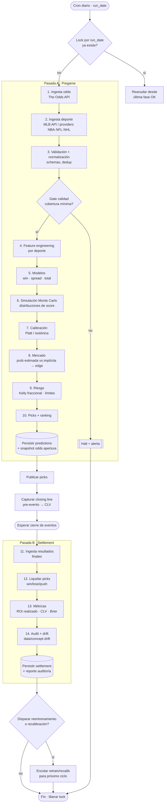

# Loop Diario — Sports Quant Platform v2

**Alcance:** operación diaria completa `datos → picks → settlement`.
**Tipo:** especificación de arquitectura lista para implementación. No incluye código ejecutable.

> Esta plataforma produce **probabilidades estimadas**, no certezas ni garantía de beneficio. Toda salida debe auditarse antes de usarse.

---

## 1. Objetivo

Orquestar, en un ciclo de 24 h, dos pasadas sobre el mismo conjunto de eventos del día:

- **Pasada A — Pregame:** ingerir datos, generar probabilidades estimadas calibradas, comparar contra el mercado, dimensionar stake y publicar picks.
- **Pasada B — Settlement:** al cerrar los eventos, liquidar resultados, medir ROI realizado y CLV, detectar drift y retroalimentar el siguiente ciclo.

El loop es **idempotente por `run_date`**, reanudable por fase y auditable.

---

## 2. Diagrama



---

## 3. Fases (contratos)

| # | Fase | Capa / script | Input | Output | Falla si |
|---|------|---------------|-------|--------|----------|
| 1 | Ingesta odds | `providers` · `ingest_odds.py` | `run_date`, deportes | odds crudas (ML, spread, total, movimiento) | API caída / plan agotado |
| 2 | Ingesta deporte | `providers` · `ingest_*.py` | schedule del día | schedule, equipos, lineups, pitchers/goalie, lesiones | provider no configurado |
| 3 | Validación | `validation` | crudos 1–2 | datasets normalizados | schema inválido / cobertura < umbral |
| 4 | Features | `features/sports/*` | datos validados | matriz de features por evento | features faltantes clave |
| 5 | Modelos | `models` | features | prob. win / cover / over-under | modelo no cargado |
| 6 | Simulación | `simulation` | params de distribución | distribuciones de score y margen | — |
| 7 | Calibración | `calibration` | probabilidades crudas | probabilidades calibradas | calibrador ausente |
| 8 | Mercado | `markets` | prob. calibrada + odds | edge estimado por línea | odds no emparejadas |
| 9 | Riesgo | `risk` | edge + bankroll | stake (Kelly fraccional, cap) | excede límites de exposición |
| 10 | Picks | `markets`/`cli` | edge + stake | picks rankeados + snapshot apertura | — |
| 11 | Resultados | `providers` | `run_date` | marcadores finales | resultados incompletos |
| 12 | Liquidación | `markets`/`risk` | picks + resultados | win/lose/push por pick | mismatch pick↔evento |
| 13 | Métricas | `audit` | liquidación + closing | ROI realizado, CLV, Brier, log-loss | — |
| 14 | Audit/drift | `audit`/`monitoring` | histórico | reporte drift + flags | — |

---

## 4. Estado y artefactos

Cada fase escribe un artefacto versionado y con timestamp, particionado por `run_date`:

```
data/
├── raw/{run_date}/odds.parquet, schedule.parquet, ...
├── processed/{run_date}/features_{sport}.parquet
├── predictions/{run_date}/picks.parquet
│                          odds_open_snapshot.parquet
│                          odds_close_snapshot.parquet
└── settlement/{run_date}/settled.parquet, metrics.json, audit_report.json
```

Esto permite **reanudar** desde la última fase completada y **reproducir** cualquier ciclo.

---

## 5. Orquestación y scheduling

Dos triggers sobre el mismo `run_date`:

- **Trigger A (pregame):** varias horas antes del primer evento (deja margen para lineups/pitchers/goalie confirmados). Ejecuta fases 1–10 + captura de apertura.
- **Captura de cierre:** justo antes de cada evento, snapshot de closing line (necesario para CLV).
- **Trigger B (settlement):** tras cerrar todos los eventos del día (típicamente madrugada siguiente). Ejecuta fases 11–14 y el gate de feedback.

Orquestador sugerido: `scripts/run_daily.py` como driver; opcionalmente Prefect para retries/scheduling. El bucle de feedback **no** reentrena en caliente: encola la tarea para el siguiente ciclo (evita leakage y mantiene determinismo).

---

## 6. Robustez

- **Idempotencia:** clave `run_date` + hash de inputs; re-ejecutar una fase sobrescribe su artefacto sin duplicar.
- **Lock:** un lock por `run_date` impide solapes; reanuda desde checkpoint.
- **Reintentos:** backoff exponencial en fases de red (1, 2, 11); el resto es local y determinista.
- **Gates de calidad:** la fase 3 **detiene** el loop si la cobertura de eventos/odds cae bajo umbral, en vez de generar picks sobre datos parciales.
- **Semillas fijas** en simulación para reproducibilidad.

---

## 7. Bucle de feedback (cierre → mejora)

La pasada B alimenta la A del siguiente día mediante señales, no reentrenamiento inmediato:

- ROI realizado y CLV por deporte/mercado → ajuste de umbrales de edge y caps de stake.
- Brier / log-loss / ECE por ventana → disparo de **recalibración**.
- Data drift / concept drift → disparo de **reentrenamiento** programado (validación temporal, nunca splits aleatorios).

Distinguir siempre: *prob. estimada* · *prob. implícita* · *edge estimado* · *ROI esperado* · *ROI realizado*.

---

## 8. Observabilidad

Cada fase emite logs estructurados con `run_date`, fase, duración, conteos y estado. El reporte de auditoría (fase 14) es reproducible y timestamped, e incluye desviación prob. estimada vs observada, prob. estimada vs implícita, estabilidad temporal y variables más influyentes.

---

## 9. Limitaciones

- CLV requiere snapshots reales de apertura y cierre; sin ellos queda como placeholder.
- Settlement preciso depende de resultados finales completos del provider.
- Sin credenciales reales, el loop solo corre en modo demo con datos sintéticos etiquetados.

---

## 10. Garantías normativas v2

- Ningún dato posterior al `decision_timestamp` interviene en un pick.
- Cada pick se reconstruye desde inputs, código, configuración, modelo, calibrador y política de riesgo.
- Datos raw y revisiones históricas son inmutables.
- Las fallas se aíslan por deporte, liga y familia de mercado.
- ROI teórico, ROI ejecutado, CLV y calidad probabilística se reportan por separado.
- El feedback crea candidatos; nunca promueve modelos automáticamente.

## 11. Identidad canónica y schemas mínimos

### Evento

```text
canonical_event_id
sport, league, season, competition_stage
league_event_date
home_team_id, away_team_id, venue_id, neutral_venue
scheduled_start_utc, actual_start_utc
event_status
provider_event_ids
identity_match_method, identity_confidence
created_at_utc, updated_at_utc
```

Estados: `SCHEDULED`, `DELAYED`, `IN_PROGRESS`, `FINAL_PROVISIONAL`, `FINAL_CONFIRMED`, `POSTPONED`, `CANCELLED`, `ABANDONED` y `UNKNOWN`.

El matching usa primero IDs de proveedor y después reglas controladas. Un evento ambiguo no puede producir picks.

### Cotización

```text
canonical_event_id, sportsbook, market_type, period, selection, line
american_odds, decimal_odds
quoted_at_utc, received_at_utc
is_live, is_suspended
rules_profile
provider_quote_id, raw_payload_hash
```

No se comparan mercados con distinto periodo, selección, tratamiento de overtime o `rules_profile`.

### Pick

```text
pick_id, run_id, canonical_event_id
sport, league, market_type, period, selection, line, sportsbook
decision_odds_decimal, minimum_acceptable_odds_decimal
decision_timestamp, expires_at_utc
estimated_probability, market_fair_probability
estimated_edge, estimated_ev, uncertainty_measure
recommended_stake, approved_stake, bankroll_reference
model_version, calibrator_version, risk_policy_version
status
```

Un pick sin precio mínimo, timestamp o expiración es inválido.

### Settlement

```text
settlement_id, pick_id, settlement_rules_version
settlement_status, settled_stake, net_profit, settled_at_utc
result_revision, explanation_code, supersedes_settlement_id
```

Estados: `PENDING`, `WIN`, `LOSS`, `PUSH`, `VOID`, `CANCELLED`, `PARTIAL` y `MANUAL_REVIEW`.

## 12. Arquitectura operacional corregida

No se mantiene un lock durante todo el día. Se usan tres jobs:

- `pregame_run(run_date, segment)`
- `closing_snapshot(canonical_event_id, snapshot_policy)`
- `settlement_run(run_date, segment)`

Cada worker adquiere una lease con propietario, heartbeat, expiración e intento. Una lease activa impide concurrencia; una expirada puede recuperarse explícitamente. No existe lease durante la espera entre pregame y settlement.

Estados de fase:

```text
PENDING | RUNNING | SUCCEEDED | FAILED_RETRYABLE | FAILED_FINAL
SKIPPED | QUARANTINED | STALE
```

La capa raw es inmutable. Los derivados se escriben en staging, se validan y se publican atómicamente. Una reejecución crea una revisión; no borra evidencia.

## 13. Gates de calidad

| Control | Umbral inicial | Acción |
|---|---:|---|
| Eventos emparejados | ≥ 98 % | Detener segmento. |
| Picks con odds vigentes | 100 % | Rechazar pick. |
| Antigüedad de `decision_line` | ≤ 5 min | Refrescar o rechazar. |
| Features críticas presentes | 100 % | Rechazar evento. |
| Features no críticas imputadas | ≤ 5 % | Alertar o rechazar. |
| Duplicados canónicos | 0 | Detener segmento. |
| Eventos iniciados en pregame | 0 | Rechazar evento. |
| Picks sobre identidades ambiguas | 0 | Revisión manual. |
| Integridad de timestamps | 100 % | Detener dataset. |

Cada gate conserva numerador, denominador, umbral, resultado y muestra de rechazados.

## 14. Point-in-time y prevención de leakage

Para toda feature:

```text
source_available_at_utc <= decision_timestamp
```

Queda prohibido utilizar resultados del evento objetivo, revisiones retrospectivas, closing odds, ratings recalculados con partidos futuros o información confirmada después del cutoff. Los backtests usan joins point-in-time y validación walk-forward; nunca splits aleatorios.

## 15. Mercado, de-vig, edge y EV

```text
p_raw = 1 / cuota_decimal
p_fair_i = p_raw_i / sum(p_raw_j)
edge = p_model_calibrated - p_market_fair
EV = p_model_calibrated × (cuota_decimal - 1) - (1 - p_model_calibrated)
```

La normalización proporcional es el método inicial de de-vig. Alternativas como power o Shin requieren validación y versionado.

Un candidato solo avanza si la cotización es comparable, completa, ejecutable, pregame, no suspendida y fresca; el EV supera costes y umbral; la incertidumbre no invalida el edge; y existe una cuota mínima publicable.

## 16. Riesgo agregado

Kelly es un punto de partida, no una orden de publicación:

```text
stake_base = fractional_kelly × haircut_incertidumbre × haircut_correlación
```

Después se aplican caps por pick, evento, participante, deporte, liga, mercado, sportsbook, día, drawdown y grupo correlacionado. Sin una matriz de correlación fiable se usa un haircut conservador documentado.

Se distinguen `recommended_stake`, `approved_stake`, `submitted_stake` y `accepted_stake`. En este alcance solo existen los dos primeros; por eso el rendimiento se etiqueta como teórico.

## 17. Closing line y CLV

Cada evento programa snapshots en T-60, T-10 y en la última cotización válida anterior a `actual_start_utc`. Si no existe una cotización comparable, CLV queda `UNAVAILABLE`; nunca se imputa retrospectivamente.

Se reportan por separado CLV de precio, CLV de línea, CLV como probabilidad justa sin vig, porcentaje de picks que baten al cierre y magnitud media/mediana. No se compara una línea -2.5 con -3.5 usando únicamente la cuota.

## 18. Settlement y reconciliación

El settlement depende de deporte, mercado, periodo, `rules_profile` y `settlement_rules_version`. Debe cubrir overtime, eventos acortados o abandonados, postergaciones, cambios de sede/rival, pitcher o goalie listado, push, void, cancelación, liquidación parcial y correcciones.

Una corrección genera una revisión que referencia la liquidación anterior. Los mismatches pasan a `MANUAL_REVIEW` sin bloquear casos inequívocos.

## 19. Métricas y drift

```text
ROI_realizado = beneficio_neto / stake_liquidado
```

Debe informarse con cantidad de picks/eventos, stake, unidades netas, distribución de cuotas, drawdown, intervalo de confianza y segmentos. Pushes y voids se muestran explícitamente.

Calidad probabilística: Brier, log-loss, ECE con bins documentados, reliability diagrams y calibración segmentada. Se distinguen data drift `P(X)`, concept drift `P(Y|X)` y operational drift.

Ningún trigger se activa por un solo día negativo: exige ventana, muestra, magnitud, persistencia y significancia suficientes.

## 20. Gobernanza de modelos

```text
dataset congelado
→ entrenamiento o recalibración
→ validación walk-forward
→ champion/challenger
→ pruebas de estabilidad
→ aprobación
→ shadow o canary
→ promoción versionada
```

El ROI reciente puede reducir exposición por precaución, pero no aumentarla automáticamente.

## 21. Observabilidad y SLO

| Indicador | Objetivo inicial |
|---|---:|
| Pregame terminado antes del cutoff | ≥ 99 % |
| Picks con lineage reproducible | 100 % |
| Closing snapshots disponibles | ≥ 98 % |
| Picks elegibles liquidados dentro del SLA | ≥ 99 % |
| Picks duplicados | 0 |
| Picks con datos posteriores al cutoff | 0 |
| Mismatches sin revisión explícita | 0 |

Los logs incluyen run, fase, segmento, evento, proveedor, modelo, configuración, intento, duración, conteos, freshness, quality score, trace y estado.

## 22. Seguridad y pruebas

Credenciales fuera de código y logs, cifrado, acceso por rol, auditoría de cambios, rotación, retención, separación entrenamiento-aprobación-producción y kill switch.

Pruebas obligatorias: unitarias de cuotas/riesgo/settlement/fechas; contratos de proveedores; integración y recovery; backtest point-in-time; closing perdido; lease expirada; resultado corregido y segmento incompleto.

## 23. Criterios de aceptación del MVP

1. Reconstruye cualquier pick sin consultar datos posteriores.
2. Reejecuta fases sin duplicar picks ni settlements.
3. Aísla la falla de un segmento.
4. Rechaza eventos ambiguos, odds antiguas y features fuera de cutoff.
5. Publica línea, precio mínimo, timestamp y expiración.
6. Captura closing por evento o declara su ausencia.
7. Liquida win, loss, push, void, cancelación y revisión.
8. Calcula ROI con denominador verificable, separado de CLV y calibración.
9. Reprocesa correcciones sin borrar historial.
10. Identifica inputs, modelo, calibrador, reglas y configuración.
11. Crea challengers sin promoverlos automáticamente.
12. Supera pruebas de concurrencia, recuperación y leakage.

## 24. Orden de implementación

1. Identidad canónica, schemas y raw inmutable.
2. Estados, manifiesto, leases e idempotencia.
3. Ingesta, normalización y gates.
4. Features point-in-time y pruebas anti-leakage.
5. Registro de modelos, inferencia y calibración.
6. Mercado, de-vig, EV y publicación.
7. Riesgo agregado y bankroll teórico.
8. Closing por evento.
9. Settlement y reconciliación.
10. Métricas, drift y champion/challenger.
11. Observabilidad, seguridad y resiliencia.

## 25. Decisiones pendientes

Antes de implementar deben fijarse deportes, ligas y mercados del MVP; proveedores; fecha operativa; sportsbook o consenso de referencia; método de de-vig; reglas de settlement; umbrales; bankroll; correlación; muestras mínimas; tecnologías y responsables del SLA.

## 26. Conclusión

La plataforma debe tratarse como un sistema de decisiones reproducible, no solo como un pipeline de predicciones. La identidad de eventos, el tiempo de disponibilidad, la comparabilidad de líneas, el riesgo agregado y las reglas de liquidación tienen la misma importancia que el modelo.
